As I started looking at data on [CKAN](http://ckan.org/) sites, I noticed that a lot of the
datasets were links to files on other websites and that a lot of these links
were dead. Then I started wondering how many and which ones.

## Why study dead links
It goes without saying that websites usually shouldn't have dead links, but
here are a bunch of fancy reasons why dead links shouldn't be on open data sites.

* [Sunlight Foundation](http://sunlightfoundation.com/opendataguidelines/#permanent-access)
    says to "Create permanent, lasting access to data".
* [Project Open Data](http://project-open-data.github.io/principles/) says
    that data should be "Managed Post-Release".
* The [questions](http://census.okfn.org/faq/#what-do-all-the-questions-about-the-datasets-mean-)
    for Open Knowledge Foundation's Open Data Census include
  * "Is the data available online?"
  * "URL of data online?"
* The Open Data Institute
    [Open Data Certificate questionnaire](https://certificates.theodi.org/surveys/gb/ofm6KhncVg/take)
    asks for a bunch of URLs about the dataset to be certified;
    I presume they should be alive.
    It also asks "How long will this data be available for?"

In summary, dead links are bad.

That said, if the alternative to having a dead link to a dataset is having no
link to a dataset, I'd say it's better to have the dead link so we know that the
data exist. But live links are better; let's move on.

## Acquiring the data
I collected data about dead links from CKAN and
[Socrata](http://www.socrata.com/open-data-portal/) catalogs;
it went a bit like this.

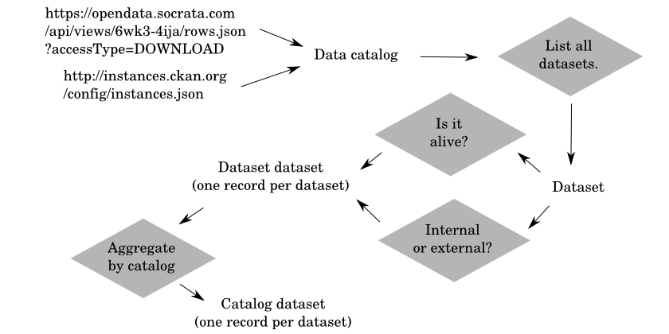{:.wide}

The next few sections explain this a bit more.

### Accessing data catalogs
I downloaded [a list of Socrata catalogs](https://opendata.socrata.com/api/views/6wk3-4ija/rows.json?accessType=DOWNLOAD)
([mirror](https://github.com/tlevine/open-data/blob/master/opendata.socrata.com/api/views/6wk3-4ija/rows.json%3FaccessType%3DDOWNLOAD))
and [a list of CKAN catalogs](http://instances.ckan.org/config/instances.json)
([mirror](https://github.com/tlevine/open-data/blob/master/instances.ckan.org/config/instances.json)).

I tried querying the APIs for all of these sites.
I couldn't do this for some of the sites, mainly because they required
authorization (lolz open data) that I did not have or because
the URL I found for the catalog did not correspond with the
domain for the CKAN or Socrata API.
I continued with all of the sites for which I could get the data;
this wound up being
44 CKAN catalogs and
52 Socrata catalogs.

### Dataset metadata
With each of these catalogs, I acquired the metadata JSON file for each dataset
in the catalog. Here they are for
[Socrata](https://github.com/tlevine/socrata-views) and for
[CKAN](https://github.com/tlevine/ckan-datasets). These are also
[submodules](https://github.com/tlevine/open-data/tree/master/downloads)
to the [main repository](https://github.com/tlevine/open-data/tree/master).

### Link liveliness
From the metadata for each dataset, I pulled out the
URL
for the dataset if there was a URL.
Here's the code
for [Socrata](https://github.com/tlevine/open-data/blob/master/links.py#L13) and
for [CKAN](https://github.com/tlevine/open-data/blob/master/links.py#L32).

I checked whether datasets were alive by trying to download them.
([More precisely](https://github.com/tlevine/open-data/blob/master/links.py#L37),
I really issued a HEAD request and checked the status code.)

### Internal versus external storage
Once I had the metadata files about each dataset, I also
[determined](https://github.com/tlevine/open-data/blob/master/links.py)
whether the dataset was stored *internally* or *externally*.
These are terms that I just invented, so I define them below.

With **internal storage**, the dataset is uploaded to the data catalog software
itself. In CKAN, the dataset gets stored in the FileStore, and in Socrata,
the dataset gets stored in Socrata's data storage. (There isn't really a
name for this place in Socrata's architecture, as far as I know.)

With **external storage**, the dataset is a file that is stored on some other
website on the internet, and we can reference the dataset with a URL. When we
add the dataset to CKAN or Socrata, we are just linking to this other website.

As I imply above, Socrata and CKAN both support both of these two approaches.

### Final database
I combined this all into the same
[SQLite3 file](http://bigdada.thomaslevine.com/open-data.sqlite.gz)
as I used for the [Socrata products analysis](/!/socrata-products).

## Results

### How many data catalogs have external links?
As I mention above, there are
52 Socrata catalogs.
Of these,
19
(37%)
have at least one externally stored dataset.

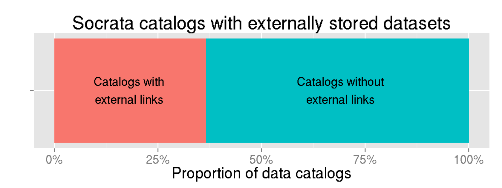 

Of the 44 CKAN catalogs,
43
(98%)
have at least one externally stored dataset.

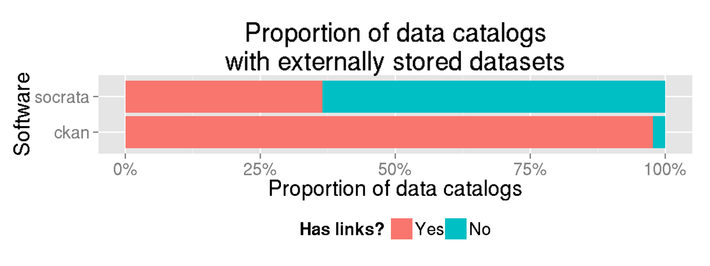 

That's a big difference.

### Link types and liveliness by catalog
Rather than looking at just whether there are any externally stored datasets at all,
let's now look at what proportion of the datasets are stored externally.

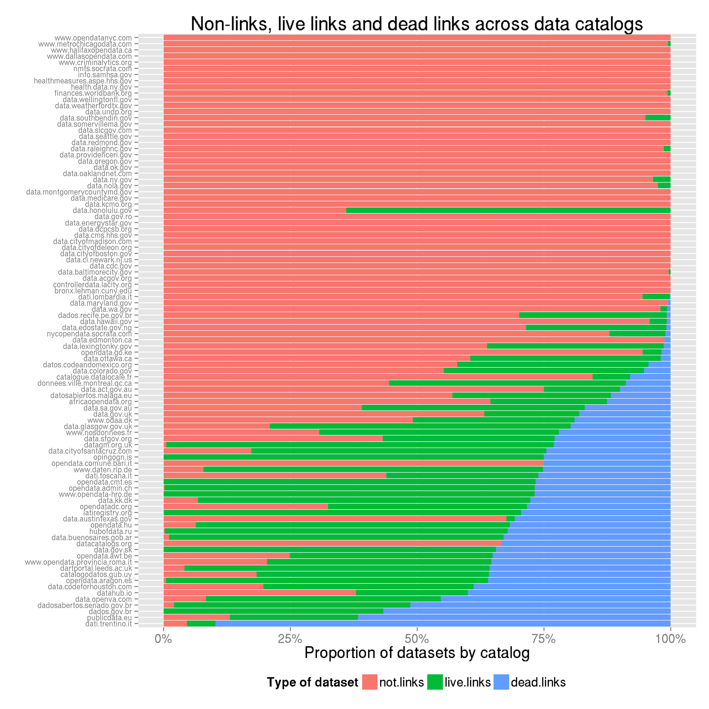{:.wide}

Whether a dataset is stored internally or externally is related to whether it
stays alive. This is a plot of what proportion of datasets on Socrata are stored
internally and what proportion of datasets are alive; each dot is a data catalog
run by Socrata.

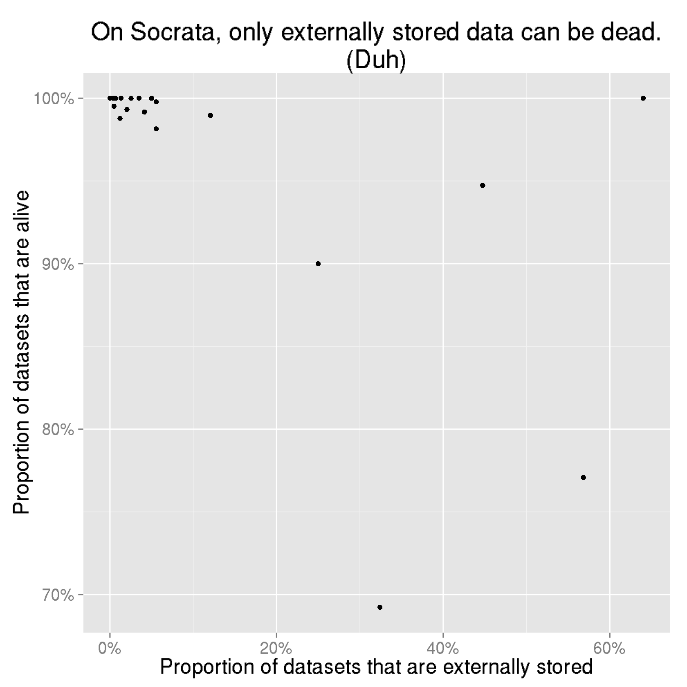 

Socrata data catalogs with more externally stored data tend to have more dead links.

The above plot was for just Socrata; let's see what happens when we add CKAN.

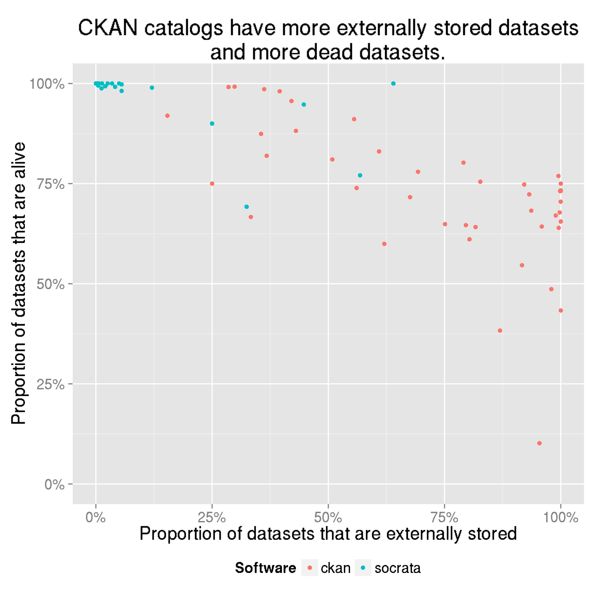{:.wide}

CKAN catalogs tend to have more externally stored data. When we add CKAN, the
association between externally stored data and dead links continues.

### Liveliness among externally stored data
Here's another way of seeing the above relationship. Let's look at only the externally
stored datasets, and check what proportion of those are alive.

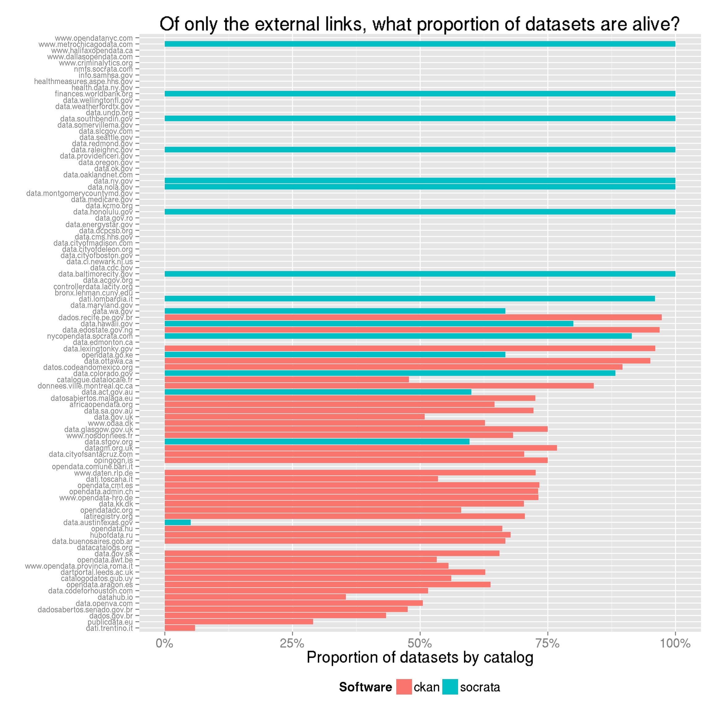{:.wide}

*Catalogs with no external links appear as empty bars.* This is ambiguous,
because empty bars could also mean that there are external links but they're
all dead. Oh, well.

Some data catalogs are better than others, but about a quarter of externally stored
datasets tend to be dead. Thus, when we make more externally stored datasets,
we should expect more dead datasets.

Possibly interesting: the catalogs in this plot are ordered the same way they
are in the [earlier similar-looking plot](#link-types-and-liveliness-by-catalog),
so higher catalogs
are ones with fewer dead links.

## Software suggests behavior
While both softwares support both storage methods, Socrata encourages the
use of internal storage, and CKAN encourages the use of external storage.
Let's walk through how you create a dataset in both CKAN and Socrata through
their respective web interfaces.

### CKAN
In CKAN, this is the screen you get when you are specifying the data file
for your dataset.

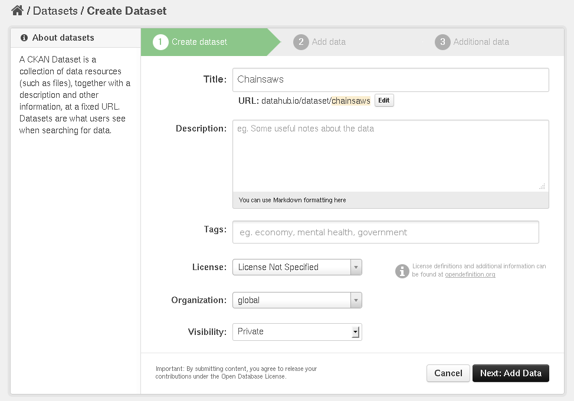{:.wide}

The first screen says nothing about how to enter the data, but the second one does.

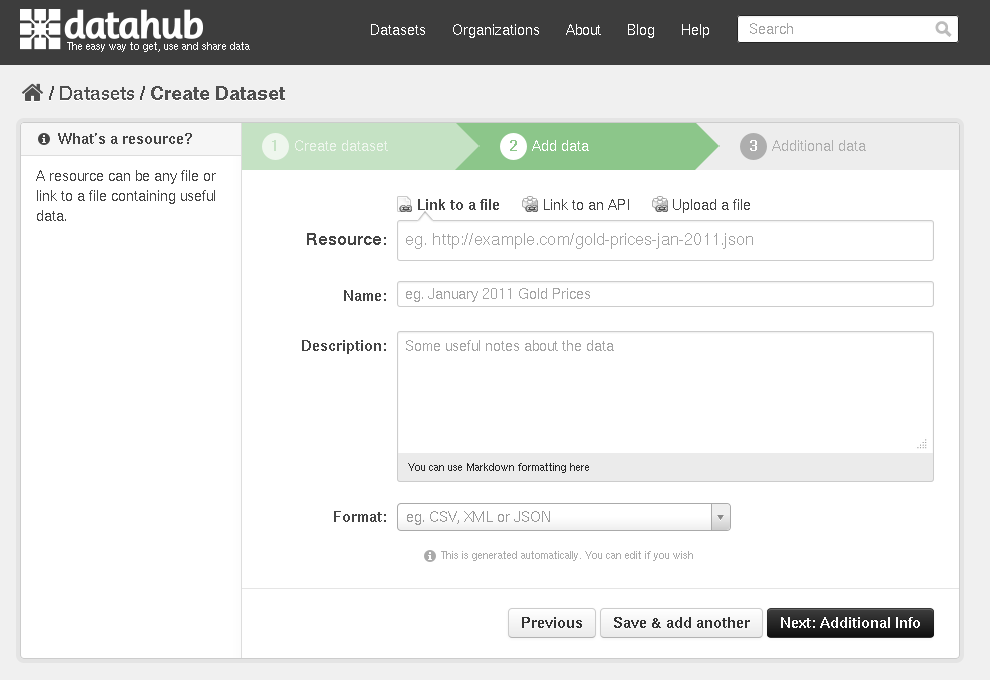{:.wide}

You enter the URL of a file or an API,

{:.wide}

or you upload a file.

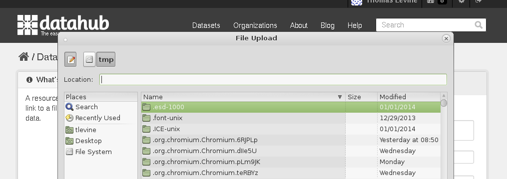{:.wide}

After you upload the file, the box gets populated with the URL to which that
has been uploaded. (This URL is inside the CKAN FileStore.)

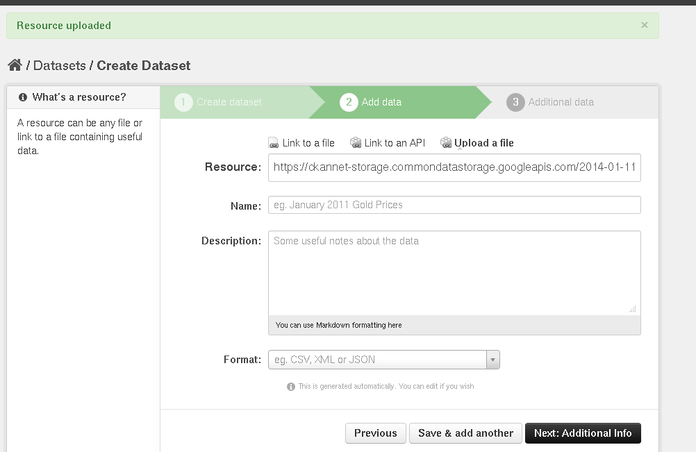{:.wide}

The first two cases lead to external storage, and
the third case leads to internal storage.
CKAN does fancy things depending on whether you say it's a file or an API
and depending on the file format you tell it, but that's separate from the
issue of internal versus external storage.

As you might notice above, CKAN subtly encourages you to store things externally.

1. There are two options for external storage but just one for internal.
2. The two tabs for external storage options come before the third tab for
    internal storage.
3. In the web interface, internally stored, uploaded files are treated like
    external links.
4. One of the external storage options (the "Link to a file" tab) is selected
    by default when you arrive at the page.

CKAN is a bit subtle in encouraging external storage, but do keep this in mind.

### Socrata
While externally stored data exist on Socrata, I didn't find any way of creating
such a dataset with the Socrata website. Here's what creating a new dataset on 
Socrata looks like.

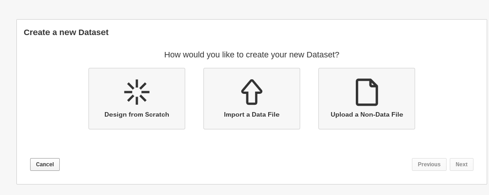{:.wide}

If you choose to "Design from Scratch", you wind up entering the data through
the table interface in Socrata; after you click through a few screens, you get
an editor like this.

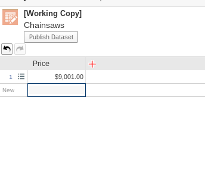

If you choose to "Import a Data File", you see this.

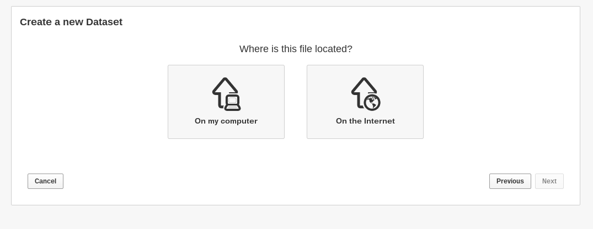{:.wide}

Because I was looking for a place to add externally stored data, I clicked on
"On the Internet". I entered a file into this box, and the file got downloaded
to Socrata.

{:.wide}

Then I got this schema editor,

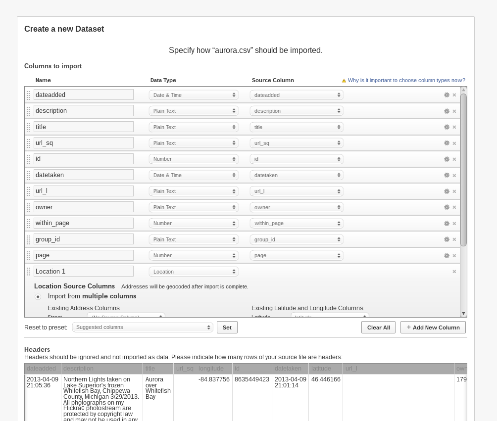{:.wide}

and the data got imported to the internal storage.

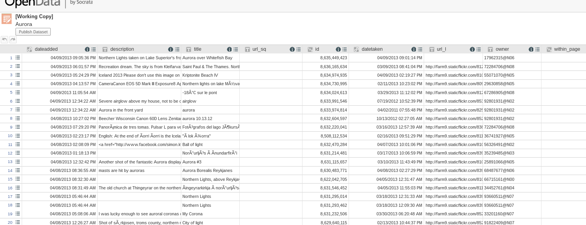{:.wide}

The non-data file approach also leads to internal storage.

{:.wide}

I don't even see any documentation as to how to do this
[with the API](http://dev.socrata.com/publishers/importing).

Socrata Support did send me an
[answer](https://twitter.com/SocrataSupport/status/423600872501690368),
but I need to log in to ZenDesk to do that (lolz open data again),
and I was having trouble doing that.

So it's pretty hard to add an externally stored dataset to Socrata.

## Internal storage encourages live links
If your data are stored in CKAN's FileStore or in Socrata's
data storage (rather than as an external link), then it is
practically impossible for the link to be dead.

If we want to use fancy design-speak, we can call this a forcing function.
A forcing function is an aspect in the design of a thing that makes it
impossible for people to do something that they aren't supposed to do.
If we make it impossible for links to be dead, they won't ever be dead.

## Other ways of encouraging live links
Removing the external link feature should reduce the number of dead links
to zero, and that might be nice. On the other hand, there might be some good
things about external links, so maybe we can instead come up with some other
software feature that helps people avoid or fix dead links. For example,
perhaps there could be a page that lists the dead datasets and counts how
many times people have tried accessing them.

The [CKAN Quality Assurance Extension](https://github.com/okfn/ckanext-qa)
does just this; here's one of its reports.

[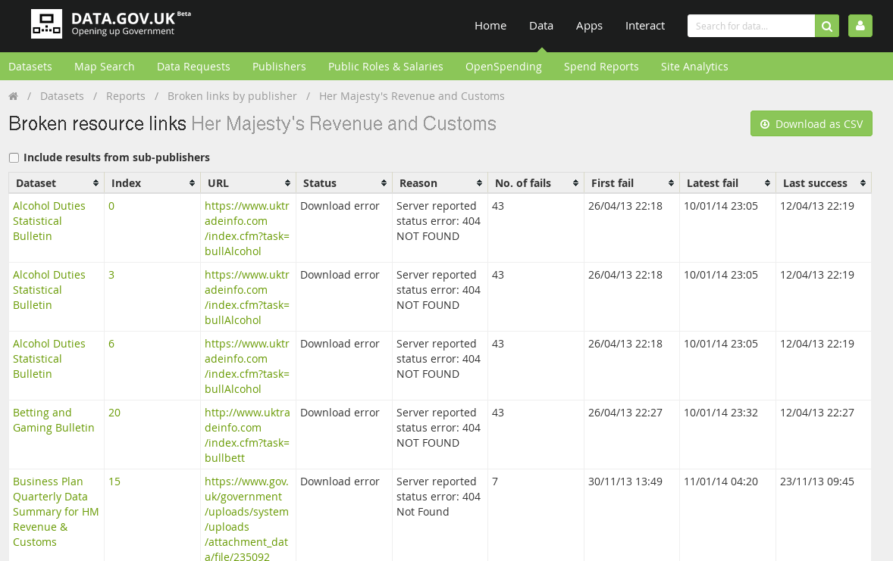{:.wide}](http://data.gov.uk/data/reports/qa/organisation/broken_resource_links/her-majestys-revenue-and-customs)

## Why measure data catalogs
Detecting dead links is one of several things that we can easily do to
measure the quality of a data catalog. Similarly, we can also measure
[what licenses are used](/!/open-data-licensing),
[how up-to-date the data are](/!/data-updatedness),
and [what data formats the data are in](/!/socrata-formats).

When we have lots of datasets on our data catalog, it becomes too much
for someone to read through all of them. Measures like these help us get
some idea of what is going on across the data catalog. They also help us
choose where to focus our attention, so that we may identify good
practices and diagnose problems.
