[Project Open Data](http://project-open-data.github.io/principles/),
the [Sunlight Foundation](http://sunlightfoundation.com/opendataguidelines/#real-time-updates),
a bunch of
[open](http://le.utah.gov/~2013/bills/sbillenr/SB0283.pdf)
[data](http://www.scribd.com/fullscreen/26442622?access_key=key-20rfsh26eu0ob66xlbmu))
[policies](http://www.governor.ny.gov/executiveorder/95),
and probably everyone else says that it's important that open data
be kept up-to-date. So I was wondering how up-to-date they actually are.

I collected some data about the updatedness of open data.
Based on these data about open data,
the open data don't seem very up-to-date.

## The data about data
I [downloaded](/!/socrata-summary/)
all the metadata about all of the public datasets that are hosted on
58
data portals run by [Socrata](http://socrata.com).

### Removing duplicates
I had to do a lot to remove duplicate datasets.
I did these two things.

1. Remove federated datasets
2. Deal with derived views

Dealing with federation was annoying, but I had already
done that; you can read about that
[here](/!/socrata-deduplicate/#dealing-with-federation).

Dealing with derived views is more complicated.
Socrata has this feature where you can create multiple
[views](/!/socrata-genealogies#term-view) from a single
[table](/!/socrata-genealogies#term-table).
It is hard to separate the official views, created by someone in the
government, from the unofficial, derived views. I did not try to determine
which view/dataset was the original, official one, but I did separate
them based on their `tableId`, which links all of the different views
that use the same data. Because I didn't figure out which view is the
original one for each table, I can't tell you things like the name of
the original dataset. On the other hand, I can tell you a lot of things.
Most importantly, this manner of removing duplicates doesn't hinder
my approach for determining updatedness.

### Dates
The Socrata API provides four date fields for each view.

* `createdAt`
* `publicationDate`
* `rowsUpdatedAt`
* `viewLastModified`

`createdAt` is when someone clicked the button to include the dataset;
it's always the oldest one. It is possible to create a dataset but keep
it private, for internal review. If you spend a couple days reviewing
the dataset privately before you post it publically, the `publicationDate`
will reflect this latter date, while `createdAt` will still be the time
when you added the private dataset. Also, `createdAt` is different for
different views of the same data, but `publicationDate` is not.

    table(subset(socrata, tableId == 926641)$publicationDate)
    2013-06-18 
            46

    table(subset(socrata, tableId == 926641)$createdAt)
    2011-09-26 2011-10-25 2011-12-22 2012-01-03 2012-01-04 2012-01-30 
             2         17          1          1          1          6 
    2012-01-31 2012-02-06 2013-04-08 2013-05-30 
             7          9          1          1

`rowsUpdatedAt` and `viewLastModified` presumably have something to do
with the time the dataset was updated. I don't really know what those
mean, but I think `rowsUpdatedAt` is the one I want. Recall from above
that views with the same `tableId` share the share the underlying data.
If the data get updated, it should be reflected in all of the datasets.
This is the case for `rowsUpdatedAt`; for all
46
datasets with an `tableId` of `926641`, the `rowsUpdatedAt` field
is the same.

    > table(subset(socrata.deduplicated.orig, tableId == 926641)$rowsUpdatedAt)
    1371584568 
            46

On the other hand, the `viewLastModified` field is quite different.

    > table(subset(socrata.deduplicated.orig, tableId == 926641)$viewLastModified)
    1320681652 1320681806 1320683489 1320683529 1320683572 1320683615 
             1          1          1          1          1          1 
    1320683652 1320683694 1320683740 1320683775 1320683818 1320684414 
             1          1          1          1          1          1 
    1320684459 1320684504 1320684542 1320684575 1320684625 1325697249 
             1          1          1          1          1          1 
    1327951380 1327951474 1327951571 1327951655 1327951743 1327951864 
             1          1          1          1          1          1 
    1328026858 1328027111 1328027387 1328027479 1328028650 1328031765 
             1          1          1          1          1          1 
    1328037223 1328544614 1328544754 1328544905 1328545059 1328545187 
             1          1          1          1          1          1 
    1328545294 1328545431 1328545524 1328545643 1328734273 1330367612 
             1          1          1          1          1          1 
    1365458282 1365463347 1369872686 1371584597 
             1          1          1          1

Thus, I'm using `rowsUpdatedAt` for calculating the updatedness measure.

## What is an "update"
I'm going to use the term *update*{:#term-update} to mean a reasonably particular
thing that excludes some other things that you might consider an update.

The Socrata data portal software has 
[this publisher API](http://dev.socrata.com/publishers/getting-started)
that lets the publisher (usually a government) upload data as a
[dataset](/!/socrata-genealogies/#term-dataset)-type [view](/!/socrata-genealogies#term-view),
with its own unique URL based on its
[4x4 identifier](http://dev.socrata.com/docs/endpoints).
I presume that there's some web interface for this too.

An update only occurs when you use the API (or the presumed web interface)
in a particular manner. I'll tell you about three ways you might use it,
and I only count the third way as an update.

### Upload a new version and delete the old version
Let's say you have a dataset of
[lottery contracts for 2011](https://data.oregon.gov/dataset/Contracts-Lottery-Fiscal-Year-2011/dwi6-thje)
and you notice a spelling error in one of the fields. You fix it on your own computer,
but how do you get it to the main site? You could upload the new one and delete the old
one, but then the URL will change.

When someone uploads a new version of the dataset to Socrata
but it has a different URL, I do not count it as an update.

### Upload new data as a separate dataset
What if you want to add the 2012 data but keep the 2011 data the same?
You could upload the 2012 data as a
[separate dataset](https://data.oregon.gov/Revenue-Expense/Contracts-Lottery-Fiscal-Year-2012/i3ri-n6hq).
The old dataset would still have the same URL,
but but the new one would be hard to find; the open data catalog doesn't make a link between these two datasets.

Within the present article, I do not consider this to be an update either.

### Using the append and replace API methods
The publisher API lets you
[append to or replace](http://dev.socrata.com/publishers/importing#append_replace)
the data in an existing dataset. That is, you can upload new data for an
existing dataset while keeping its 4x4 identifier and all of its metadata.

This approach is much better than the other two because it
makes it much easier to find the new data; we can get the
new data while still referencing the same URL. This is the
only of the three approaches that I count as an update.

## Data summary
We have data from mid-2011 to mid-2013. In order to fit this all on
one plot, let's look first at which datasets were updated; we're ignoring
the dates when they were updated. Each horizontal band is a data portal,
each dot is a data [table](/!/socrata-genealogies#term-table)
inside of a data portal,
and the dots are colored based on whether the data were ever updated.

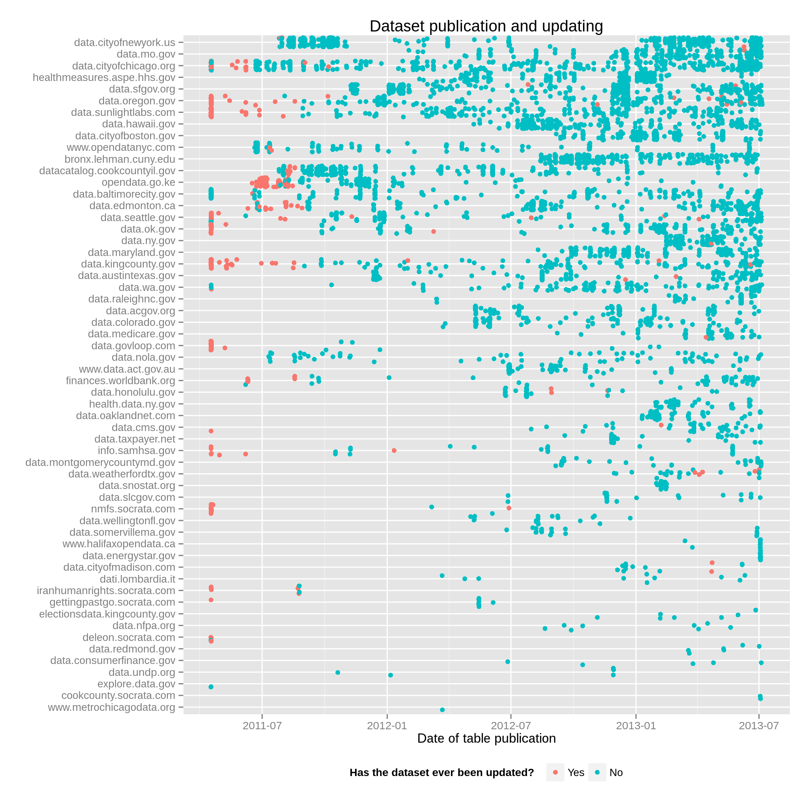{:.wide}

This plot shows us that older datasets are more likely to have been
updated. It also subtly points out that different data portals have
different amounts of datasets and that they have grown at different
rates over time. Let's plot that more clearly.

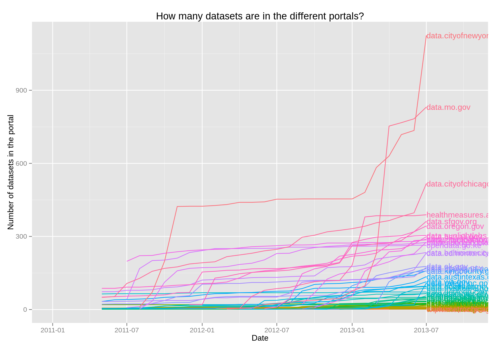{:.wide}

Data portals grow over time, often in sudden bursts. Two notes about
that plot:

1. It assumes that no data have ever been deleted from a portal;
    it's all based on the publication date.
2. It is counting the number of [tables](/!/socrata-genealogies#term-table)
    rather than the number of [views](/!/socrata-genealogies#term-view).

Let's also relate the update dates to the publication dates.

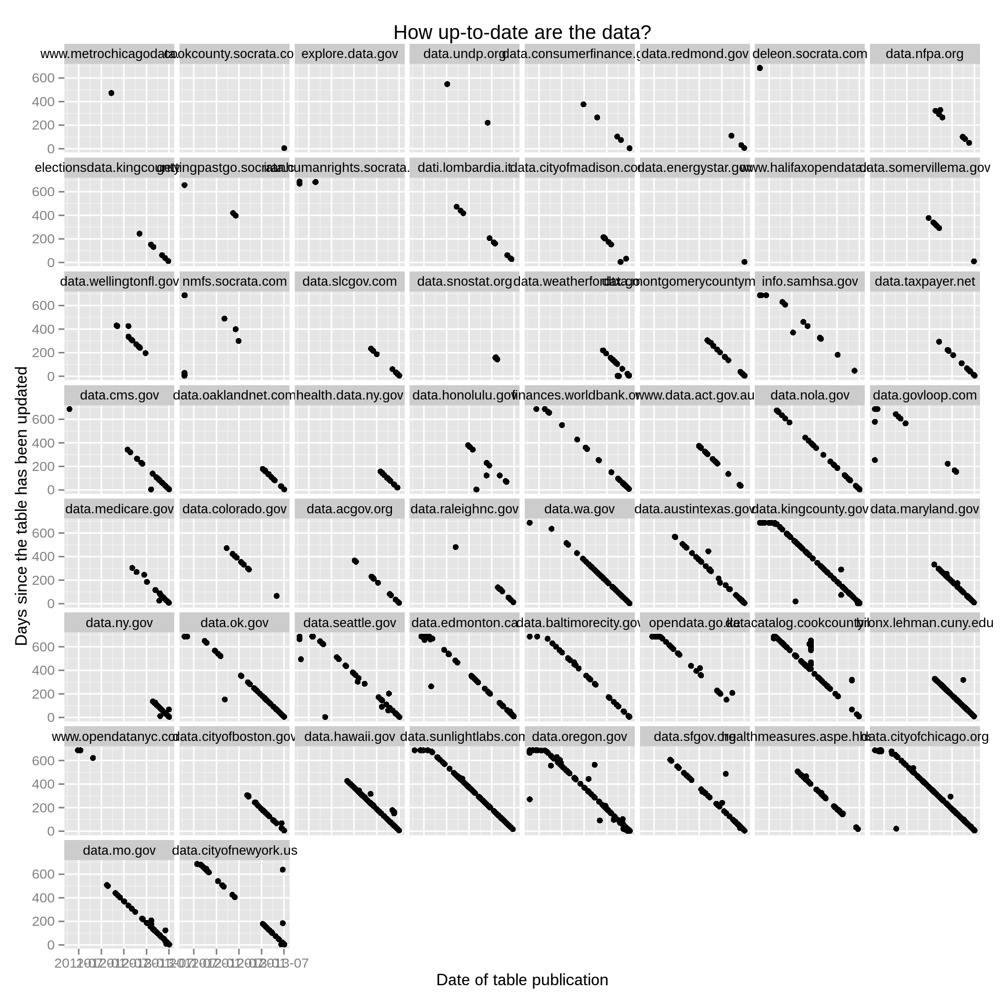{:.wide}

It looks like most data were "updated" only within an hour of their
initial publications. Colloquially, we'd say that they haven't been
updated ever. But there are some spikes here and there.

Also, it appears that only certain kinds of data get updated.

    > table(socrata.deduplicated$viewType, is.na(socrata.deduplicated$rowsUpdatedAt))
            FALSE TRUE
    blobby      0 1752
    geo         0  400
    href        0  571
    tabular  5552  151

Tabular data (the stuff you're used to) get updated, but links to
external data (`href`), geospatial data (`geo`) and ordinary files (`blobby`)
don't seem to get updates. I don't know whether this is a feature of
Socrata or just a strong tendency for those sorts of data.

## Motivating an updatedness measure
The update date can tell us how up-to-date a particular dataset is,
but I want to get a bigger picture. I want to quantitatively compare
datasets and groups of datasets. I tried to come up with a simple
statistic that would let us do that.

One measure that I came up with is **proportion of datasets older than
a year that have been updated within the year**. (The timespan of a
year is pretty arbitrary, though.) Here's how I arrived at that measure.

### General formulation
In producing a measure of updateness, we are trying to come up with a
simple number that matches our intuition about whether something is
up-to-date. Let's think a bit about what would count as up-to-date.

A dataset first gets published at some time. For a little while, the
data will be up-to-date even if no updates are sent. For example, if
data about wifi usage per month are uploaded on the first of the month,
we'll consider them to be up-to-date two weeks later.

After some point, we must have received an update in order for the
data to be up-to-date. In the case of monthly wifi usage, we need an
update on the first of the second month; if we haven't received one
by then, we'll consider the data out-of-date. Thus, I arrive at the
general concept of comparing the date of initial publication to the
date at which the dataset was last updated.

### Differences by dataset
If a dataset of scores on standardized math tests taken in schools
was uploaded two weeks ago and hasn't been touched since, I'd say it's
up-to-date. A particular standardized math tests might be administered
yearly, so I don't expect the data to have changed in a couple of weeks.

On the other hand, if a dataset of 311 calls hasn't been updated in
two weeks, we could say that it is out-of-date because 311 calls are
always coming in.

A dataset about something that happens often needs to be refreshed
more often for us to consider it up-to-date. A very cool measure of
updatedness would account for out how often new data come in and
check whether those new data show up in the dataset. But that would
be a lot of work, so let's start with something simpler.

### Keep it simple
Rather than worring about the exact time period, let's address a simpler
issue. I've heard complaints that some data get uploaded data once and
never updated, ever. Rather than worring about the exact time since update,
let's just check whether the dataset has been updated ever.

I'm going to use the format of *datasets older than X that have been updated since*
and just choose an appropriate time X. The time probably has to be kind of
long, so that we don't count datasets as out-of-date when they just have
long update cycles (like yearly data). On the other hand, the time can't be
too long, because then we'll wind up saying that everything is out-of-date.

### Choosing a less arbitrary cutoff
We can check whether different values will give us the same value on our
updatedness measure. To say it fancy-like, we can check whether our updatedness
measure is robust to the cutoff.

A simple way of checking this is to plot the value of our updatedness
measure for different cutoff values. If we find a region where the value
of the updatedness measure doesn't change very much when we change the
cutoff, we could say that cutoffs in that region are safe to use.

I also had to decide whether to use `rowsUpdatedAt` or `viewLastModified`
as the date of update. I don't really know what either of these means, so
let's just try both.

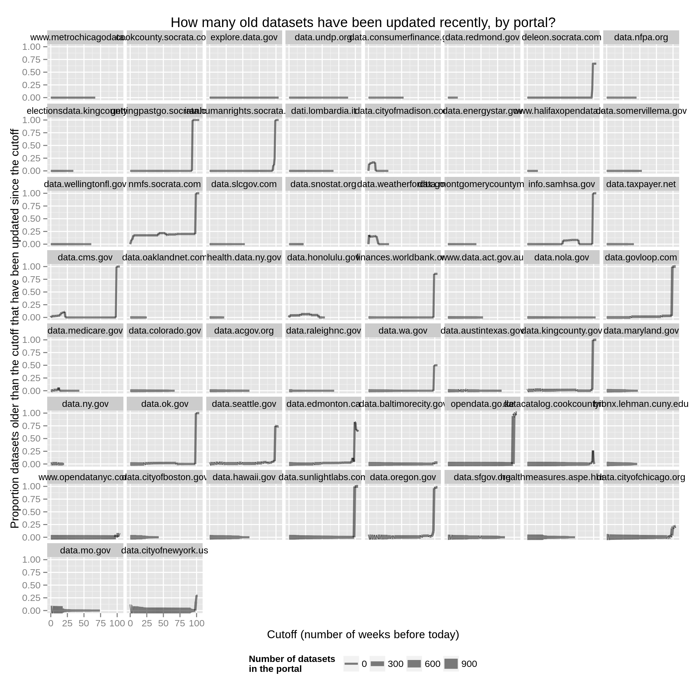{:.wide}

The main thing I notice is that the value of this statistic
(again, proportion of datasets older than some date that have been updated since)
is pretty close to zero for all of the portals at any time.
This is very bad; it means that we pretty much never update
data that we put on data portals.

The next thing I notice is that the value varies widely when there aren't
very many datasets on the portal. Visually, this shows itself as skinny
lines (few datasets) jumping up and down very suddenly, like for
`data.cms.gov`. When there are very few datasets on a portal
(like 12), an addition of a dataset or an update to a dataset will have
a large impact on the value of our updatedness measure (the height of the line).
This is not interesting, and the plot below should explain why.

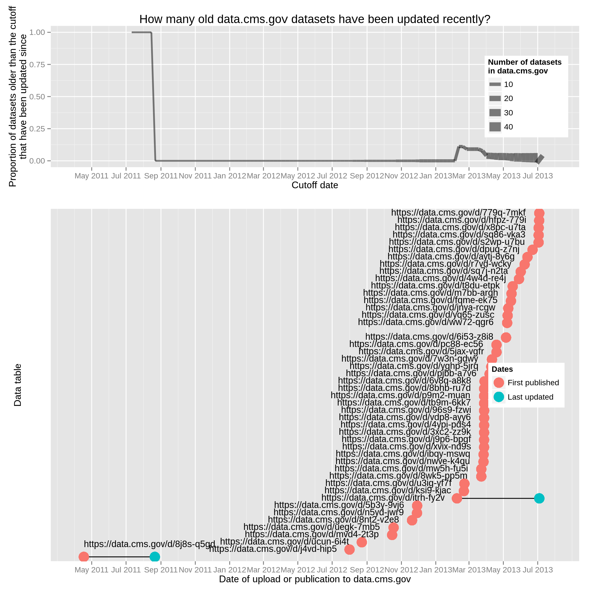{:.wide}

In these two plots, we're only looking at `data.cms.gov`. The first
plot is the same as the corresponding plot in the previous image,
only larger. The second shows the dates at which each
[data table](/!/socrata-genealogies#term-table) was
published and most recently updated. Red dots are publication dates,
and blue dots are update dates. If there was no update or the most
recent update was within a day of the publication date, no blue dot
is shown.

The bumps in the top plot only occur when the portal contains very
few datasets; the figure stabilizes at the end of March 2013, when
a bunch of datasets get published. (In case you're curious, these
datasets are all derived from the
[Beneficiary Summary File](http://www.resdac.org/cms-data/files/bsf),
according to their respective descriptions in the portal.)

## Even simpler
I'd assumed that people actually update their data, but it looks
like people don't.
I think we need something even simpler to drive this conclusion home.

Let's look at the number of datasets that have ever been updated, by
portal. We'll count a dataset as having been updated if it has a value
in `rowsUpdatedAt` that is more than one day greater than the value
in `publicationDate`.

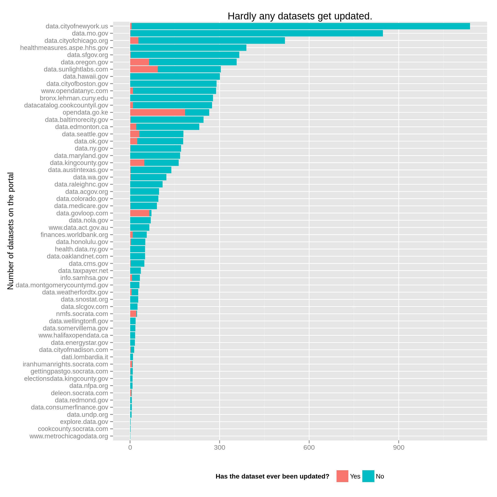{:.wide}

Keep my [definition of "update"](#term-update) in mind;
in the above count, I'm including neither situations where old datasets
were deleted and replaced with new ones nor situations where new records
were uploaded as a separate dataset.

### Which datasets have been updated?
Only 655 of the
8426 datasets have ever been updated.

These 655 datasets are
contained within only 29
portals, out of the 58
that I looked at. Here are the updates over time by portal.

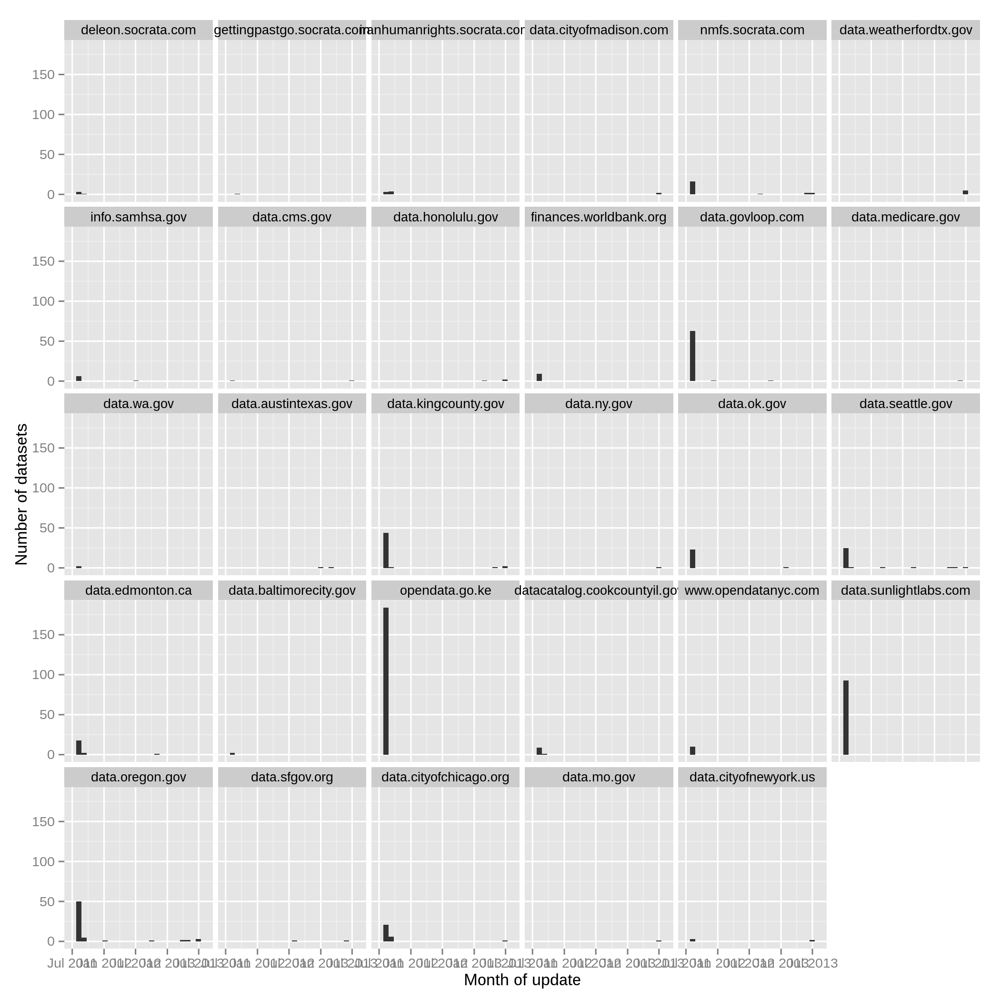{:.wide}

A few datasets are still updated today (indicated by the tiny bumps
towards the right of the graphs), but most were only updated two years
ago.

You might have guessed already, but these recent updates tend to be for
datasets that were recently updated, rather than old datasets that have
been maintained for a while. You can see that in this plot of publication
date versus update date. The update date is along the x-axis, and the
publication date is along the y-axis. The diagonal line is where the
publication date and update date are the same, and it is impossible for
a dataset to appear above the diagonal line. Datasets towards the bottom-left
of the plot were published and updated a long time ago. Datasets towards
the top-right were published and updated recently. Datasets towards the
bottom-right were published a long time ago and updated recently.

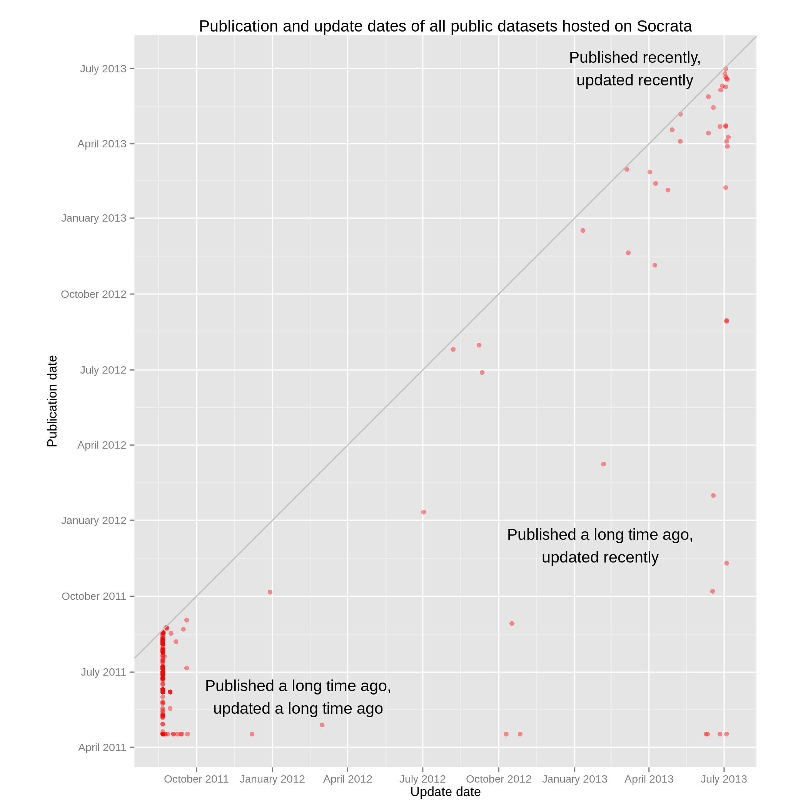{:.wide}

I didn't really look into why there were so many updates a long
time ago and so few in between, but I suspect it has something to do
with how all of these portals are managed by Socrata; there might have
been some change in software or in technical support practices that
would have impacted all of the portals.

### Which old datasets are still kept up-to-date?
Recall that the points at the bottom-right of the previous plot
correspond to old datasets that have been updated recently. Let's
look more closely at these.

I selected the datasets that were uploaded before 2013 and have
been updated during 2013; they are represented the ones contained
by the rectangle in the plot below.

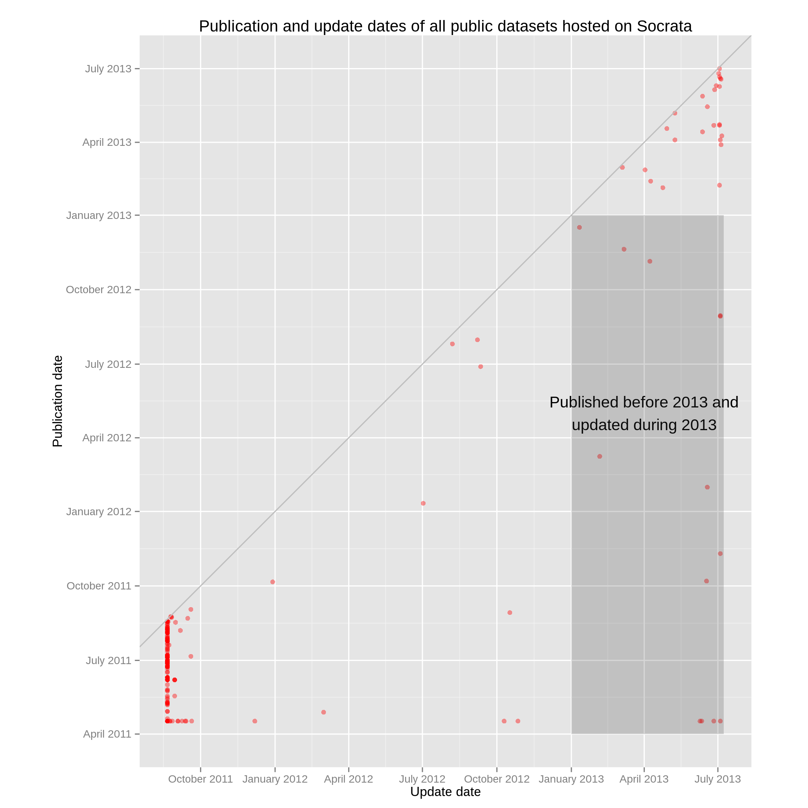{:.wide}

There are, in fact, only 13 such datasets,
and they're in 8 portals.

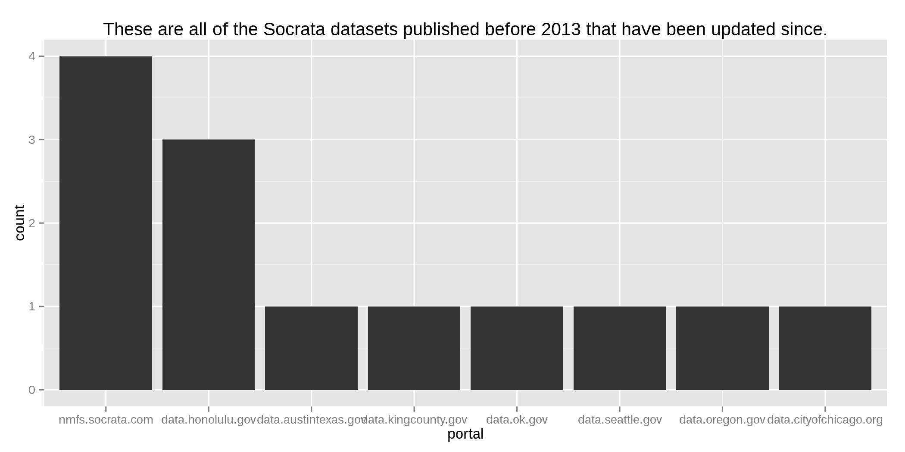{:.wide}

Here they are by url.

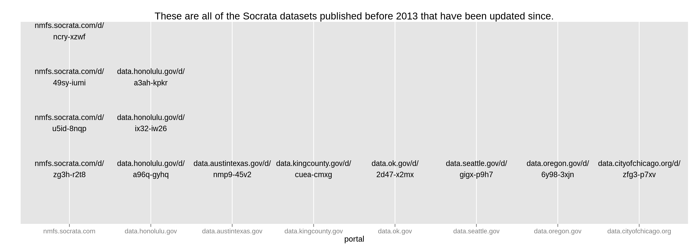{:.wide}

I was wondering whether anything was special about these. Maybe
they have a lot of records or get downloaded a lot? For both of
these statistics, I'm using the total across all [views](/!/socrata-genealogies#term-view) in the
[table/family](/!/socrata-genealogies#term-table), not just the value for that particular view.

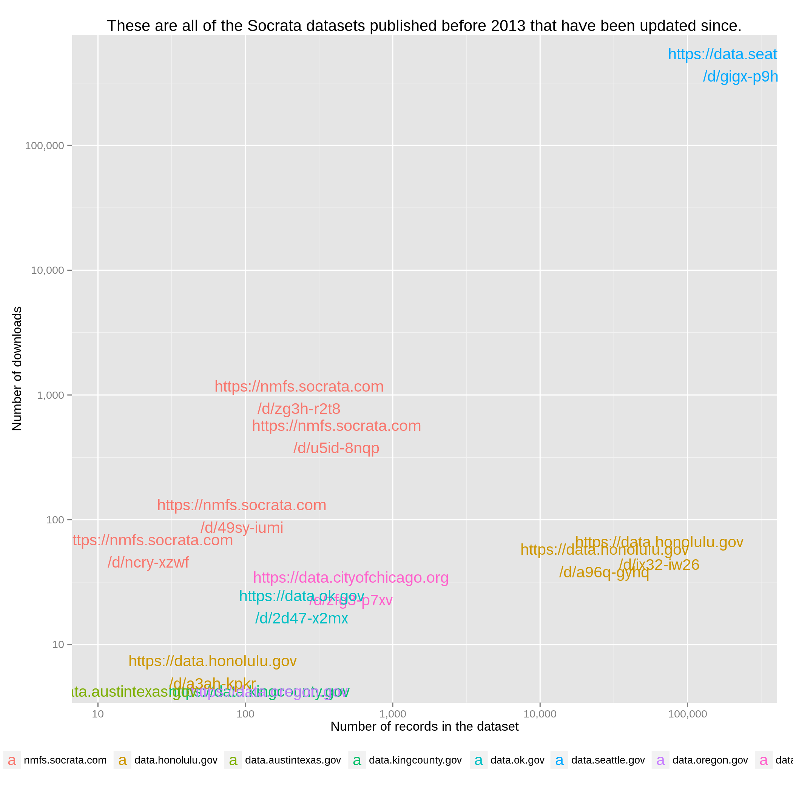{:.wide}

I didn't find anything special about these, but I didn't look very hard.
In case you want to give it a shot, here they are.

* `nmfs.socrata.com`: [Pre-Approval for Public Comments: NOAA Aquaculture Listening Sessions (2010)](https://nmfs.socrata.com/-/-/zg3h-r2t8)
* `nmfs.socrata.com`: [2011 Aquaculture Public Comments Form](https://nmfs.socrata.com/-/-/u5id-8nqp)
* `nmfs.socrata.com`: [Map of U.S. Department of Commerce Comments](https://nmfs.socrata.com/-/-/49sy-iumi)
* `nmfs.socrata.com`: [Photo Directory Example](https://nmfs.socrata.com/-/-/ncry-xzwf)
* `data.cityofchicago.org`: [Performance Metrics - Innovation & Technology - Site Availability](https://data.cityofchicago.org/-/-/zfg3-p7xv)
* `data.seattle.gov`: [Heatmap - Assault](https://data.seattle.gov/-/-/gigx-p9h7)
* `data.kingcounty.gov`: [Damage report form for primary residences](https://data.kingcounty.gov/-/-/cuea-cmxg)
* `data.ok.gov`: [Library Map](https://data.ok.gov/-/-/2d47-x2mx)
* `data.honolulu.gov`: [Crime Incidents](https://data.honolulu.gov/-/-/a96q-gyhq)
* `data.honolulu.gov`: [Traffic Incidents](https://data.honolulu.gov/-/-/ix32-iw26)
* `data.oregon.gov`: [GPL Documents](https://data.oregon.gov/-/-/6y98-3xjn)
* `data.honolulu.gov`: [Data Catalog](https://data.honolulu.gov/-/-/a3ah-kpkr)
* `data.austintexas.gov`: [Austin Green Infrastructure Inventory](https://data.austintexas.gov/-/-/nmp9-45v2)

Note well: These links go to arbitrary [views](/!/socrata-genealogies#term-view) on the particular
[table](/!/socrata-genealogies#term-table) that was updated; you'll have to follow a few links to get to
the original dataset.

### Updated datasets in context
Maybe there actually is something different about the sort of dataset that
gets updated.

It turns out that data that have been updated tend to get more downloads than
data that data that haven't. (This again uses the family/table totals rather
that the values for the particular views.)

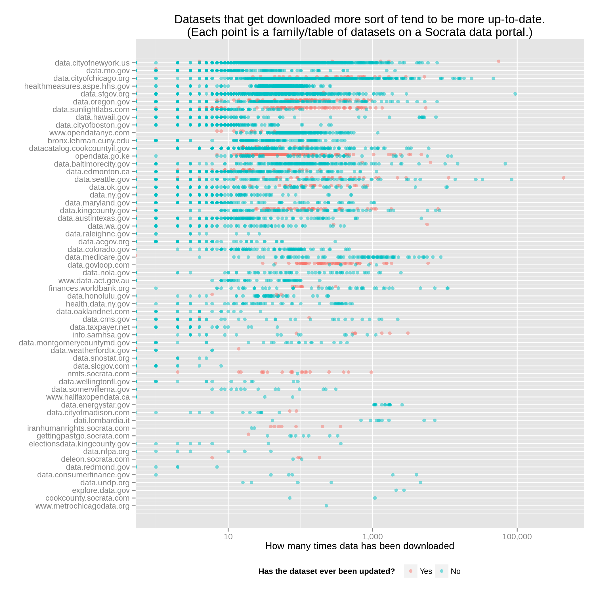{:.wide}

To give you some more concrete numbers, the median download count was
88 among data tables that got updated and 15
among data tables that didn't. A Wilcoxon rank sum test says that this
difference is significant (assuming that our 8426
datasets are a representative sample of some super-population, yadda yadda),
with a p-value far less than 0.001.

There is a similar relationship with number of records.
It turns out that data that have been updated tend to contain more records than
data that data that haven't.

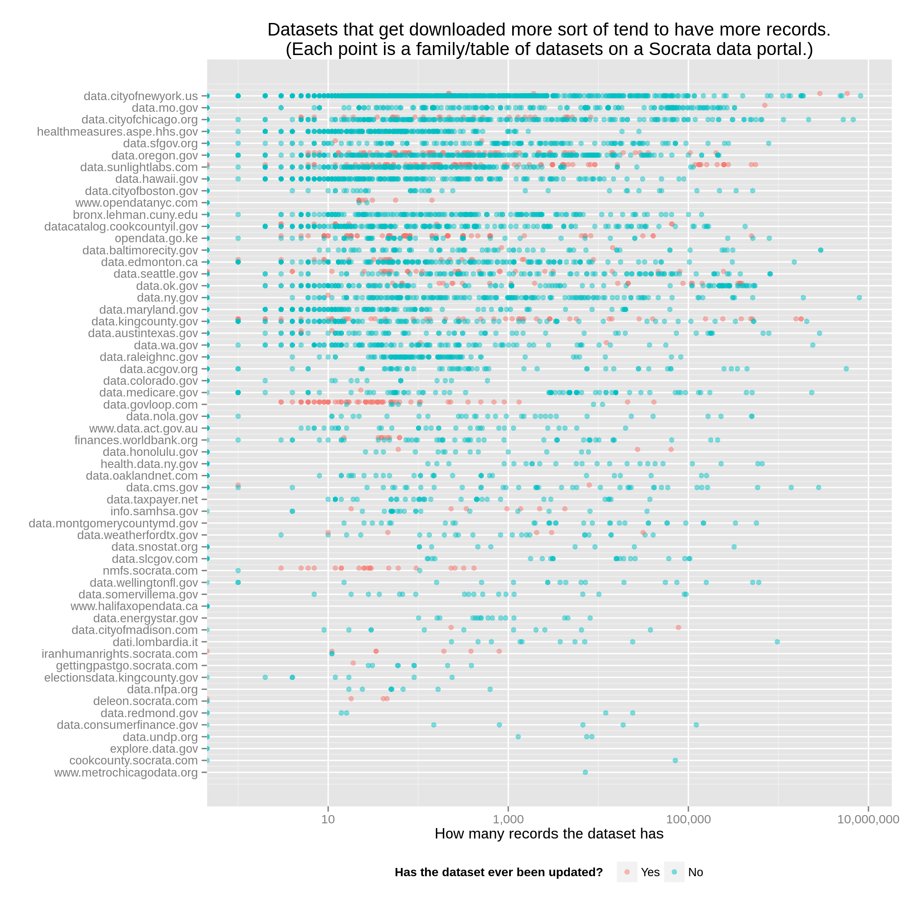{:.wide}

The median record count was
66 among data tables that got updated and 17
among data tables that didn't. A Wilcoxon rank sum test says that this
difference too is significant.

## A proposal for an updatedness measure
I thought I was going to find out which datasets are more up-to-date,
when they get updated, and so on, but I really just found that the data
are completely out-of-date.

Perhaps this says something about the need for more measures of the progress of
our open data efforts. We have a crude measure of the size of a data catalog
(the number of datasets it contains), so we can check that number and make sure
that it is increasing. But that's pretty much the only one we have, and there
are surely other things that are worth measuring. Nobody is measuring updatedness,
so how can we expect anyone to know that the data are out-of-date?
I think that we'll keep these portals more up-to-date if we come up with a
measure of their updateness that is easy to calculate and easy to understand.

Having found hardly any datasets that get updated, it's difficult for me to
say whether any measure I come up with will be all that helpful. But here's
my best guess as to the measure we should try to arrive at.

### Update cycles
As I explained above, different datasets have different update cycles
(daily, weekly, quarterly, yearly, &c.), and we can know what this cycle
is for most datasets. In many cases, we don't know exactly how often a
dataset will be updated, but we can be reasonably confident that it will
be within a certain range.

### What we do in treasury.io
We do something like this in [treasury.io](http://treasury.io).
The Financial Management Service (FMS) provides a daily treasury
statement. One statement is provided per work day, so we should
get updates approximately every day. In order to make sure that
our daily importer is working, we check every day that the
resulting dataset is up-to-date.

We know from experience that
the file doesn't always come out on time; that is, we might only recieve
today's statement two days from now. On the other hand, we've
rarely (never?) seen it take longer than that. Our daily updatedness
test checks how far behind the data are, and it sends us an email
if the data are
[more than three days behind](https://github.com/csvsoundsystem/federal-treasury-api/blob/master/tests/is_it_running.py#L47);
if this happens,
we'll suspect that it's something wrong with our importer rather
than just a late upload from the FMS.

### Possibilities
I brainstormed a bit with [Cris Cristina](https://twitter.com/criscristina)
about how we could present this sort of information inside of a data catalog
website to help people maintain it.

If we indicate how often each dataset needs to
be updated, the data portal software could make us aware of which datasets
need updating. Aside from comparing datasets to datasets, we could compare
other groupings, like departments.

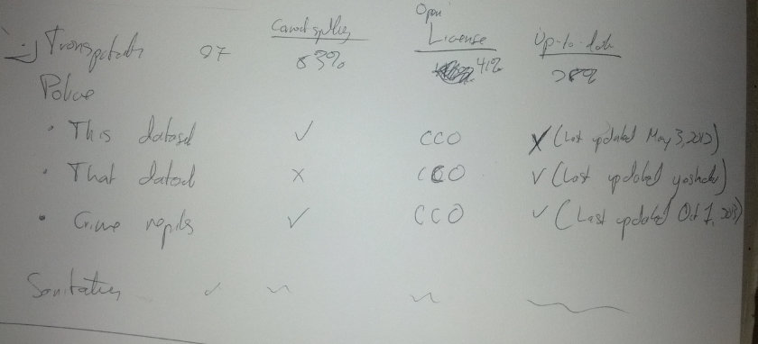{:.wide}

Rather than just presenting a bunch of raw statistics as in the previous
sketch, we could aggregate these so that you can look at just one thing
to get a quick idea of whether a dataset or group of datasets is in good
shape. For example, we could have icons for the general health of a dataset:
Sad face for bad, smily face for good, and big smiley face for awesome.

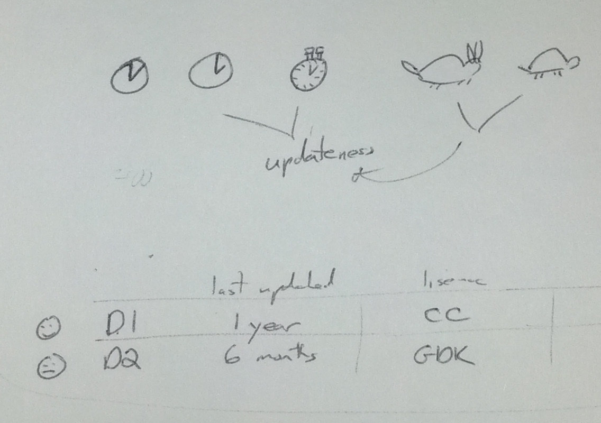{:.wide}

We could present much more detail about the updates to a dataset.
Rather than simply saying the date at which it was last updated, we could
have a timeline of the updates, and we could let you look at old versions
of the dataset. (Actually, it's super important to have access to old
versions, but I won't get into that now.) Perhaps you could put multiple
datasets or groups of datasets on this timeline and compare them.

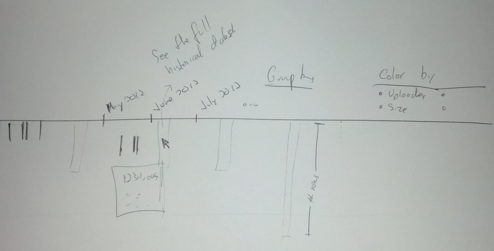{:.wide}

Also, we can present specific action items. I don't know exactly what
these would be, but they might include datasets that are out-of-date
and datasets that will soon be out-of-date. Imagine the following table
being presented in some administration page in a data catalog.

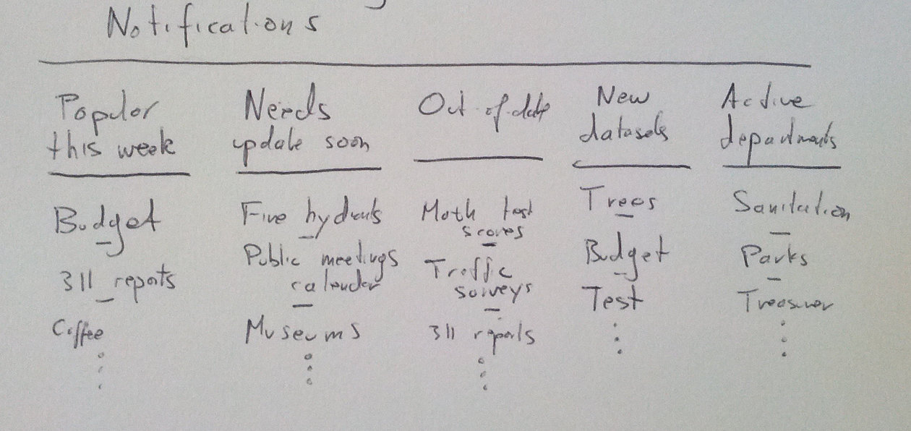{:.wide}

## You get what you measure
I thought this article was going to be about which datasets are more up-to-date,
when they get updated, and so on, but I really just found that the data
are completely out-of-date.

The phrase "You get what you measure." (or any of its variants) seems to
describe our present situation quite well.
We say a lot of things about how people should be doing open data,
and people count [some of these things once-in-a-while](http://census.okfn.org/).
Aside from efforts like the Open Data Census, we don't really do anything.

### Current metrics
Well actually we sort of do at least count the number of datasets. There are
[problems](http://technickle.nicklin.info/post/58169276432/accurately-counting-socrata-datasets),
with this metric, but it does vaguely point us in the right direction.

### Other metrics
We measure the number of datasets, and we get more datasets. There are a bunch
of other things that we want. We don't measure them, and we don't get them.
As you saw above, we don't measure updatedness, and we don't get up-to-date data.
Similarly, we don't measure [license-free-ness](http://theunitedstates.io/licensing/),
and we [don't get license-free data](/!/open-data-licensing/). Also, we don't
check whether different datasets could be combined into one, and we get a lot
of situations, at least in [New York City](http://appgen.me/audit/report) and
[Missouri](/!/missouri-data-licensing/), several datasets could be combined
into one.

### Data-driven open data
Considering that we're doing open *data*, it's only reasonable that we make
data-driven decisions about our open data efforts. We obviously need data
about open data to make these data-driven decisions, so we had better start
measuring the all of these things that we care about.
