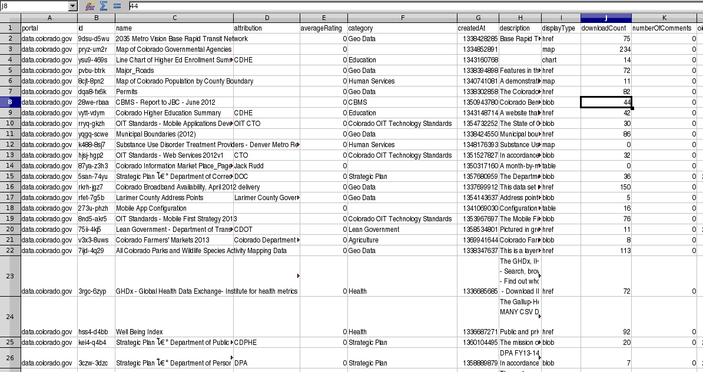

<!-- For the winter issue of Socrata's magazine -->
How can we tell whether our open data efforts are working,
and how do we make decisions about our open data strategy?
Maybe we can use data to drive some of these decisions.

Our open data efforts have advanced enough that we have lots
of data about how people publish and consume open data. With
a slight shift in our way of thinking, we can use these data
about open data to make better decisions about open data.

## Data set as data point
A collection of datasets could be treated as a dataset
of datasets, with a record for each particular dataset.
When datasets are points within a super-dataset,
we can naturally do a bunch of standard data things.
For example, we can calculate statistics like
[how many datasets have licenses](/!/open-data-licensing),
we can model networks of the
[use of the data](http://www.chriswhong.com/nycopendata/),
and we can look for [out-lying data points](/!/socrata-users/).

## Metadata as data
The term "metadata" is sort of funny to me.
When people talk about "metadata", they're
usually thinking of stuff that you'd use for cataloging
and framing the data rather than stuff on which you would do
"data analysis". That is, metadata are things that you would use
for styling webpages, and searching datasets,
but you would never put them in a spreadsheet.

It doesn't have to be this way.
If datasets are data points in a larger table, the metadata
about the included datasets correspond to the data in our
super-dataset.

When we see datasets as data points, we see metadata as data.
Inside of our collection of datasets, we have a record for each
sub-dataset, and this record is composed of metadata about that
sub-dataset. Metadata isn't any different from any other data.

## Why this matters: Data-driven open data
Ironically, our open data
initiatives haven't been particularly data-driven. I've seen a
[lot](http://beyondtransparency.org/)
[of](http://www.socrata.com/case-studies/)
[case](http://ckan.org/case-studies/)
[studies](http://theodi.org/case-studies)
about how to open government data, but these are based strongly
on personal experience about opening data and not on
more on precise, quantitative data about opening data.

I've seen [comparatively little](/open-data) work that uses data
about open data efforts to come up with guidelines or
decisions about the opening of data. Similarly, no data catalog
software I've seen implements standard
data-driven features like randomized experiments (A/B testing)
and recommender systems.

By releasing lots of open data, we are also
producing data about our release of data.
We could use these data to make our open data initiatives more data-driven.
That is, we could measure people use the data that we are putting up;
we could figure out who tends to use which datasets and which formats
are best for different people; we could help people find datasets that
they wouldn't have thought to search for;
and we automate some processes for checking the
quality of datasets or for correcting them.
This is what it would mean for our open data efforts to be driven by data.

Our open data efforts aren't data-driven right now,
but it shouldn't be hard to change that. Most data catalogs are already
collecting some sort of data about how people use their datasets, and we
can study these existing data to drive our decisions about open data.
We're technically pretty close; we mostly need a shift in thinking.

## Conclusion
Open data portals make it easier to organize our data for publication,
but they don't yet give us the
bigger picture of what's going on, what's working, and what isn't.
We can't really tell what sorts of data are available, who's using them,
what impact they're having, or whether they are of good quality.

By collecting data about the use of open data, we can get a
better picture of what is going on in open data and make data-driven
decisions about open data.
Let's start thinking of datasets as datapoints so that we can use
data about data to drive our open data initatives.
