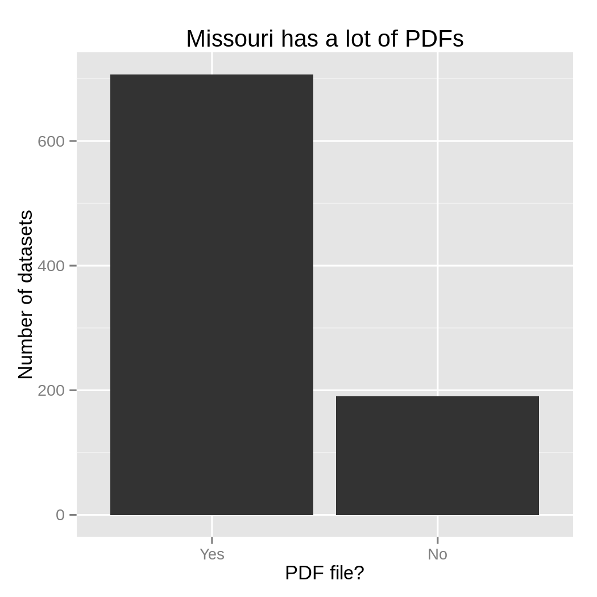
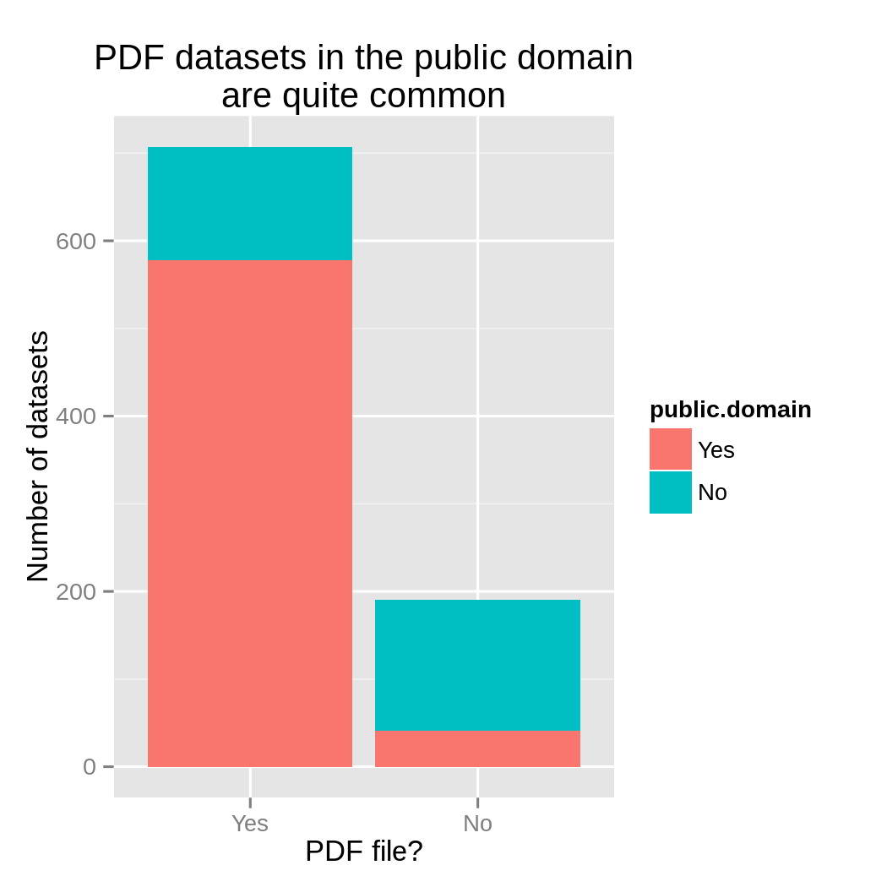
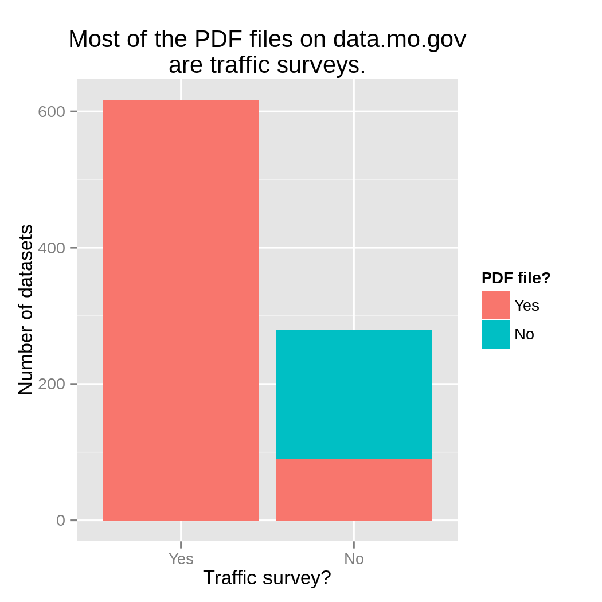
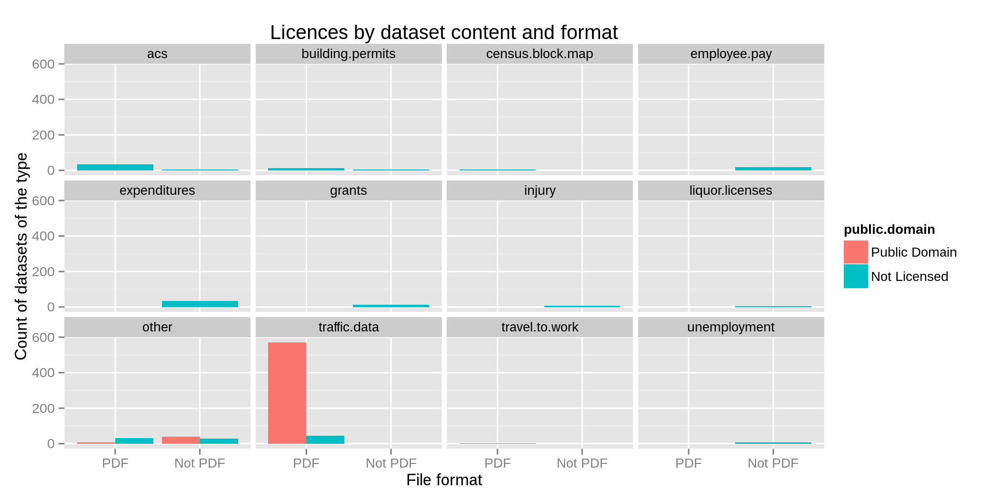
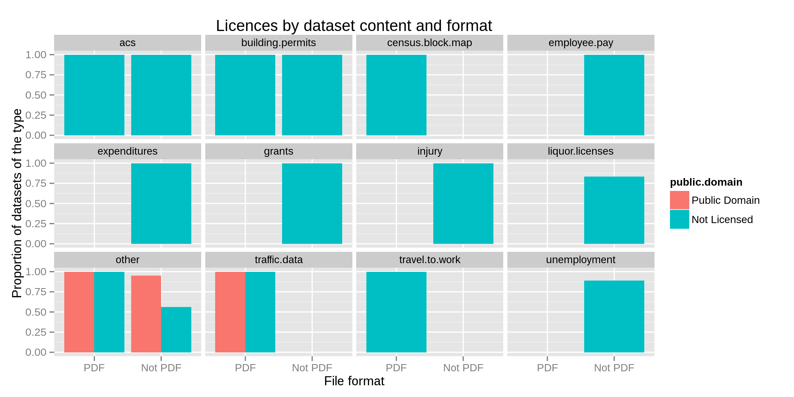
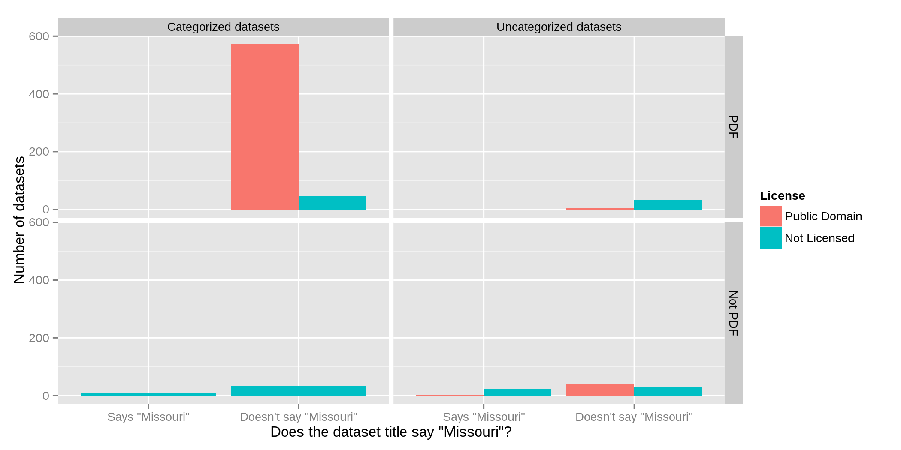
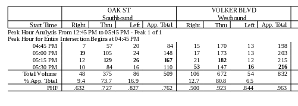
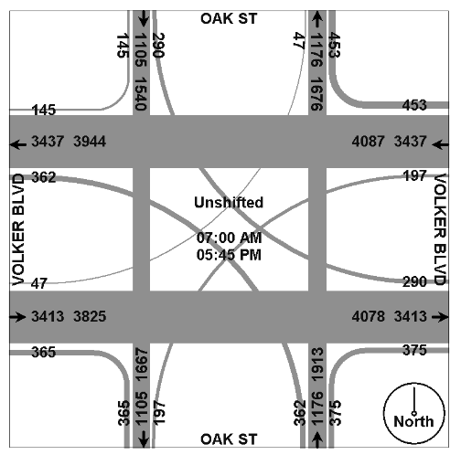

<!-- https://github.com/tlevine/socrata-catalog/ -->

## Which specific datasets have license metadata?
I recently [found](/!/open-data-licensing) that most datasets on the
open data portals I've been looking at don't have open licenses or
public domain dedications.

But a lot of datasets do have licenses or public domain dedication, and
licensing this varies within portals. I wanted to see which datasets get
have some sort of licensing metadata and which ones
don't.
Or this is what I thought I wanted;
I started looking at this on one data portal, and I
wound up going down a slightly different rabbit hole.

## The Missouri Data Portal
I looked at the Missouri Data Portal,
[data.mo.gov](https://data.mo.gov). Here's why I chose it.

1. To make it easy to download the license information, I wanted to use
    [Socrata's data.json endpoint](/!/socrata-formats/).
    This endpoint only returns up to 1000
    datasets, so I needed a portal with no more than 1000 datasets.
    Missouri's portal has 897 datasets.
2. I think I've figured out how to
    [deduplicate federated datasets](/!/socrata-deduplicate),
    but I didn't want to deal with that.
    The Missouri portal federates only the
    [Kansas City data portal](https://data.kcmo.org),
    so no federal data should be duplicated in this portal.
3. Missouri has [a lot of PDF files](/!/socrata-formats),
    so I thought there might be something in there that would be more
    original than mere facts and covered under copyright; this would
    make a license more important.

I wound up categorizing the datasets quite a bit more than I originally
intended, so now I know a lot about the sorts of data on the portal.

## Licenses
Most datasets (619) on the
Missouri portal are listed as in the public domain.

 

The rest (278 datasets) have nothing in the "license" metadata field.

## Formats
Proportionately more PDF files are public domain.

 

I noticed a bunch of PDF files with names like these.

* [  SWTWESTP EW 5 HR 2009 A PCW](https://data.mo.gov/d/nfur-xwk2)
* [  SHAWNEEWARD 5 HR 2009 A TMC](https://data.mo.gov/d/5zv3-u47y)
* [PROSPECTSWOPE 5 HR 2009 A TMC](https://data.mo.gov/d/i2ip-cykb)
* [    OAKVOLKER 5 HR 2009 A TMC](https://data.mo.gov/d/6gz3-267n)
* [         OAK9 5 HR 2009 A TMC](https://data.mo.gov/d/yjr5-e96s)
* [        OAK12 5 HR 2009 A TMC](https://data.mo.gov/d/sqpd-738e)
* [       MAIN13 5 HR 2009 A TMC](https://data.mo.gov/d/9ddu-xy68)
* [        MAIN8 5 HR 2009 A TMC](https://data.mo.gov/d/eyii-3nuq)
* [    MADISON43 5 HR 2009 A TMC](https://data.mo.gov/d/n2kq-rg69)

These are all traffic surveys, and it turns out that they account for
almost all of the PDF files on the portal.

 

## Dataset kinds
A lot of PDF files had public domain licenses, but it's not clear-cut,
so I looked more specifically at what datasets are on the portal. The only
field in the dataset that really told me much about this was the
`title` field, which is what I used above to find the traffic surveys.
I kept going with that for the other datasets.

I just used a bunch of reasonably simple
[string matches](https://github.com/tlevine/socrata-catalog/blob/master/src/missouri.license.r).
For example, a bunch of datasets came from the American Community Survey,
and these said "ACS" or "American Community Survey" in the title.
Data from the federal said "Census". And liquor license data said either
"Liquor" or "Alcohol".

In the plot below, I map out the different kinds of datasets, whether
they are PDF files and whether they have public domain licenses.

{:.wide}

Here's the same plot but with proportions instead of counts. This makes
the small bars more apparent.

{:.wide}

I didn't manage to get it much more precise than this, but I did find that
the uncategorized datasets containing the word "Missouri" tended not to
have a license.

{:.wide}

## The merits of explicitly stating that a dataset is in the public domain
A few years ago, a few open government advocates came up with
[eight principles of open government data](http://www.opengovdata.org/home/8principles).
Among these is the principle that the data be free of license.

> Data are not subject to any copyright, patent, trademark or trade secret regulation. Reasonable privacy, security and privilege restrictions may be allowed as governed by other statutes.

In some cases, government data already meet this criterion by default.
As the /unitedstates project [explains](http://theunitedstates.io/licensing/),

> Copyright applies to some government data but not others (and never to U.S. law). When it applies, it must be waived by the agency (or owner if not the agency) for the data to meet the "license-free" principle. In this case, data is dedicated to the public domain, not licensed.

In some cases, copyright does not apply at all because it is a government
product. In other cases, it might not apply because the data might be
facts, which can't be copyrighted. However, it can be quite difficult for
a consumer of data to determine whether copyright applies to a dataset.
Thus, it makes sense to be explicit. As the /unitedstates project explains,

> Data is more valuable when its copyright status is clear through an explicit statement.

## The importance of an explicit statement for traffic surveys
Traffic surveys are a perfect example of where you need to be explicit.

### Are traffic surveys facts?
In some cases, copyright might not apply to a dataset simply because the
dataset isn't sufficiently original; if the dataset contains only facts,
copyright won't apply. This might be okay for parts of the traffic survey
files. Here's part of a page from
[this traffic survey](https://data.mo.gov/Traffic/OAKVOLKER-5-HR-2009-A-TMC/6gz3-267n?).

{:.wide}

The page above just has a table of numbers. This might count as facts, so
it is possible that it would not be original enough for copyright to apply.
This next page is a bit fancier.

While this diagram contains facts (counts of cars taking different routes
through the intersection), it also contains a fancy drawing of the intersection.
The numbers are facts, and those should be free from copyright, but does
copyright apply to the diagram?

### Are traffic surveys government works?
Copyright protection does not apply to government works, but it could apply
to works produced by contractors. From the file on the data portal website,
we can't tell whether it was produced entirely by government workers, so
we can't use this law for assurance that the data are free of a license.

### Yay for explicit statement
Given the potential ambiguities above, it is quite important that these traffic
survey files have explicit notices where it's possible. I commend the state of
Missouri for providing such notices.

## What I really learned from this
I used this analysis to provide an example of a situation where it is
important to have an explicit statement about the license of a dataset
or about the absence of license. Beyond that, this analysis doesn't
really tell us much about licensing.

On the other hand, I feel like I've come up with a reasonably complete
grouping of the datasets in the Missouri data portal.

In the more granular groupings, I think
I've arrived at datasets that could naturally be combined into one data
table. This is even true for the traffic survey data; each particular PDF
traffic survey report could be converted into a single row in a data table.

I arrived at these groupings pretty much entirely by looking at the tables,
but the groupings seem to relate to trends in other variables, like the
license field of the dataset. I've been wanting to come up with methods for
relating datasets to each other. I thought these methods would need to be
[somewhat involved](/!/open-data-plans#better-search-and-linked-data), but
maybe we can start with something simpler.

## Future study
In the Missouri portal, I used only title to group datasets; I didn't
look at the long-form description, the author or the schema. There were
pretty clear-cut divisions between titles, but I would like to see how
reasonable this approach really is; I want to whether groups of similarly
named datasets tend to have similar schemas.
