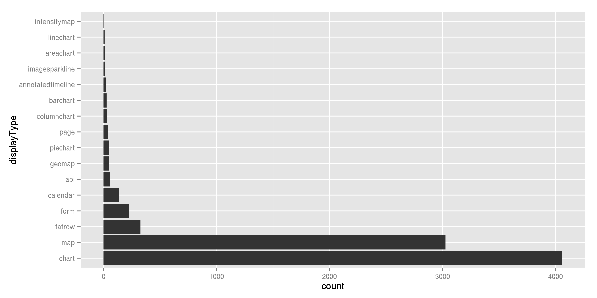
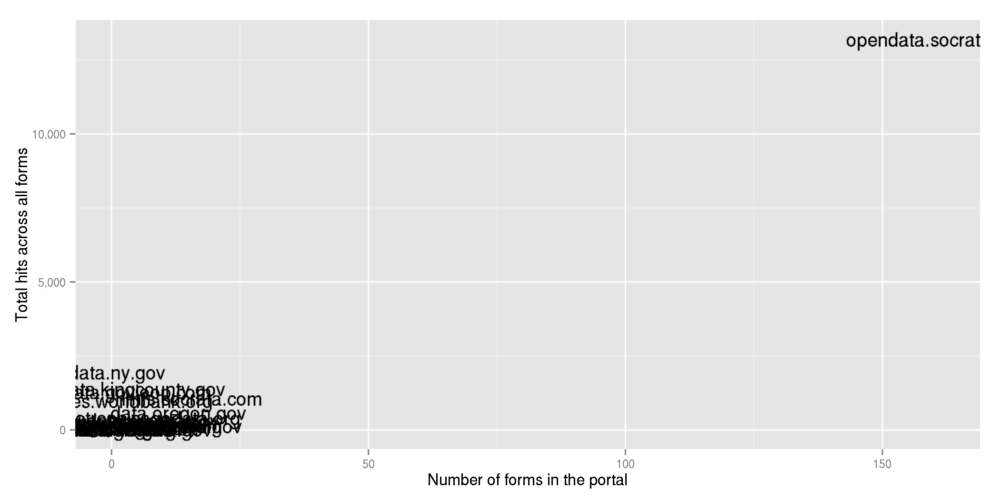
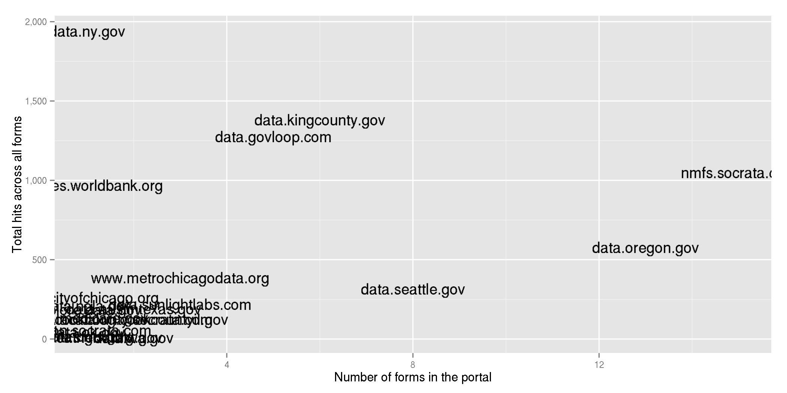

The first of Sunlight Foundation's 32
[Open Data Policy Guidelines](http://sunlightfoundation.com/opendataguidelines/)
is to "Set The Default To Open".

> Most public records systems, including the Freedom of Information Act itself, are systems of reactive disclosure -- meaning that a question has to be asked before an answer given; public information requested, before it is disclosed.
>
> Proactive disclosure is the opposite. Proactive disclosure is the release of public information -- online and in open formats (see Provisions 8 and 9) -- before it is asked for. This is no simple task, but, in a way, it’s what all "open data" is aiming to accomplish. Setting the default to open means that the government and parties acting on its behalf will make public information available proactively and that they’ll put that information within reach of the public (online), with low to no barriers for its reuse and consumption. Open formats may help us maximize on the value we can extract from certain kinds of public data today, but to ensure that data publishing is sustained and, in fact, made easier over time, we need to reset the default for how data is released and disclosed.
>
> Setting the default to open is about living up to the potential of our information, about looking at comprehensive information management, and making determinations that fall in the public interest. It’s about purely practical government improvements, too, and taking steps that not only keep government systems up to date, but ensure that we have the foresight to survive changes in technology that we can’t predict.
>
> Usually, for information to be defined as public, important restrictions have already been applied. Therefore, policy language can be used to outline that "all public data and information must be considered open and accessible." Whether listed as part of a statement of intent (as Austin, Texas does; a concept explored more in Provision 21), as direction to a new oversight authority (Provision 22), or as the underlying aim of new data guidance (Provision 20), openness by default is a critical tool in crafting open data policies that are both ambitious and sustainable.

After discovering something on Socrata data portals, I remarked that
software can encourage this practice of making data open by default.

## Types of visualizations on Socrata portals
I previously [downloaded](/!/socrata-summary) metadata about all of
the datasets on all of the Socrata portals, and I continue to find
interesting things in these data. Let's look at the different types
of visualizations ("[views](/!/socrata-genealogies#term-view)") on the portals.

{:.wide}

(I excluded tables and external links from the above plot.)

I was somewhat surprised to see forms and calendars in the portals.
I've [previously](/!/open-calendars) written about why I think Socrata calendars are cool,
so now I'm just going to talk about forms.

### Popularity of forms
Much of the goal of these portals is to open up existing government data, but
[forms](https://data.wa.gov/Economics/Broadband-Project-Data-Entry/38rz-krmg?) provide a way for citizens to create data.
lets you enter data. A bunch of people have implemented them, but none seems to get accessed much.

{:.wide}

I'm gonna remove opendata.socrata.com to make that easier to read.

{:.wide}

### Cool Forms
I hadn't seen [nmfs.socrata.com](https://nmfs.socrata.com) before.
It belongs to the [National Oceanic and Atmospheric Administration Fisheries Service](http://www.nmfs.noaa.gov),
which apparently used [a Socrata form](https://nmfs.socrata.com/Government/2011-Aquaculture-Public-Comments-Form/u5id-8nqp) to power a
[policy comments website](http://www.nmfs.noaa.gov/aquaculture/policy2/).

New York made a form for [feedback on the portal](https://data.ny.gov/dataset/Give-Feedback/fq3e-q75i?).

World Bank Open Finances made a
[form](https://finances.worldbank.org/dataset/Global-Open-Data-Calendar-Entry-Form/qdbh-rfd3?)
that populates an
[open data events calendar](https://finances.worldbank.org/dataset/Global-Open-Data-Calendar/g4sx-dwxc).

## Relevance to software
The three examples of Socrata forms show us how we can turn user input on a website into
open data automatically. Using a Socrata form to compose a dataset is quite inconvenient,
unreliable, limited, and other bad things, but I see this as a nice example of how software
can encourage that data be open by default. I previously
[hinted](http://thomaslevine.com/!/socrata-calendars#opening-data-at-their-sources) at this,
but now I have some more ideas as to how software can encourage that data be open by default.

### Standard formats
If you run any sort of involved website, you are probably already storing data in some
reasonably standard way, and you probably could send it to a data portal somewhat easily.

#### Opening user-entered application data on your website's database
One advantage of the Socrata form approach is that the data go automatically into a
reasonably standard format (a Socrata dataset). It happens that most websites work this
way, except that the standard format is something like MySQL.

A notable difference is that database software generally doesn't concern itself as
strongly with opening the data. Many websites have HTTP APIs, but few will give out
direct access to their databases. And even if they did this, it wouldn't provide the
various cataloging and format conversion features that people expect of data portals.
This is why we make data portals that import from these databases and provide all the
fancy features.

If you have a website that stores information in a standard database (like MySQL) and
you separate the private information from the public information, you already can quite
safely and easily have it sent to a data portal.

If you are making a new website and care about open data, try to choose a common
database for which integrations will already exist.

#### Storing user-entered application data directly in a data portal
If you have a simple website, maybe you don't have to run your own database
and write your own web APIs. You could store the data directly in the data portal
and query it from the data portal. If this is powerful enough for you, it
simplifies your database management, and it naturally makes your data open by default.

#### Opening data from some other software
Every time you save something in a computer program, you are creating some sort
of data, just like when you fill out a form on an open data portal.
If you have purchased a software service, you might not have access to the
underlying database, but you can still send it to a data portal.

When a lot of people use services like these, the services' protocols naturally
become standard, so it becomes worthwhile to write tools that pull data from these
services into some standard place like a data portal. Using a standard service
with lots of users and integrations should make it easier for you to get the data
into a data portal.

### Explicit separation between public and private data
With a questionnaire, you might be able to just say that all of the responses are
private or that all are public. With other datasets, you might be able to say that
certain fields are private and others are public; in a database of employees, name
and salary can be public, but Social Security number can't.

Things aren't always this simple. With something like project management software,
some records/documents should be private and others should be public. Many of the
entries in project management software are probably safe for public disclosure,
but there might be some private information; for example, I've put passwords inside
calendar entries and issue tracker tickets.

Project management software, email clients, calendars, web browsers and image
editors all contain rich data that can help people understand how government
and other organizations work, so we should find ways of separating the public
information and opening that. Software can help with this.

Separate public information and private information from the beginning, and it
should be easier to open the data that is behind all of these applications.
The user interface can expose the separation between public and private and
encourage that information public by default.

## Things to think about
Think about what programs you and others are already using, especially if you
don't think of them as data programs, and think about how you can open the data.
A program's data will be easy to open if the program already stores its data in
a standard format on the internet and it clearly separates public data from
private data.

Also think about how we can make software that follows the policy guideline of
open data by default. I've proposed that clear separations between public and
private data is part of this and that standard storage methods is another, but
there are probably other relevant features.
