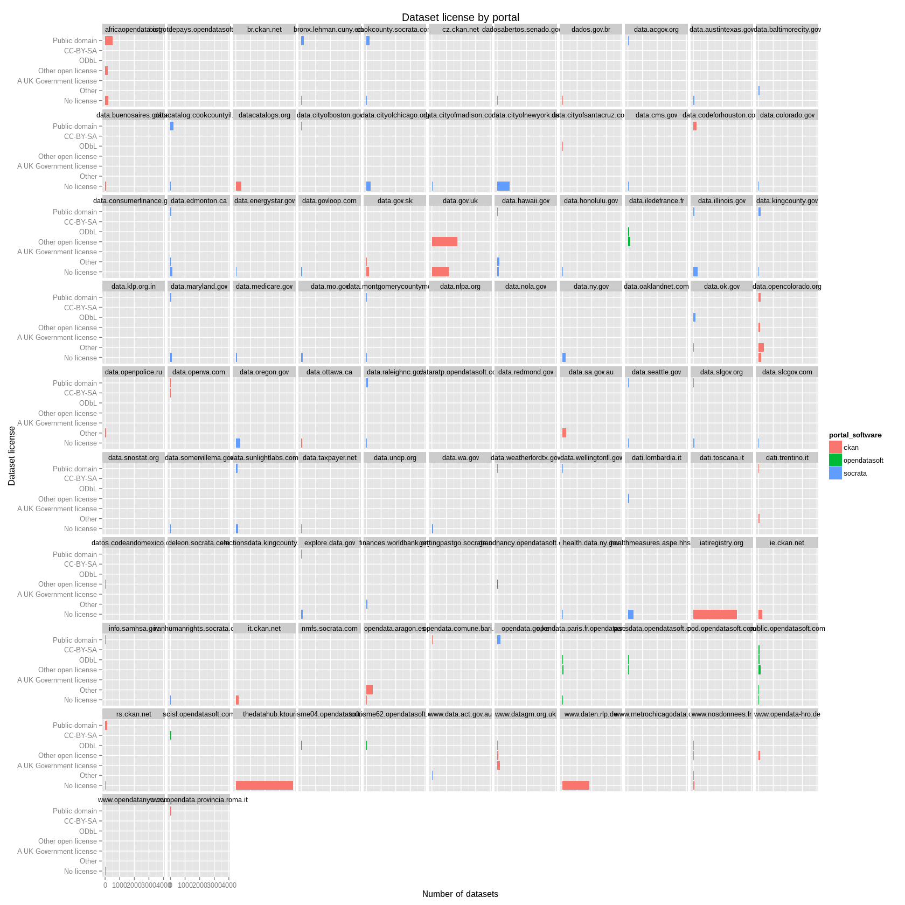

Open data are "open", but do their licenses reflect that?
I downloaded all of the metadata files from 102 open data
portals hosted on CKAN, Socrata and OpenDataSoft. Each of
these data portal softwares has a metadata field for the
license of each particular dataset. I looked at whether
those were used and at what the licenses were.

## The portals
I ignored these portals because they aren't associated with specific governments.

* datahub.io
* datastore.opendatasoft.com
* opendata.socrata.com

## Reducing license names
I then made a [rough mapping](https://github.com/tlevine/open-data-download/blob/3115221f193e08d2e83eb753e8154ea9593fec55/query-license.py#L5)
between the free-form names of the
licenses and some standard licenses. I didn't test this
very well, so there are probably some errors, but I think
these results are informative regardless.

## Do people specify a license at all?
In doing this, I distinguished between whether a license was
specified. Here's a histogram of the proportion of datasets
with licenses, by portal. Portals on the right of the graph
specified licenses for most of their datasets, and portals on
the left specified licenses for few of their datasets.

I was actually slightly surprised that people had set licenses
at all.

## Which licenses?
Then I looked at what these licenses (after I reduced them to
a few standard names) were.

As we saw in the previous plot, most datasets don't specify a
license. They might be specified elsewhere.
While many datasets have standard open licenses, the licenses

## How do portals differ?
I looked at the variation in this across portal.

`publicdata.eu` is pretty big. Like the three portals that I removed
at the beginning, it isn't associated with a particular government,
so I removed it.

## Do people put licenses elsewhere?
I looked around the websites for a few portals to see whether they
grant a license somewhere else in the website. Let's group them into
two groups: Portals that specify lots of open licenses and portals
that don't specify very many license

### Lots of open licenses
Everything's public domain on the
[data.codeforhouston.com](http://data.codeforhouston.com/dataset/city-of-houston-funds),
and it says so in the individual datasets, but there's no site-wide
license page that explains this.

### Few licenses

#### Oregon
The closest thing I could find to a license on Oregon's data portal was
[this](http://www.oregon.gov/Pages/datamoderation.aspx).

> **Source Data**
> Applications using data supplied by this site must include the following disclaimers on their sites:
>
> > "The data made available here has been modified for use from its original source, which is the State of Oregon. THE STATE OF OREGON MAKES NO REPRESENTATIONS OR WARRANTY AS TO THE COMPLETENESS, ACCURACY, TIMELINESS, OR CONTENT OF ANY DATA MADE AVAILABLE THROUGH THIS SITE. THE STATE OF OREGON EXPRESSLY DISCLAIMS ALL WARRANTIES, WHETHER EXPRESS OR IMPLIED, INCLUDING ANY IMPLIED WARRANTIES OF MERCHANTABILITY, OR FITNESS FOR A PARTICULAR PURPOSE. The data is subject to change as modifications and updates are complete. It is understood that the information contained in the Web feed is being used at one's own risk."

I suppose that implies that it is okay to copy the data, modify
the data and supply your application with it, but is this enough
to give you the right to do that?

#### Italy
Few datasets on [it.ckan.net](http://it.ckan.net) specify licenses,
but it says in two places
that most everything is released under the Open Database License.
The ["Meta" section](http://it.ckan.net/#credits) of the footer says this.

> © 2012 Open Knowledge Foundation Disponibile nei termini della Open Database License

And the [about/informazioni](http://it.ckan.net/about) page says this.

> Most of the data indexed at CKAN Italia is openly licensed, meaning anyone is free to use or re-use it however they like. Perhaps someone will take that nice dataset of a city's public art that you found, and add it to a tourist map - or even make a neat app for your phone that'll help you find artworks when you visit the city. Open data means more enterprise, collaborative science and transparent government. You can read more about open data in the Open Data Handbook.

Perhaps this implies that everything is licensed under ODbL unless
something specifies otherwise?

## Conclusions
By law, products of the United States federal government are public domain,
so I'd love to think that everything on at least `data.gov` is in the public domain.

http://www.whitehouse.gov/copyright

http://en.wikipedia.org/wiki/Copyright_status_of_work_by_the_U.S._government#State.2C_territorial_and_local_governments

like [CC0](http://creativecommons.org/publicdomain/zero/1.0/)
http://opendatacommons.org/licenses/odbl/summary/

http://data.sncf.com/feedbacks/108009-open-data-open-data

