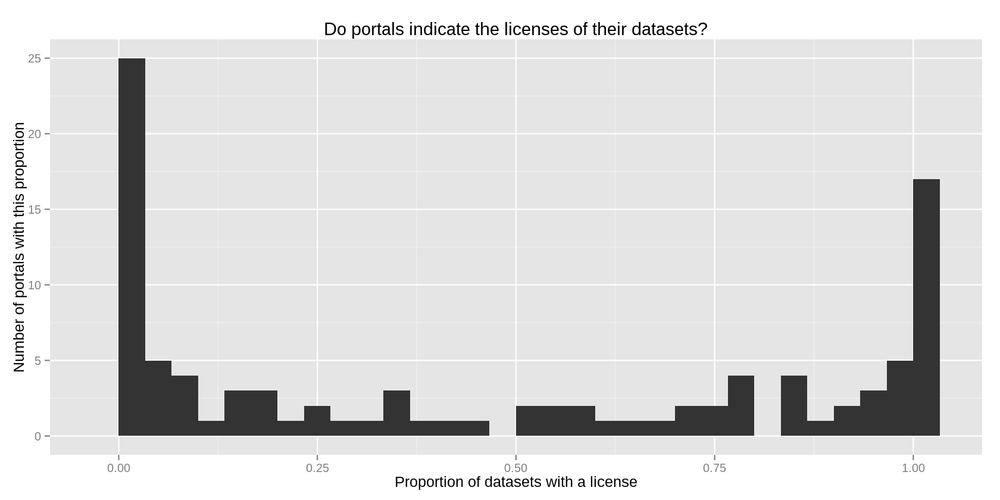
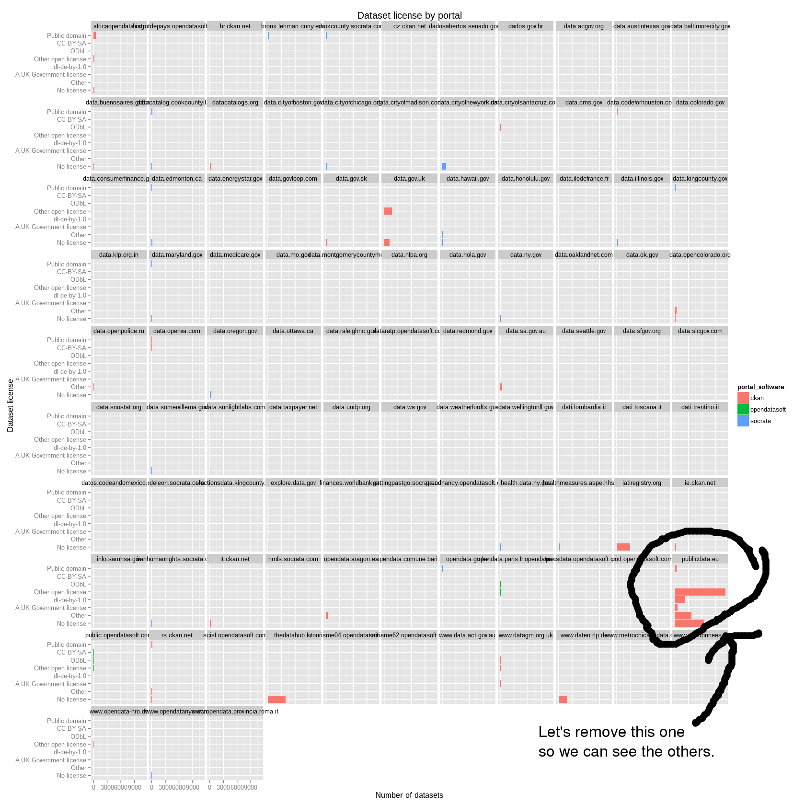

Open data are "open", but do their licenses reflect that?
I downloaded all of the metadata files from 102 open data
portals hosted on CKAN, Socrata and OpenDataSoft. Each of
these data portal softwares has a metadata field for the
license of each particular dataset. I looked at whether
those were used and at what the licenses were.

## The portals
I ignored these portals because they aren't associated with specific governments.

* datahub.io
* datastore.opendatasoft.com
* opendata.socrata.com

## Reducing license names
I then made a [rough mapping](https://github.com/tlevine/open-data-download/blob/3115221f193e08d2e83eb753e8154ea9593fec55/query-license.py#L5)
between the free-form names of the
licenses and some standard licenses. I didn't test this
very well, so there are probably some errors, but I think
these results are informative regardless.

## Do people specify a license at all?
In doing this, I distinguished between whether a license was
specified. Here's a histogram of the proportion of datasets
with licenses, by portal. Portals on the right of the graph
specified licenses for most of their datasets, and portals on
the left specified licenses for few of their datasets.

I was actually slightly surprised that people had set licenses
at all.

## Which licenses?
Then I looked at what these licenses (after I reduced them to
a few standard names) were.

As we saw in the previous plot, most datasets don't specify a
license. They might be specified elsewhere.
While many datasets have standard open licenses, the licenses

## How do portals differ?
I looked at the variation in this across portal.

`publicdata.eu` is pretty big. Like the three portals that I removed
at the beginning, it isn't associated with a particular government,
so I removed it.

## Conclusions
As you see, it seems like each portal chooses one or two of the
standard licenses for the bulk of its datasets. But a substantial
portion of datasets have no license field or have no specified
license. What's going on here? Let's hope that an open license is
specified elsewhere.

like [CC0](http://creativecommons.org/publicdomain/zero/1.0/)
http://opendatacommons.org/licenses/odbl/summary/

http://data.sncf.com/feedbacks/108009-open-data-open-data

