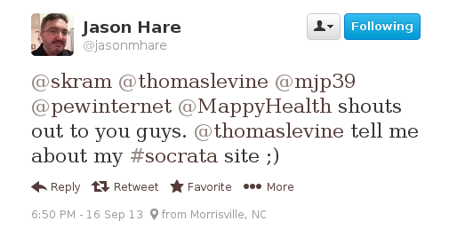

I've brief suspended my open data studies to prepare
some things for [Zipfian Academy](http://zipfianacademy)'s
first twelve-week course, but I've been accumulating
lots of ideas of things you could do with data about
open data. I plan on doing a lot of them, but I
probably can't do all, so you should take one of these
ideas and do something awesome.

## What's in the portals?

### Socrata v GitHub
GitHub has a pretty CSV table visualizer thingy that supports small CSV files.
What proportion of Socrata tables are small enough to be supported by GitHub?

### Compare official datasets to derived datasets
The `data.json` file contains only the official datasets and the federated datasets.
The search of the site contains all of the derived views. Let's compare these two to
see what sort of data gets studied within the data portal.

### Openness by department and city
Some departments are more resistant to opening data. I'm told that the departments
that are more political tend to be more resistant to opening data. I want to use
open data release as an indicator of politicalness of a department, and I want to
see how open data release (politicalness) of equivalent departments (like education)
vary by city.

## Better search and linked data

Let's find links between datasets. Ideally, let's get a bunch of datasets with rich
linked data about them and try to predict the linkages. Specific things I want to try

* Find datasets that can be joined on common variables (columns).
* Determine the statistical unit (meaning of a row) of a dataset.
* Aggregate datasets so that they can be joined.
* Automatically union datasets by selecting datasets with the same variables (columns)
    and statistical units (rows)
* Fill in the codebook (data dictionary). For datasets missing codebooks, we might be
    able to pick some of the information out of codebooks with other dictionaries.

## Data quality

### Dataset and data portal scorecard
The current obvious metrics of dataset and data portal quality are
size, like number of records and number of datasets. There are other
things that we might want to worry about.

There are a few guidelines as to how to do open data.
There's one from [Sunlight](http://sunlightfoundation.com/opendataguidelines/),
there's one from the [AppGen audit](http://www.appgen.me/audit/),
I have a list from a conversation from [Noel](http://noneck.org/),
there's Tim Berners-Lee's [five stars](http://5stardata.info/),
and there are a bunch of open data laws and policies.

People like the Sunlight Foundation
have rated the openness of various places. I would like to make
such a rating in a more automated way.

### Completeness of portals
By looking at data from FOIA and other portals, we can guess whether
a city has a particular dataset internally and check whether it has
been released publicly. Let's do this across all cities and see whether
a particular sort of data is available in particular cities.

### Dependencies
Maybe one dataset is only useful if we also have another dataset.
For example, maybe we need the mapping from school identifier to
school location before a school dataset is interesting. If we look
at historical release and usage of datasets, we might get an idea
of these dependencies and interactions.

### Real outcomes
Open data isn't useful in itself; it's useful because good things
will happen if we do. Or at least that's the idea. As
[Ian Kalin](https://twitter.com/IanJKalin) says, the data portal
metrics should really tell us how many tax dollars the open data
saved and how many jobs the data portal created. If we're creative,
we can come up with something like this.

## Collect more data
There are lots of data portals, and not all
aspects of the various data portals software
are documented. Here are some things that will
help with further studies in the areas discussed
above.

* Who federates whom on Socrata? Figure this out by checking the
    home pages.
* Download data from other data portal software. I currently just
    have all of the Socrata portals, but it won't be hard to get all
    of the CKAN, Junar and OpenDataSoft portals as well.
* Collect data about FOIA from places like MuckRock and FOIA Machine.

## Studies with open data
I've been studying the use of open data, but we could also do some studies
that use open data. Here are two particular things that I want to do.

### Gentrification
Where is gentrification gonna happen next, or where should a hipster move?
Look at hipster places in open data, and model historical data about gentrification
to find places that will become hipster soon. My current thought is that these
places are the ones where it is easy to move and start something new; they might
have efficient housing markets, decent public transit, and open social circles.
Note well: I suspect that my thinking is quite naive and that there are probably
loads of doctoral students working on this already

### Tutorial on using open data
I want to do all this aforementioned stuff to make it easier to find and connect
open data. But people might not want to wait until all of that stuff exists.
So I want to make a tutorial about finding and connecting open data from different
governments in order to learn cool things.

## Bug me
I have a pretty clear list of things to do, but I've only planned out the next
couple blog posts. If you would like to influence the order in which I do things,
please take Jason's lead and bug me.

