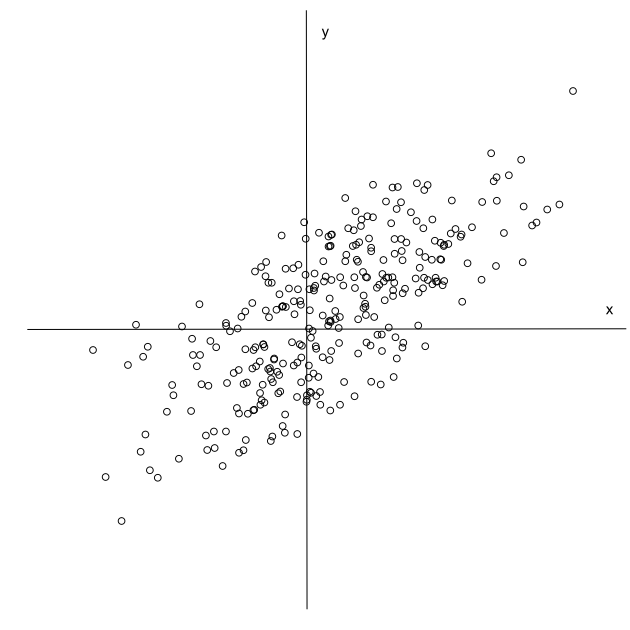
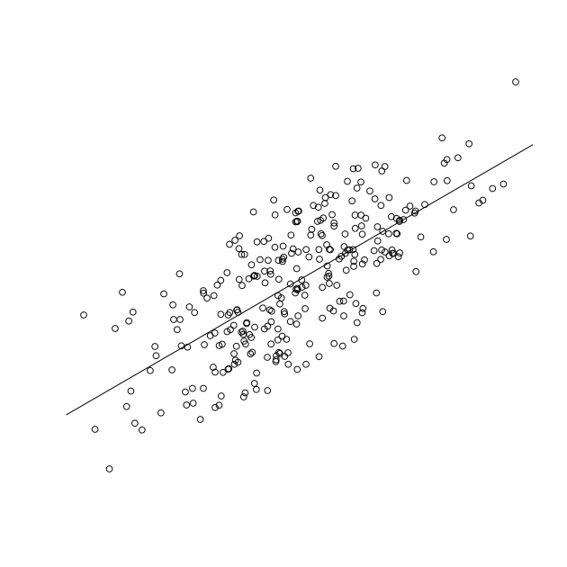
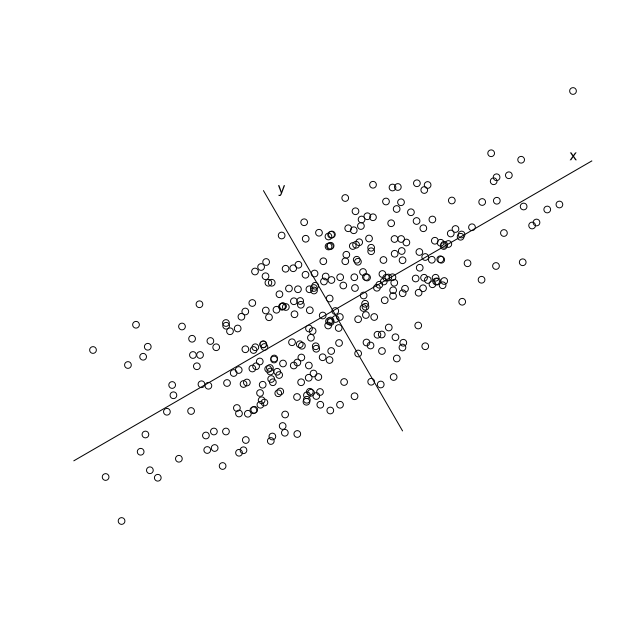
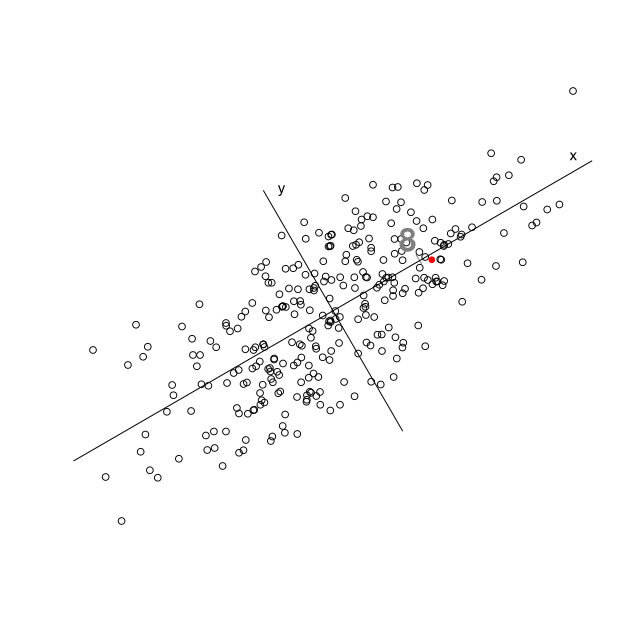

Principal component analysis (PCA) finds relationships in numerical
(as opposed to categorical) data. It works by plotting the data on a
many-dimensional dot plot and then switching the axes.

Here's a simple explanation of how PCA works. For this explanation, I'll
assume that we only have two variables, but it's conceptually the same with
more variables. Here are two variables.

These variables could be any numerical variable. Maybe *x* is height and *y*
is arm length. For this explanation, however, let's use coordinates on a map.

Let's say that the axes cross at the center of town and that the *x* and *y*
axes are distances from the town in kilometers; this plot is just a map of
the town. Let's say that the points are houses. We can refer to the locations
of these houses their *x* and *y* coordinates; the red point has an *x* of 12
and a *y* of 6, so it is at (12, 6).

We start by drawing the best-fit line between these two variables.

This best-fit line is called the 'first component'.

Next, we change axes so that the x-axis is the best-fit line and the y-axis
is perpendicular to the best-fit line and in the middle of the cloud of points.

This second line is called the 'second component'.

Now, we can refer to points using the new coordinate system. Recall the (12, 6)
point from the old coordinate system.

In the new system it has an *x* value of 13 and a *y* value of 0,
(I'm rounding.) so it would be (13, 0).

That's how PCA works, but **what does it tell us**?

Remember, we're thinking of this plot as a map of the houses in a town. Without
losing precision, we could decide to switch to the new coordinate system.
Instead of using north-south and east-west as the axes, we could use
east-northeast--west-southwest and north-northwest--south-southeast as axes.

It gets interesting when we decide to focus on only the first component. While
we won't be exact, we can explain a house's position pretty well by giving its
location along the new *x* axis (east-northeast--west-southwest). This works
because the PCA has uncovered some underlying relationship in the locations
of the houses. Maybe the houses are arranged like this because the town is
along a river, valley or highway.

Let's say it's along a river that runs west-southwest, along the new x-axis.
Based on that, let's come up with better names for these new axes; let's call
the new *x*-axis "location along the river", and let's call the new *y*-axis
"distance from the river".

The PCA has helped us **find this line** along which the houses stand. This was
already obvious because we only had two variables and were thus able to plot
them on a map; similar relationships are less obvious when you have 80
variables. That alone is useful.

But another benefit is that PCA lets us **reduce the number of variables**. We
started with east and west as the two variables, but it turns out that people
tend to live close to the river, so we might be able to get away with just
using the "location along the river" variable for future analyses. Having just
one variable can make statistics easier to compute and easier to explain.

(This explanation is taken from my work [for Place2Be](http://tlevine.github.com/place2be/).)
