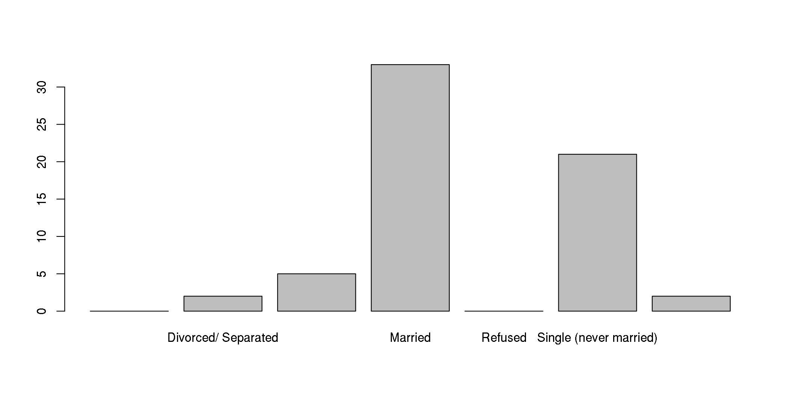
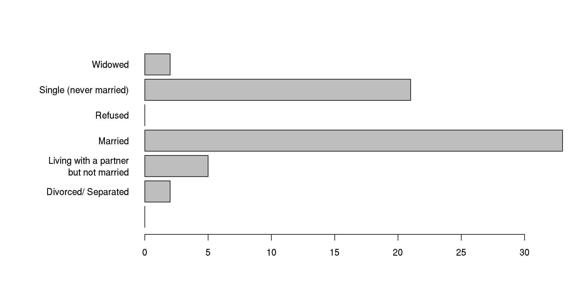
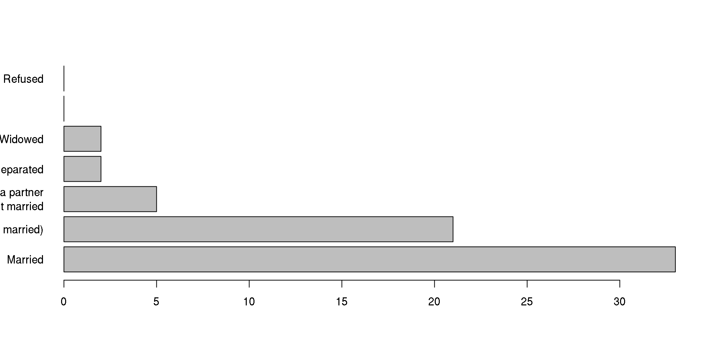
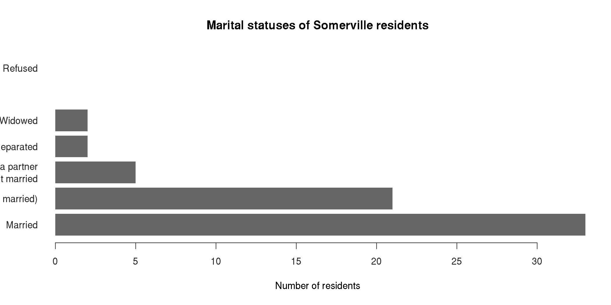
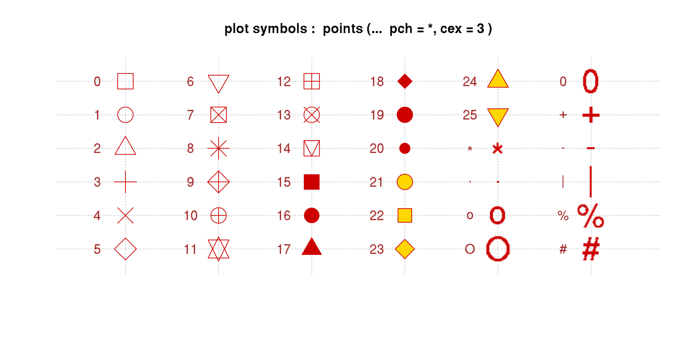
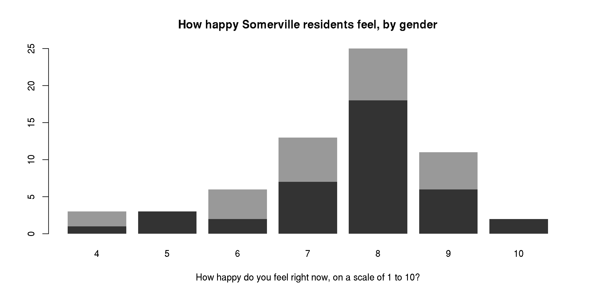
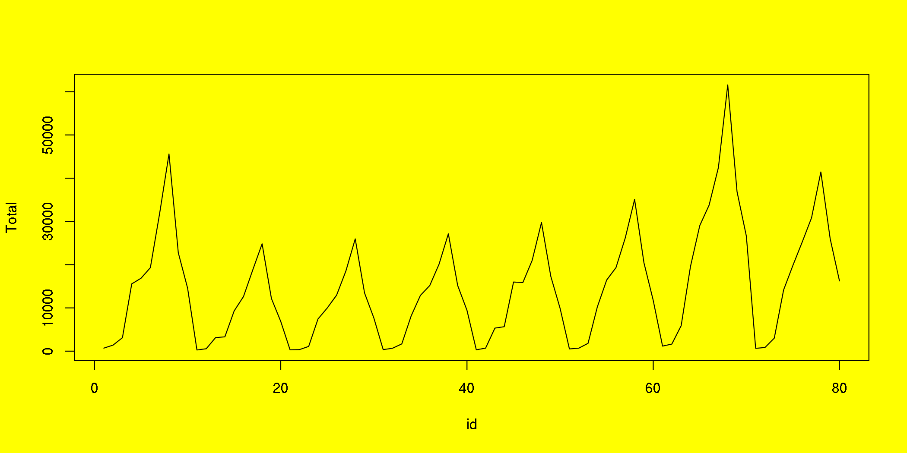
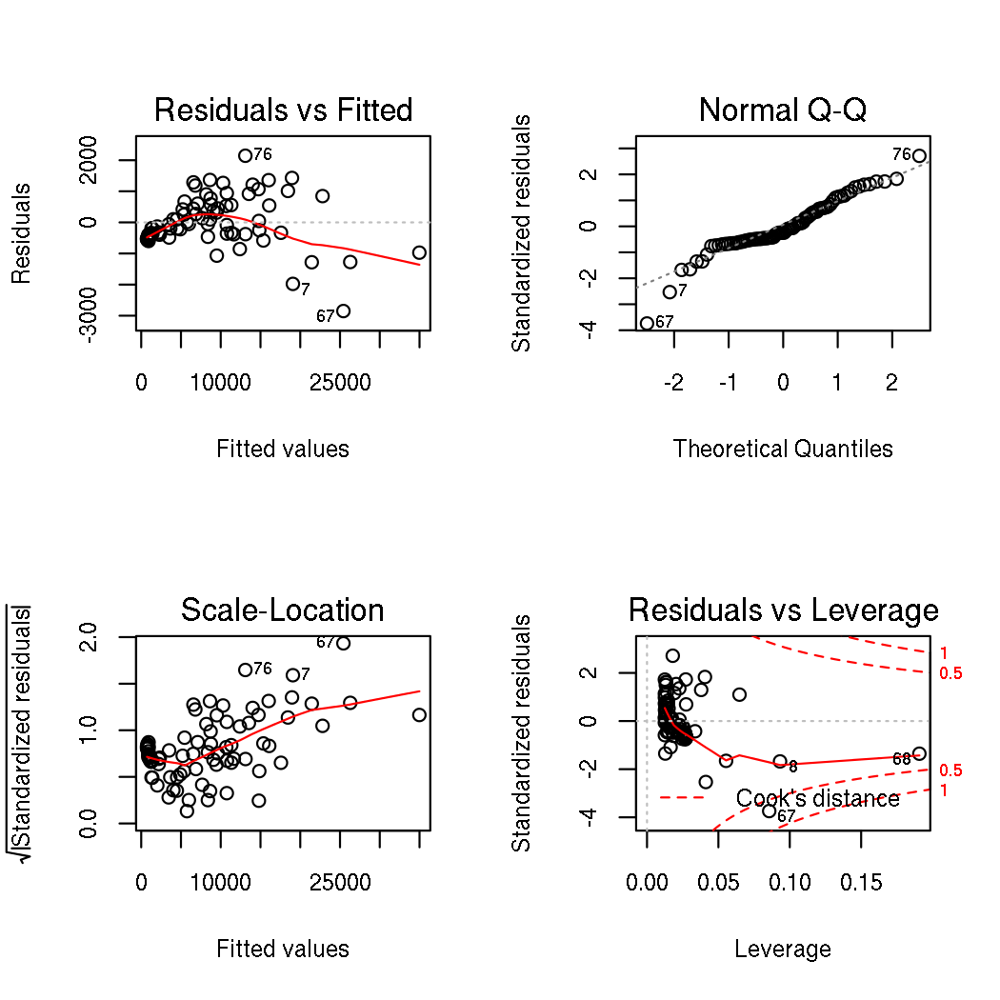

I've spent/wasted years of my life trying to make nice plots with
base R graphics, so I've learned a bunch of base R graphics tricks.
One annoying part of base R graphics is that the defaults look ugly,
so I'm going to show you how to make some bar plots, strip charts,
and line plots that don't look so ugly.

You might pick up some useful tricks from this post, but I really
hope that the insanity of it encourages you to use ggplot instead.

## Data
I'm going to use data came from an earlier version of
[this website](http://peregrinossantiago.es/eng/pilgrims-office/statistics/).
They're "statistics about pilgrims who have arrived in Santiago".
The observations are monthly, but I'm missing the Novembers and Decembers.

    pilgrams <- sqldf("select * from pilgram", dbname = "pilgrams-db.sqlite")

I'm also going to use data from a
[wellbeing study](https://data.somervillema.gov/dataset/Results-of-2011-Wellbeing-Study/pjhx-dusc)
about Somerville, Massachusetts. There are a lot of missing values in this dataset, and I'm only
trying to show you how to make plots, so I'm just going to remove the missing values.

    wellbeing <- na.omit(read.csv("http://data.somervillema.gov/api/views/pjhx-dusc/rows.csv?accessType=DOWNLOAD"))

## Bar plots
Maybe we want count the marital statuses of Somerville residents.
This won't work.

    barplot(wellbeing$X24..What.is.your.marital.status.)

Instead, you need to give barplot a vector of heights. We can make one with `table`.

    barplot(table(wellbeing$X24..What.is.your.marital.status.))

{:.wide}

I can't read the bar labels, so let's make the bars horizontal.

    barplot(table(wellbeing$X24..What.is.your.marital.status.), horiz = TRUE)

{:.wide}

Oops. Now the labels are rotated the wrong way. The `las` parameter to `par` handles that.

    barplot(table(wellbeing$X24..What.is.your.marital.status.), horiz = TRUE, las = 1)

{:.wide}

And let's adjust the margin and bar labels so the text doesn't fall off.

    levels(wellbeing$X24..What.is.your.marital.status.)[3] <- "Living with a partner\nbut not married"
    par(mar = c(5, 12, 4, 2))
    barplot(table(wellbeing$X24..What.is.your.marital.status.), horiz = TRUE, las = 1)

{:.wide}

I also want to sort the bars so they're easier to read.

    barplot(sort(table(wellbeing$X24..What.is.your.marital.status.), decreasing = TRUE), horiz = TRUE, las = 1)

{:.wide}

The black border around the bars is noisy; let's remove it.

    barplot(
      sort(table(wellbeing$X24..What.is.your.marital.status.), decreasing = TRUE),
      horiz = TRUE, las = 1, border = NA)

{:.wide}

Now the colors don't match. We could just make the bars black,

    barplot(
      sort(table(wellbeing$X24..What.is.your.marital.status.), decreasing = TRUE),
      horiz = TRUE, las = 1, border = NA, col = 1)

{:.wide}

but that's a bit harsh. Instead, let's make everything grey.

    barplot(
      sort(table(wellbeing$X24..What.is.your.marital.status.), decreasing = TRUE),
      horiz = TRUE, las = 1, border = NA,
      col = "#666666", fg = "#333333", col.axis = "#333333")

{:.wide}

And add a title, of course

    barplot(
      sort(table(wellbeing$X24..What.is.your.marital.status.), decreasing = TRUE),
      horiz = TRUE, las = 1, border = NA, col = "#666666", fg = "#333333", col.axis = "#333333", 
      xlab = "Number of residents", main = "Marital statuses of Somerville residents")

{:.wide}

Summing that up, this is approximately what I think the default barplot function should be.

    tom.barplot <- function(height, col = 'grey', border = NA, ...) {
      barplot(
        sort(table(height)), col = col, border = border,
        col = '#666666', fg = '#333333', col.axis = '#333333',
        ...
      )
    }

## Strip charts
Here is a strip chart about how people in Somerville are feeling, on a range of 1 to 10.

    stripchart(wellbeing$X1...First.of.all..how.happy.do.you.feel.right.now.., method = "jitter")

{:.wide}

The observations are randomly jittered above, but we can also stack the observations.

    stripchart(wellbeing$X1...First.of.all..how.happy.do.you.feel.right.now.., method = "stack")

{:.wide}

Let's change the scale to emphasize its limits.

    stripchart(wellbeing$X1...First.of.all..how.happy.do.you.feel.right.now.., method = "stack", xlim = c(1, 10))

{:.wide}

The white boxes with borders are noisy; let's change them to filled boxes.
The default point type (`pch = 1`) doesn't support a fill color (`bg`),
so we have to switch to a different point type;
here are the different point types, from `example(points)`.

{:.wide}

Let's use `pch = 22`.

    stripchart(
      wellbeing$X1...First.of.all..how.happy.do.you.feel.right.now..,
      method = "stack", xlim = c(1, 10), col = NA, pch = 22, bg = 1)

{:.wide}

That's just a bar plot. Let's switch back to jittering and make the
points translucent.

    stripchart(
      wellbeing$X1...First.of.all..how.happy.do.you.feel.right.now..,
      method = "jitter", xlim = c(1, 10), col = NA, pch = 22, bg = "#00000033")

{:.wide}

Let's make a nicer axis.

    stripchart(
      wellbeing$X1...First.of.all..how.happy.do.you.feel.right.now..,
      method = "jitter", xlim = c(1, 10), col = NA, pch = 22, bg = "#00000033", axes = FALSE, 
      xlab = "How happy do you feel right now, on a scale of 1 to 10?",
      main = "How happy Somerville residents feel")
    axis(1, at = 1:10)

{:.wide}

And let's not waste half of the canvas.

    stripchart(
      wellbeing$X1...First.of.all..how.happy.do.you.feel.right.now..,
      method = "jitter", xlim = c(1, 10), col = NA, pch = 22, bg = "#00000033", axes = FALSE, 
      xlab = "How happy do you feel right now, on a scale of 1 to 10?",
      main = "How happy Somerville residents feel", jitter = 0.5, ylim = c(0, 2))
    axis(1, at = 1:10)

{:.wide}

## Stacked bar plots
Now we could also color the points by a different color depending on the
gender.

    barplot(
      table(
        wellbeing$X15..Gender..1..female..2..male.,
        wellbeing$X1...First.of.all..how.happy.do.you.feel.right.now..),
      border = NA, col = c("#333333", "#999999"), 
      xlab = "How happy do you feel right now, on a scale of 1 to 10?",
      main = "How happy Somerville residents feel, by gender")

{:.wide}

We make the legend in a separate command.

    wellbeing$X15..Gender..1..female..2..male. <- factor(wellbeing$X15..Gender..1..female..2..male., levels = 1:2)
    levels(wellbeing$X15..Gender..1..female..2..male.) <- c("Female", "Male")
    col <- c("#333333", "#999999")
    barplot(
      table(wellbeing$X15..Gender..1..female..2..male.,
        wellbeing$X1...First.of.all..how.happy.do.you.feel.right.now..),
      border = NA, col = col, xlab = "How happy do you feel right now, on a scale of 1 to 10?", 
      ylab = "Number of residents", main = "How happy Somerville residents feel, by gender")
    legend("topleft", legend = levels(wellbeing$X15..Gender..1..female..2..male.), col = NA, pch = 22, pt.bg = col)

{:.wide}

## par
All of these `col`, `pch`, `bg`, `fg`, `border`, &c. commands are graphical
parameters passed to `par`. You can set their global defaults with `par`,
but they won't necessarily apply to the same scope as when you pass them
within a function. For example, `bg` applies to the outer canvas's background.

    par(bg = "yellow")
    plot(Total ~ id, data = pilgrams, type = "l")

{:.wide}

You might use this to set fonts across all of your plots.

    par(family = "serif", font = 3, font.lab = 3, font.main = 2, font.sub = 3)
    plot(Total ~ id, data = pilgrams, type = "l", main = "Pilgrams")

{:.wide}

I tend to find the global namespace unpleasant, so I like to wrap that
in a function that closes the device afterwards, with `dev.off`.
(The settings only apply to the current device.)

    plot.something <- function(a, b, c, e, f) {
      par(family = 'serif', font = 3, font.lab = 3, font.main = 2, font.sub = 3)
      plot(a ~ b, col = c)
      lines(d, e)
      # ...
      dev.off()
    }

`mfrow` and `mfcol` allow you to make multiple plots in one device

    par(mfrow = c(2, 2))
    plot(lm(Men ~ Women, data = pilgrams), mfrow = c(2, 2))

{:.wide}

`bty` lets you change the outer border of the plot.

    plot(Total ~ id, data = pilgrams, type = "l", bty = "l")

{:.wide}

Its options are quite hilarious; here is its entry in `?par`.

    ‘bty’ A character string which determined the type of ‘box’ which
         is drawn about plots.  If ‘bty’ is one of ‘"o"’ (the
         default), ‘"l"’, ‘"7"’, ‘"c"’, ‘"u"’, or ‘"]"’ the resulting
         box resembles the corresponding upper case letter.  A value
         of ‘"n"’ suppresses the box.

Most plotting commands call `plot.new`, which clears the plot by
default. Setting `new` to `TRUE` makes it not clear the plot, which
can help you build up more complicated plots.

## Line plots
Displaying multiple sets of lines and points on a graph gets more messy.
For example, let's say we want to make two lines to represent pilgram
counts. One is for people on horseback, and the other is for people on
foot. First, I like to make an empty plot with the full range so we don't
cut anything off. Let's also put the labels and remove the axes.

    plot.pilgram.base <- function() {
      plot(0, 0,
        xlim = range(pilgrams$id),
        ylim = c(0, max(c(pilgrams$Foot, pilgrams$Bicicle))),
        xlab = "Month", ylab = "Number of pilgrams",
        main = "Pilgrams by month and transportation medium", 
        axes = FALSE, type = "n")
    }
    plot.pilgram.base()

{:.wide}

The key there is `type = 'n'`, which makes no data be plotted.
Now we can add the lines one at a time.

    plot.pilgram.lines <- function() {
      lines(Foot ~ id, data = pilgrams, lty = 1)
      lines(Bicicle ~ id, data = pilgrams, lty = 2)
      legend("topleft", c("Foot", "Bicycle"), title = "Transportation media", lty = 1:2)
    }
    plot.pilgram.base()
    plot.pilgram.lines()

{:.wide}

I removed the axes because the default axes are usually quite
ugly. Now let's add prettier axes.

    plot.pilgram.axes <- function() {
      axis(1, at = seq(1, 80, 10), labels = paste("January", unique(pilgrams$year)))
      par(las = 1)
      axis(2, at = seq(0, 60000, 10000), labels = c(0, paste0(1:6, "0,000")))
    }
    plot.pilgram.base()
    plot.pilgram.lines()
    plot.pilgram.axes()

{:.wide}

The tick marks go at `at`, and they are labeled with `labels`.

## Use ggplot
I just showed you some simple bar plots, strip chart and
line plots in base R graphics. Each one only took a few lines,
but they were sort of complicated. Moreover, each plot type
took slightly different inputs, so I needed to transform the
data a bit differently for each one and to send different
parameters for each one. This is what makes base R graphics.

ggplot, on the other hand, has a much more reasonable and standardized
plot-configuration interface (through the grammar of graphics). The
equivalent ggplot commands for all of these plots would have been about
as complicated but much more predictable and consistent across plot types.

I still use base R graphics for [music videos](/music), but
I try to use ggplot for everything else.
