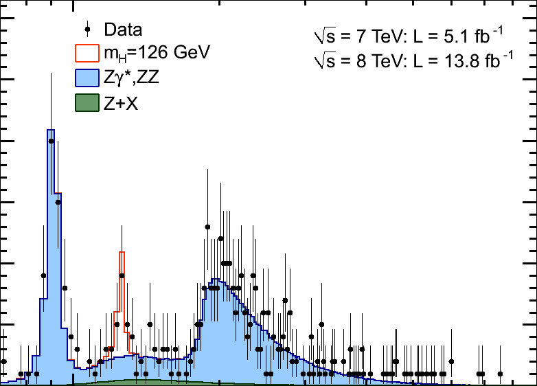

Big data leads quickly to information overload.

<blockquote class="twitter-tweet">
For handle big data, solution is very simple: buy bigger monitor and use smaller font in the terminal.
&mdash; MySQL Borat (@mysqlborat) <a href="https://twitter.com/mysqlborat/status/306078371182428161">February 25, 2013</a></blockquote>

How can we deal with this?

I've recently been seeing a trend towards animated visual/audio data presentation
experiences. I started toying with this a few years ago around Christmas time.

<iframe width="560" height="315" src="http://www.youtube.com/embed/rLZDvXPIDa0" frameborder="0" allowfullscreen></iframe>

They've recently become more popular. My [band](http://csvsoundsystem.com)
made a music video of treasury data.

[fms.png" class="wide" />](http://fms.csvsoundsystem.com)

Küechenstudio made a [podcast](http://www.kuechenstud.io/datenschau/podcast/ds008/)
about some of the other recent advances in data music.

Combining data with music, specifically, may also appeal to a younger audience.
This is because both data is "in".

> [S]tatisticians are the new sexy vampires, only even more pasty.
> ([Emma Gertlowitz](http://www.newyorker.com/humor/2012/11/19/121119sh_shouts_rudnick))

Recognizing this, the White House released to advertise the State of the
Union Address. It uses pie charts and dubstep to appeal to a younger audience.

<iframe width="560" height="315" src="http://www.youtube.com/embed/i85haOoK5os" frameborder="0" allowfullscreen></iframe>

Data animations are also becoming popular in experimental physics, for both the
ATLAS and CMS experiments.

<!-- https://twiki.cern.ch/twiki/pub/AtlasPublic/HiggsPublicResults//4l-FixedScale-NoMuProf2.gif -->

<!-- https://twiki.cern.ch/twiki/pub/CMSPublic/Hig13002TWiki/HZZ4l_animated.gif -->

Dynamic, multisensory data experiences will help us make sense of big data.
In the long term, we really need to gastronomify data in order to experience
them with all of the senses, but that isn't feasible right now because of the
reasonably high cost of food printers (three-dimensional printers).

Until we develop cheaper taste and smell APIs, we are stuck with what we have
on our smartphones, laptops, &c., which is vision, hearing and touch. We need
to make data music videos in order to make the most of these tools.

## Other resources
[Brian Abelson](http://brianabelson.com)
and I gave a [talk](http://www.meetup.com/nyhackr/events/111193682/) on this at the
[New York Open Statistical Programming Meetup](http://www.meetup.com/nyhackr/).
Here are [my slides](http://tlevine.github.com/music-videos-in-r),
my [code](http://tlevine.github.io/music-videos-in-r/live-code-christmas.r)
[demos](http://tlevine.github.io/music-videos-in-r/live-code-fms.r),
[Brian's slides](http://csv.github.io/ddr_nyhackr/) and Brian's
[data-driven rhythms](https://github.com/csv/ddr) package.
