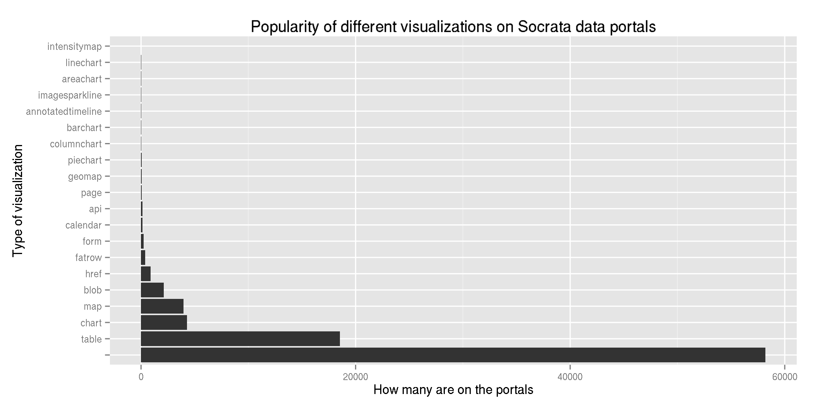
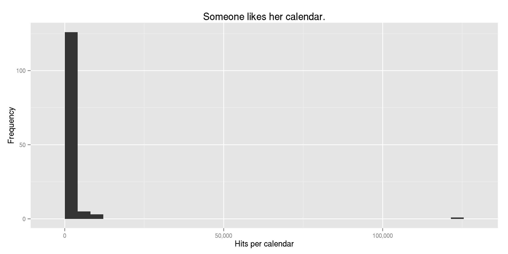
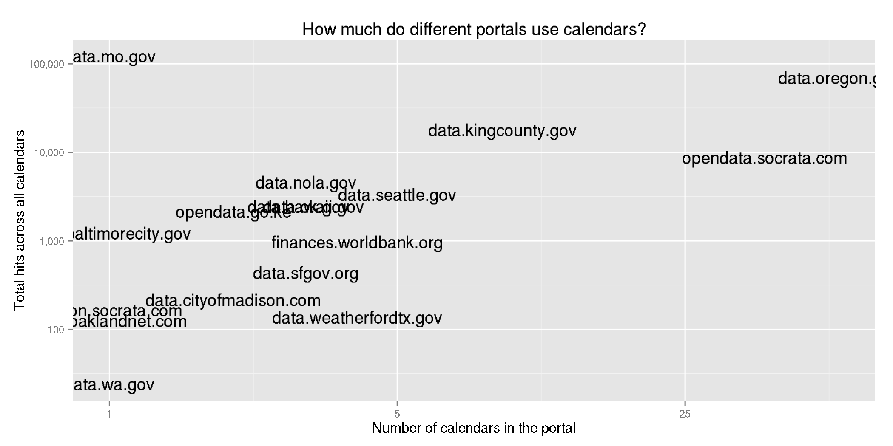
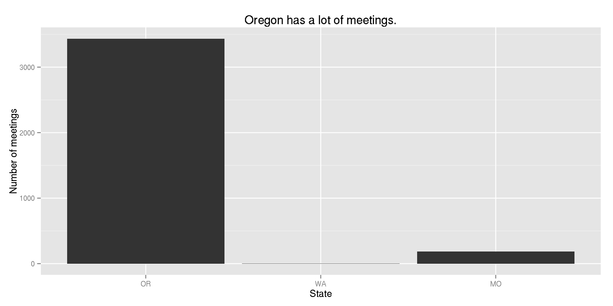
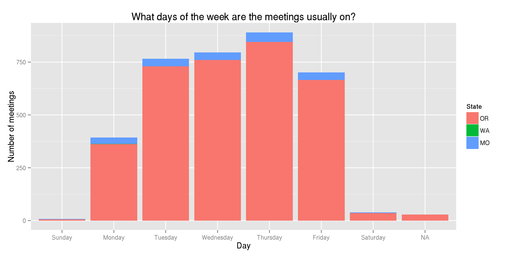
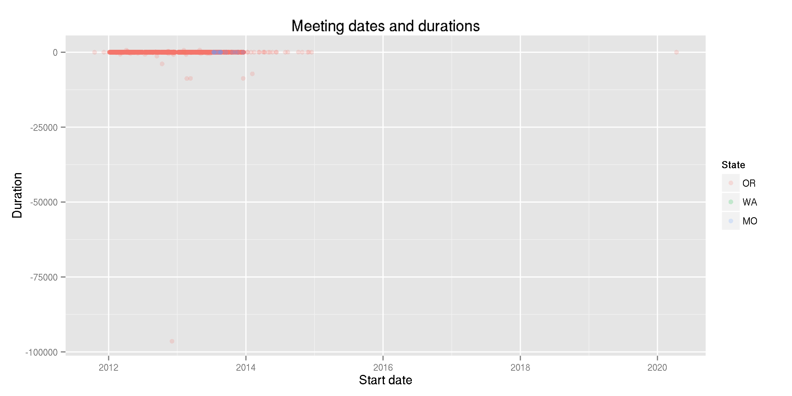
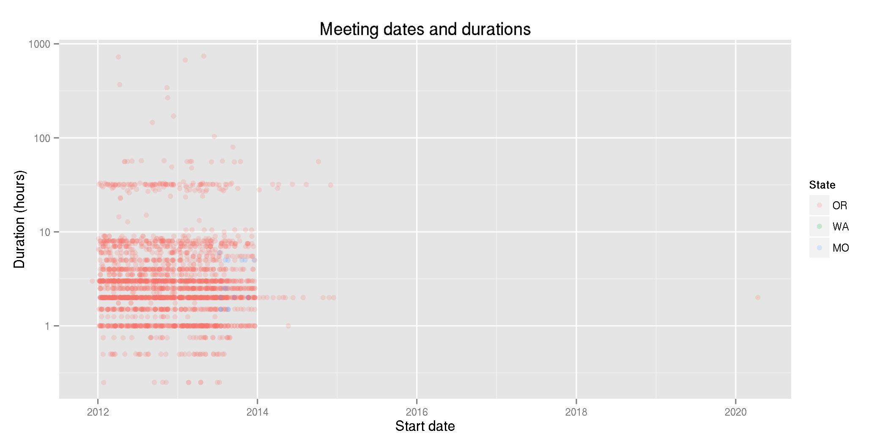
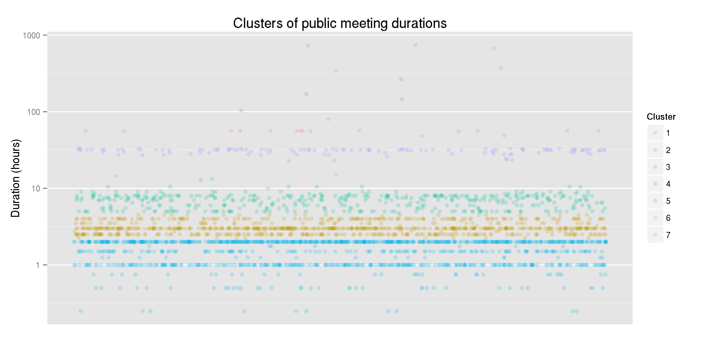

My new favorite Socrata visualization is the calendar.

## Socrata visualization types
Socrata is more than a place to dump raw tables, or at least
it tries to be; you can make various charts and maps, and you
can serve non-tabular information to some degree.

There are many ways that a particular dataset could be visualized.
Socrata has 20 ways.
Here they are.

{:.wide}

There are a lot of Socrata [views](/!/socrata-genealogies#term-view) that don't
have display types listed. I don't know what's up with that.

Anyway, I looked through the different visualization types and became quite interested
in calendars.

## People actually use calendars
The calendar is
[what it sounds like](https://data.oregon.gov/dataset/Public-Meetings-3-Month-View-/4775-yg3b?).
Some of them are reasonably popular.

{:.wide}

Let's look at some specific calendars.

    calendar.use <- subset(socrata, displayType == "calendar")[c("portal", "id", "viewCount")]
    calendar.use[order(calendar.use$viewCount, decreasing = T), ][1:5, c("portal", "id", "viewCount")]
    ##                    portal        id viewCount
    ## 32659         data.mo.gov mahp-izvx    121455
    ## 43101 data.kingcounty.gov p98f-kyer     11164
    ## 49823     data.oregon.gov 4wcf-m6kg     11080
    ## 49741     data.oregon.gov imfn-d2p5     10559
    ## 52858     data.oregon.gov pw6y-72a2      6167

The most-viewed is Missouri's [open meetings calendar](https://data.mo.gov/Government-Administration/Open-Meetings-Calendar/mahp-izvx?).
They also have a different view of the calendar [outside the portal](http://www.mo.gov/meetings/),
with an RSS feed from the Socrata portal. But I don't know how the calendar on Socrata got so many views.

It looks like some other portals are using calendars a lot too,
but usually with several separate calendars instead of one huge one.

{:.wide}

## The cool thing about Socrata calendars
The cool thing about Socrata calendars is that you can download them
as a spreadsheet.

There are lots of different calendar programs. Most of them are way
better for calendaring than Socrata. They also typically have import
and export tools for transferring your calendar between different
calendar tools.

But as far as I can tell, none of the main calendar programs lets
you export to a format that isn't special to. As far as I can tell,
Outlook, iCal and Google Calendar can import and export iCal files (`.ics`).
This lets you move your data among calendar programs, but it's
harder to connect them to non-calendar datasets.

<!--
http://www.zimbra.com/desktop/help/en_US/Calendar/Exporting_your_iCal_calendar.htm
http://office.microsoft.com/en-us/outlook-help/transfer-calendars-between-outlook-and-google-calendar-HA010167495.aspx
-->

### The calendar is just one possible visualization of the same data
Because calendar data is data just like any other data, you can visualize
it in any number of ways. For a very rough example, we search Socrata for
Oregon's calendars,

    oregon.calendars <- subset(socrata, portal == "data.oregon.gov" & displayType == "calendar")

we find out what datasets they visualize,

{:.wide}

we look up one of the tables,

    table.429573 <- subset(socrata, tableId == 429573)[c("id", "name", "displayType")]

and we find the associated views.

* [Domoic acid results calendar](https://data.oregon.gov/-/-/b574-ggwh)
* [Domoic acid results list](https://data.oregon.gov/-/-/3eya-wjrj)
* [Domoic acid sample map](https://data.oregon.gov/-/-/225z-wxd7)
* [Domoic acid sample chart](https://data.oregon.gov/-/-/mjdt-ztkh)

Here we have an example of how the calendar is just one of many possible
visualizations of the same dataset.

## Analysis of a Socrata calendar
Socrata's representation of a calendar as a table with easy importing and
exporting is really cool. But Socrata's data analysis tools are leave much
to be desired. So I downloaded the calendars and played with them in R.

### Combining calendars
I downloaded Oregon's and Missouri's public meetings calendars and combined
them into one R data frame. Now I can have fun.

### Who has more meetings?
Oregon has 3436 meetings.
Oregon even has one meeting in Washington!

{:.wide}

### Day of week
Meetings are usually in the middle of the week.

{:.wide}

More precisely, most meetings start in the middle of the week, and
you'll see later that most meetings last less than a day.

### Date cleaning
Let's clean up the dates so we can look at when meetings happen and how long they are.

A bunch of the meetings have end times before their start times. Also, about a third of
the meetings don't have end times, but I'm not going to worry about that for now.

{:.wide}

We could take a look at them like so.

    subset(public.meetings, Duration < 0)

But rather than figuring out what's wrong, let's live life on the edge and just ignore them.

{:.wide}

A meeting has already been planned for 2020!

    subset(public.meetings, Start > as.POSIXlt(as.Date("2015-01-01")))

It's for the Health Care Acquired Infections Advisory Committee, in the
Portland State Office Building room 1D on April 11, 2020 at 1 pm.
(I think that's an accident.)

### Meeting durations
Some of these meetings are pretty long. The three longest are each a month long.

    subset(public.meetings, Duration > 400)[c("Group", "Meeting", "Start", "End")]

Group                                | Start          | End
-------------------------------------|----------------|-----------------
             Health Authority, Oregon|2013-02-04 13:00|2013-03-04 13:00
             Health Authority, Oregon|2013-04-30 00:00|2013-05-31 00:00
Housing/Community Services Department|2012-04-04 08:00|2012-05-04 17:00

Those three longest meetings got me thinking:
Maybe there are clusters of durations. Like maybe they're either an hour or two,
a day, a week or a month. I didn't look very hard, but seven clusters seems okay.

    public.meetings.clean <- subset(public.meetings, !is.na(Duration) & Duration > 0)
    clusterings <- list()
    for (n in 1:10) {
      clustering <- kmeans(log10(public.meetings.clean$Duration), n)
      clusterings[[n]] <- clustering
      public.meetings.clean[paste0("cluster", n)] <- factor(clustering$cluster)
    }

    ggplot(public.meetings.clean) + aes(color = cluster7, x = 1, y = Duration) + 
      geom_jitter(alpha = 0.2) + scale_y_log10("Duration (hours)", breaks = 10^(0:3)) + 
      scale_x_continuous("", breaks = c()) + scale_color_discrete("Cluster") + 
      labs(title = "Clusters of public meeting durations")

{:.wide}

So the meeting durations seem clustered around these durations.
(The paranthetical durations are the mean durations for the corresponding clusters.)
<!-- sort(10^clusterings[[7]]$centers) -->

1. An hour (1.03 hours)
2. Half a workday (2.41 hours)
3. A workday (5.89 hours)
4. Two workdays (32.44 hours)
5. A work week (119.92 hours)
6. Two weeks (322.59 hours)
7. A month (714.32 hours)

## Thoughts
My aimless exploration of Oregon's and Missouri's public meetings isn't
outrageously interesting, but it demonstrates what is possible when a
calendar's data is fundamentally open. Along these lines, I have two thoughts.

1. Prevent data from becoming closed by opening them at their sources.
2. Anything could be data, and data could be anything.

### Opening data at their sources
Typical calendar software can import and export only from other calendar
software. I wouldn't say that Socrata's calendar visualization is anywhere
near calendar software, we can see it as an attempt at creating calendar
software whose data are fundamentally open.

Take a look at the World Bank Open Finances
[open data events calendar](https://finances.worldbank.org/dataset/Global-Open-Data-Calendar/g4sx-dwxc),
which is populated by this
[form](https://finances.worldbank.org/dataset/Global-Open-Data-Calendar-Entry-Form/qdbh-rfd3?)
that populates an.
Any data that is sent into the calendar immediately made available
to the public in various formats that can be used a wide variety of programs.

There's lots of siloed data in government, and we need better software and
methods for opening that up. But let's also make tools that prevent data from
becoming siloed in the first place. Imagine if Outlook, Google Calendar,
or whatever calendar software you use had a CSV export option.

### Anything could be data, and data could be anything
For someone like me, it's not a big deal if standard calendar software
does not allow CSV export; I could easily have done the same analysis I did
above from iCal files, though it would have taken a bit longer. My larger
concern is that people don't think of calendars and other "apps" as data.

To me, anything could be turned into data, and data could be turned into
anything. For example, treasury cash flows that start
out as [nonstandard text files](https://www.fms.treas.gov/dts) can be
turned into [tabular data](http://treasury.io) and then
[music](http://fms.csvsoundsystem.com).
Turns of a turnstile can recorded, stored in a
[really strange format](http://www.mta.info/developers/turnstile.html),
[parsed into a nicer format](https://github.com/ajschumacher/datathon)
and turned into [music](/!/ridership-rachenitsa).
And we could collect some information about a bunch of parking lots,
put it in a [data table](https://data.sfgov.org/Transportation/Off-Street-parking-lots-and-parking-garages/uupn-yfaw?)
and turn that into [cookies](https://twitter.com/internetrebecca/status/352955293291913217).

Much of our statistical
knowledge is based around a concept of a table, with columns as
variables (like "eye color") and rows as observations. (So each row might
be a different person.) This tabular representation is what
I think of as "data".

If we can represent the world as data, we can apply many quantitative
analytical methods to the data. First, we can convert data into other
data by combining datasets, building models, &c. And then we can convert
data back into real-world representations, like charts, apps, music and food.

But a lot of people don't realize this. I see this concept is a major part of
what I'll call "data literacy". I propose that a lack of understanding of this
concept contributes to the siloing of data and that teaching this concept is
an important part of the advance of open data.
