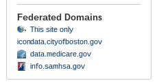
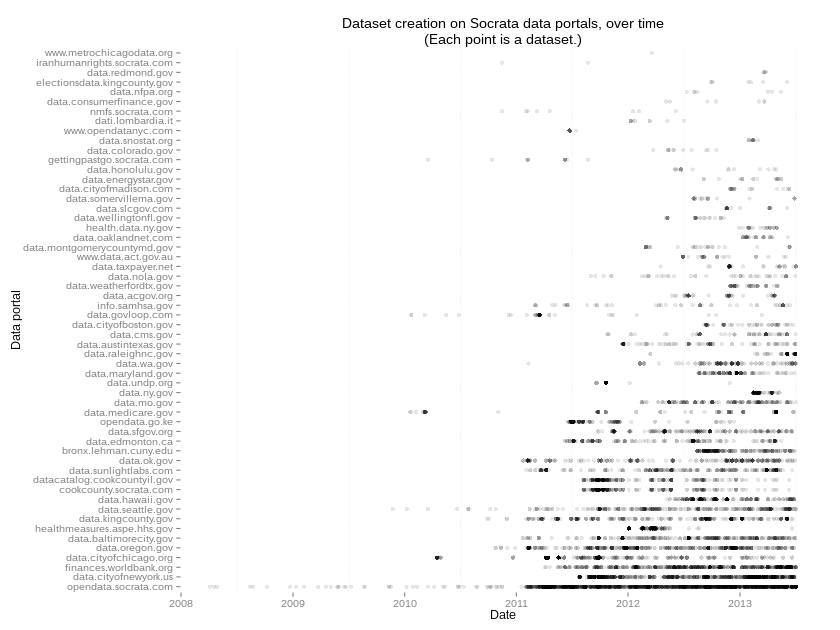

Lots of governments use Socrata data portals to release their open data.
This results in a super-dataset of datasets that tells us something about
the ecosystem surrounding open data.

For a [couple months](/!/socrata-summary), I've been studying the data
about these data and have continuously been dealing with duplicated data.
I finally fixed that, so now I have more accurate statistics on portals.

Quick preview:

{:.wide}

(I'll explain later.)

## Types of duplication
I'm concerned with
[two forms of duplication](/!/socrata-genealogies/#types-of-duplicate-datasets).

1. [Views](/!/socrata-genealogies/#term-view) derived from original
    [datasets](/!/socrata-genealogies/#term-dataset)
2. Federated datasets, which are just links to datasets on another portal

## Dealing with derived views
It's easy enough to deal with the former type of duplication.
One way is to use the `/data.json` (or `/api/dcat`) endpoint.
Unfortunately, this endpoint only provides the first 1000 entries.
I have been told that this has been fixed, but I had trouble getting
it working this morning.

That's not a big deal because there's another easy way. I produced a
[CSV file of Socrata data](https://github.com/tlevine/socrata-analysis/blob/master/socrata.csv)
a couple months ago. Each row in the file corresponds to a view on Socrata,
and the views that are original datasets have a displayType of `table`, I think.
(There's a notable exception: Sometimes, the original table is private and
a derived view is made available to the public.)

## Dealing with federation
Dealing with federation is less straightforward. The `/data.json` endpoint
doesn't clearly indicate whether a dataset is federated, and neither does
my CSV file. If I had been more careful when producing the CSV file, it could
have such a field, but I don't want to make another one because that took a
long time. So I took the federation links from somewhere else.

Scroll down on the homepage of a portal (like [data.gov](https://explore.data.gov/)),
and you might see something like this.

This shows up if the portal is federating any other portals. It's part of the
search menu, so it lets you filter your search by portal.

I [downloaded all of the homepages and pulled out the federation links](https://github.com/tlevine/socrata-defederate).
Here they are, in a rather plain diagram. (Hover over a node to see the portal name.)

Yay! Now we can deduplicate based on federation. I looked through the CSV file
that I produced a couple months ago and removed records that were federated.
That is, if two datasets had the same 4x4 identifier, I kept the one belonging
to the portal that was being federated.

## Better statistics
I plotted two graphs again to get a feel for how this changes things.

### Dataset counts by portal
First, here's the graph of dataset counts from the new data.

{:.wide}

My [first version](/!/socrata-summary/#sizes), also below, includes both types of deplication.

{:.wide}

The [version that uses `data.json`](/!/socrata-formats/#how-many-datasets), also below,
doesn't have the derived-view duplication, but it does have the federation duplication.

### Dataset creation dates
I also plotted dataset creation dates over time.

{:.wide}

I hadn't made a plot quite like this before, but the issue of duplication
has turned up in other plots about dataset creation dates, like in the
[original summary](/!/socrata-summary/#time) and in the study of
[dataset formats](/!/socrata-formats/#csv).

## Arbitrary metrics are arbitrary
Dataset count might sound like a decent metric, but it's quite hard to say
what a dataset is. If you [split up a dataset by year](http://appgen.me/audit/report),
do you have multiple datasets? Similarly, if you create
[lots of different queries](/!/socrata-genealogies) on the same dataset,
have you created new datasets? And do you have more datasets if you just copy
them from another data portal?

I'm told that there is perennial competition between Chicago and New York
and between `data.gov` and `data.gov.uk` over the dataset count on their portals.
Given the ambiguity of this measure, it is quite hilarious that such competition
exists.

On the other hand, that's the only obvious metric that we see in data portals.
Maybe we need to make [new metrics](/!/open-data-plans/#data-quality)
before people can stop caring about counts.

