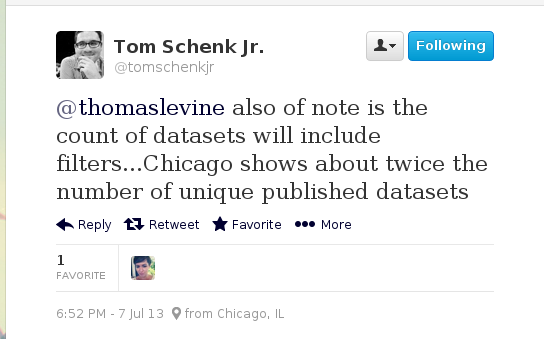
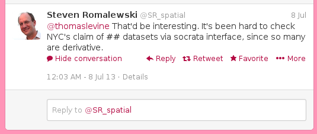
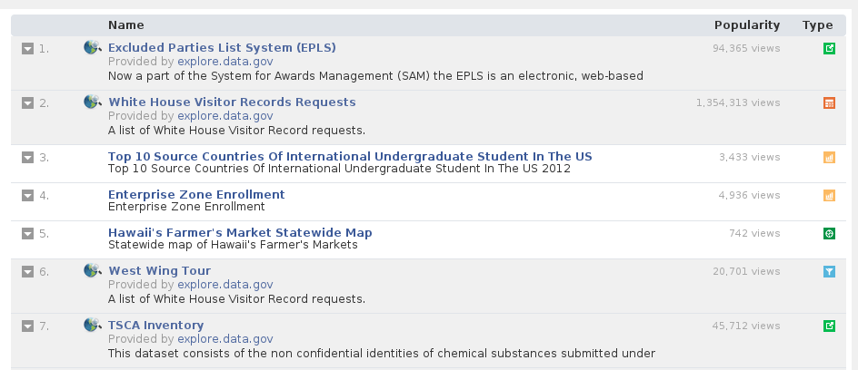

As the Twitters have pointed out, the dataset counts that I presented
in my initial [summary](/!/socrata-summary) of Socrata portals is somewhat deceptive.

Many of the things that I was calling a dataset can be seen as a
copy or a derivative of another dataset. Let me explain how that happens.

## Socrata terminology
Let's take a brief detour to discuss Socrata terminology.

### Everything is a view
When you go to the home page of a Socrata portal, you can
"Search & Browse Datasets and Views". This phrasing is sort
of wrong. Everything in this list is a **view**. I haven't
yet explained what a dataset is, but a dataset is a type of
view. For example, the top two datasets in
[explore.data.gov](https://explore.data.gov/) are currently (July 17)
[White House Visitor Records Requests](https://explore.data.gov/dataset/White-House-Visitor-Records-Requests/644b-gaut)
and [U.S. Overseas Loans and Grants (Greenbook)](https://explore.data.gov/dataset/White-House-Visitor-Records-Requests/644b-gaut).

You also get a list of "View Types". Below, I define some
of these view types.

### Datasets
Let's start with the **dataset**.
A dataset is when you get when you upload data to Socrata in one of
its supported tabular formats.

### Filtered views
Before I define "filtered views", I want to explain why they exist.
Socrata helps people publish their data by providing various APIs
for importing from different data sources, and Socrata helps people
consume data by providing a data analysis suite inside the web browser.
This includes maps and graphs and whatnot that you can embed in
websites rather than just in PDF documents.

Socrata also allows you to "Filter"
datasets. For example, here I filter the list of
[Public Works Volunteer Opportunities](https://data.oaklandnet.com/Environmental/Public-Works-Volunteer-Opportunities/sduu-bfki)
to include only opportunities on July 29.

[Here](https://data.oaklandnet.com/Environmental/Volunteer-Opportunities-on-July-29/vyhb-nqtw)'s the resulting filtered view.

**Filtered views** are queries on a dataset. The queries are represented internally in the
[SODA filter query language](http://dev.socrata.com/deprecated/querying-datasets).

### Charts and maps
**Charts** and **maps** are also queries on a dataset.
The difference between filtered views, charts and maps is quite subtle.
They are all queries on datasets; they just display a different
visualization when you view them on the Socrata website.

There are other types of views, but we don't need to know about them
for now.

### Tables
There is also a concept of a **table**, and
it is somewhat abstract. Here are two ways of thinking of it.

First, a more conceptual explanation.
After someone uploads a dataset, a variety of filtered views,
charts and maps can emerge. I see this as a family of views,
with the parent being the original dataset and the ancestors
being all of the filtered views, charts and maps that make
SODA queries on the original dataset. In Socrata, this family
is called a table.

Next, a more technical explanation.
The data are stored in a table, and this table is not exposed directly to users. 
The most raw form of the table is exposed through a dataset, which is an empty
query on the dataset (equivalent to `SELECT * FROM table_name;`). Filtered views,
charts and maps act on the table rather than on the source dataset; they're just
like datasets, except that they include a query.

## Federation
Socrata doesn't provide a particularly obvious means for searching multiple
data portals at once. (This was part of my motivation for downloading all of
the datasets.) But it is possible for one data portal to include all of
another portal's datasets.

Sometimes, you'll see a view in the search & browse pane with a grey background,
instead of white. Hawaii has a bunch of these.

These views are "provided" by other portals through a process called
"federation". The destination portal (data.hawaii.gov in the above screenshot)
makes a request to the source portal (data.explore.gov in the above screenshot)
to federate the source portal's data.

This request shows up in the administrator interface for the source portal.
If the source portal accepts the request, all of the views from the source portal
are provided to the destination portal as in the screenshot above.

If you look closely, you'll notice that the federated views are actually just
links to the source portal; the views show up in the search, but they aren't
otherwise copied to the destination portal.

## Types of duplicate datasets
Now that you know a bit more about how Socrata works, I can explain my three
categories of datasets-that-I-counted-twice.

### SODA queries: Filtered views, charts, maps
After a dataset is uploaded, people can create many views that derive from it.
Depending on what you want to know, it might not make sense to treat these as
separate entities.

In my previous analysis, I did count filtered views, charts and maps all as separate
entities. I think it's worth separating these because they can be derived from the
source datasets.

If people are using Socrata as it is intended, there should be tons of filtered
views, charts and maps, and they'll give us an interesting picture of how the
portal is being used.

### Federation
When datasets are federated, *all* of the datasets from the source portal are
provided to the destination. (You can't pick and choose.) That is, they show up
in search as links to the source portal.

In my previous analysis, I counted federated datasets as belonging to the portal
to which they're provided. Also, I downloaded them in a way that made it hard for
me figure out what the source portal was. It's easy to fix, so I might download
them all again and graph the network of federation across Socrata portals.

(For those who are curious, the issue was that I followed HTTP redirects and
didn't record whether I was following a redirect or accessing the page directly.)

### Copied rather than elegantly linked
Some datasets have simply been uploaded to two different portals.
Lombardia's museums is an example of that.

<!-- I don't know why the Kramdown table syntax isn't working here. -->
<table>
  <thead>
    <tr>
      <th>Portal</th>
      <th>Identifier</th>
      <th>Rows</th>
      <th>Columns</th>
      <th>Downloads</th>
    </tr>
  </thead>
  <tbody>
    <tr>
      <td>dati.lombardia.it</td>
      <td><a href="https://dati.lombardia.it/Cultura/Musei/3syc-54zf?">3syc-54zf</a></td>
      <td>234</td>
      <td>56</td>
      <td>1675</td>
    </tr>
    <tr>
      <td>opendata.socrata.com</td>
      <td><a href="https://opendata.socrata.com/Education/Musei-Lombardi/54y8-wyde?">54y8-wyde</a></td>
      <td>234</td>
      <td>56</td>
      <td>9</td>
    </tr>
  </tbody>
</table>

I identified this group by looking for datasets with the same numbers of rows,
the same number of columns, and similar names.
I haven't done it on a larger scale, but that would be fun to do later.

## Nine large dataset families
It took me quite a while to figure out how all of this works.
(That's a story in itself.) My goal all along was to start looking
at how families of datasets are related. I figured I'd make something
a bit less sloppy than ggplot plots tiny text and with legends
hanging off of the page.

I grouped all of the views that I had collected by table. (Recall that
a table in Socrata is a dataset plus the family of views that derives
from that particular dataset.)

Once I had grouped them, I found the ten largest families, by number of
different views. To be clear, this is the number of Socrata entities
called "views" rather than the number of times people viewed the dataset.
(Confusingly, Socrata also provides the latter sort of view count, and 
I've included that figure in the present report.)

Out of these datasets, I took out nine of the top ten datasets, and I
show their families in the table at the end of this page. Select a dataset,
and then you can see all of that dataset plus all of the filtered views,
maps and charts of that dataset. You can also see which portals each of
these datasets is federated to. You can sort by the different columns,
and you can click on a row to see more detail.

The one dataset that I skipped is 
.
I skipped it because it wasn't totally clear what the source portal was.
New York has a few different Socrata portals that contain much of the same
data but not through federation, so maybe this is a quirk of migrating data
between portals.

In case you're reading this a year later, the data were collected from
Socrata portals at the end of May 2013.

## Future research
Before you scroll down to the table of dataset progeny, I'm going to comment
on some ideas for future study that I've come up with. I've alluded to some
future study above, so here, I'm just focusing on things that I haven't really
discussed above.

A small note on grammar:
I talk about these studies as if I'm going to do them, but that's just because
I normally find that easier than convincing other people to help; all of the code
and data is free/libre/open, so you can also help or do these yourself rather
than waiting for me.

### Users
As far as I could tell, Socrata's API doesn't make it particularly easy to
get a list of all of the users, so I started with views. But now I have
a list of all of the users who have created views, which is close enough to
the list of all of the users. I'd like to see who is creating views, what
sorts of views they're creating. I'm particularly interested in ordinary
citizens who are creating lots of views.

### Socrata features
Socrata sells a bunch of add-on integration features. I'm somewhat curious to
see which cities are using which features, and we can determine this based on
the sorts of data that are in each portal.

### Data quality
A couple months ago, [Ashley Williams](https://twitter.com/ag_dubs) and I
[prototyped](http://www.appgen.me/audit/report) a tool for identifying
data quality issues in the data portal. We had a
[slew of best practices](http://www.appgen.me/audit) that we had found to
be frequently violated in the New York data portal, but we didn't know
enough about Socrata to evaluate them properly. Many of these were already
on my list for further study, but I got some more ideas on this front
through my conversation with [Nicole Nedith](https://twitter.com/nneditch),
who administrates Oakland's data portal.

**Codebooks**: Socrata doesn't really have a feature for including
explanations of what the different variables in a dataset mean. (I'd call
this a data dictionary or a codebook.) However, some datasets may already
include codebooks. I'm personally just a bit curious as to which datasets
have codebooks and whether that impacts their use. But this could also work
its way into our hypothetical tool. For example, we could look for datasets
with lots of views and without codebooks; those might be useful datasets
to write codebooks for.

**Geocoding**: Socrata is quite slow at geocoding. Nicole suspects that
this is because all of the geocoding for all of the portals runs on
one server. This is something that Socrata could improve, but there's
a lot that cities can already do about this. This issue came up in relation
to Oakland's [CrimeWatch maps](https://data.oaklandnet.com/Public-Safety/CrimeWatch-Maps-Past-90-Days/ym6k-rx7a).
The dataset has geospatial coordinates, is quite long, and is updated
frequently. Every time it is updated, all of the geocoded coordinates
get cleared, and the geocoding restarts, so the geocoding never finishes.
Oakland actually has the geospatial data in its database, but through
some accident, it wasn't appearing in the dataset. If we could identify
datasets like these, we could fix geocoding problems before people complain about them.

## The aforementioned table of dataset progeny

<!-- Scripts after the introduction so you don't notice the table loading -->

<link rel="stylesheet" href="style.css">

  

    <select ng-model="table" ng-options="t.source.name for t in tables">
      <option value="">Choose a dataset</option>
    </select>
    

      <h3>The family/table</h3>
      <ul>
        <li><strong>Original source</strong>: <a href="https://{{table.source.portal}}/-/-/{{table.source.id}}">{{table.source.portal}}</a></li>
        <li><strong>Number of children</strong>: {{table.datasets.length}}</li>
        <li><strong>Total downloads</strong>: {{ table.totals.downloadCount }}</li>
        <li><strong>Total views</strong>: {{ table.totals.viewCount }}</li>
        <li><strong>Description</strong>: {{table.source.description}}</li>
      </ul>
      <h3>Its member views</h3>
      <angular-table model="table.datasets" default-sort-column="createdAt">
        <header-row>

          <header-column sortable="true" sort-field-name="name">
            
Name

            <sort-arrow-ascending></sort-arrow-ascending>
            <sort-arrow-descending></sort-arrow-descending>
          </header-column>

          <header-column class="skinny" sortable="true" sort-field-name="createdAt">
            
Created

            <sort-arrow-ascending></sort-arrow-ascending>
            <sort-arrow-descending></sort-arrow-descending>
          </header-column>

          <header-column class="skinny" sortable="true" sort-field-name="viewCount">
            
Hits

            <sort-arrow-ascending></sort-arrow-ascending>
            <sort-arrow-descending></sort-arrow-descending>
          </header-column>

          <header-column class="skinny" sortable="true" sort-field-name="downloadCount">
            
Down-loads

            <sort-arrow-ascending></sort-arrow-ascending>
            <sort-arrow-descending></sort-arrow-descending>
          </header-column>

          <header-column class="less-skinny" sortable="true" sort-field-name="ncell">
            
Size

            <sort-arrow-ascending></sort-arrow-ascending>
            <sort-arrow-descending></sort-arrow-descending>
          </header-column>

          <header-column sortable="true" sort-field-name="ncopies">
            
Federation

            <sort-arrow-ascending></sort-arrow-ascending>
            <sort-arrow-descending></sort-arrow-descending>
          </header-column>

        </header-row>

        <row on-selected="emptyFunction" selected-color="#111">
          <column><a href="https://{{row.source_portal_hack}}/-/-/{{row.id}}" title="{{row.name}}">{{row.shortName}}</a></column>
          <column class="skinny">{{row.prettyDate}}</column>
          <column class="skinny number">{{row.viewCountPretty}}</column>
          <column class="skinny number">{{row.downloadCountPretty}}</column>
          <column class="less-skinny">
            {{row.ncellPretty}} cells
            <ul style="list-style: none;" class="snug" ng-show="row.rowSelected">
              <li class="snug"><small>{{row.ncolPretty}} variables</small></li>
              <li class="snug"><small>{{row.nrowPretty}} records</small></li>
            </ul>
          </column>
          <column>
            {{row.ncopiesPretty}}
            <ul class="snug" style="list-style: none;" ng-show="row.rowSelected">
              <li class="snug" ng-repeat="portal in row.portals"><small>{{portal}}</small></li>
            </ul>
          </column>
        </row>
      </angular-table>
    

  

