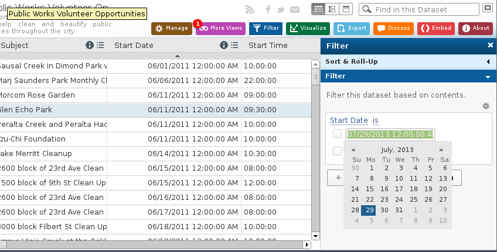

As the Twitters have pointed out, the dataset counts that I presented
in my initial [summary](/!/socrata-summary) of Socrata portals is somewhat deceptive.

[](https://twitter.com/richmanmax/status/353956877501087746)

[](https://twitter.com/tomschenkjr/status/354010005504147456)

[](https://twitter.com/SR_spatial/status/354088265344749568)

Many of the things that I was calling a dataset can be seen as a
copy or a derivative of another dataset. Let me explain how that happens.

## 1. Filtered views
Socrata helps people publish their data by providing various APIs
for importing from different data sources, and Socrata helps people
consume data by providing a data analysis suite inside the web browser.
This includes maps and graphs and whatnot that you can embed in
websites rather than just in PDF documents.

Getting back to the Tweets above, Socrata also allows you to "Filter"
datasets. For example, here I filter the list of
[Public Works Volunteer Opportunities](https://data.oaklandnet.com/Environmental/Public-Works-Volunteer-Opportunities/sduu-bfki)
to include only opportunities on July 29.

[](filter.png)

[Here](https://data.oaklandnet.com/Environmental/Volunteer-Opportunities-on-July-29/vyhb-nqtw)'s the resulting filtered view.

## 2. Socrata terminology
Let's take a brief detour to discuss Socrata terminology.

### Everything is a "view"
When you go to the home page of a Socrata portal, you can
"Search & Browse Datasets and Views". This phrasing is sort
of wrong. Everything in this list is a "view". I haven't
yet explained what a dataset is, but a dataset is a type of
view. For example, the top two datasets in
[explore.data.gov](https://explore.data.gov/) are currently
(<%= @item[:created_at] =%>)
[White House Visitor Records Requests](https://explore.data.gov/dataset/White-House-Visitor-Records-Requests/644b-gaut)
and [U.S. Overseas Loans and Grants (Greenbook)](https://explore.data.gov/dataset/White-House-Visitor-Records-Requests/644b-gaut).

[](https://explore.data.gov/)

### Types of views
You also get a list of "View Types". Let's start with the **dataset**.
A dataset is when you get when you upload data to Socrata in one of
its supported formats.

Earlier, I discussed filtered views. **Filtered views** are queries on
a dataset. The queries are represented internally in the
[SODA filter query language](http://dev.socrata.com/deprecated/querying-datasets).
Similarly, **charts** and **maps** are also queries on a dataset.
The difference between filtered views, charts and maps is quite subtle.
They are all queries on datasets; they just display a different
visualization when you view them on the Socrata website.

There are other types of views, but we don't need to know about them
for now.

### Tables
But there is one last thing. There is a concept of a **table**, and
it is somewhat abstract. Here are two ways of thinking of it.

First, a more conceptual explanation.
After someone uploads a dataset, a variety of filtered views,
charts and maps can emerge. I see this as a family of views,
with the parent being the original dataset and the ancestors
being all of the filtered views, charts and maps that make
SODA queries on the original dataset. In Socrata, this family
is called a table.

Next, a more technical explanation.
The data are stored in a table, and this table is not exposed directly to users. 
The most raw form of the table is exposed through a dataset, which is an empty
query on the dataset (equivalent to `SELECT * FROM table_name;`). Filtered views,
charts and maps act on the table rather than on the source dataset; they're just
like datasets, except that they include a query.

## 3. Federation
Socrata doesn't provide a particularly obvious means for searching multiple
data portals at once. (This was part of my motivation for downloading all of
the datasets.) But it is possible for one data portal to include all of
another portal's datasets.

Sometimes, you'll see a view in the search & browse pane with a grey background,
instead of white. Hawaii has a bunch of these.

[](https://data.hawaii.gov/)

These views are "provided" by other portals through a process called
"federation". The destination portal (data.hawaii.gov in the above screenshot)
makes a request to the source portal (data.explore.gov in the above screenshot)
to federate the source portal's data.

This request shows up in the administrator interface for the source portal.
If the source portal accepts the request, all of the views from the source portal
are provided to the destination portal as in the screenshot above.

If you look closely, you'll notice that the federated views are actually just
links to the source portal; the views show up in the search, but they aren't
otherwise copied to the destination portal.

## 4. Types of duplicate datasets

### Same dataset, linked from same portal
Through the view filters that I discuss above, Socrata makes it quite
easy to 

### Same dataset, linked from a different portal
Same dataset in opendata.socrata.com and a different portal

### Copied rather than elegantly linked
An example of that
https://dati.lombardia.it/Cultura/Musei/3syc-54zf?


```
                      portal        id    nrow ncol downloadCount
7790       dati.lombardia.it 3syc-54zf     234   56          1675
10425   opendata.socrata.com 54y8-wyde     234   56             9
```


I downloaded all of the metadata about all of the Socrata datasets during the week of ...
Explain viewFilters and provisions to other data portals
Out of these datasets, I took out nine of the top ten (Explain the weird one.) datasets, and here I show their families.
Explain the quirk about redirects that I didn't handle

## Notes from Nicole Neditch
* Oakland had the option to import all of the datasets from other portals in order to make the search work across portals, but they couldn't import just some of the datasets.
* People liked that Socrata has a lot of technical support
* When choosing the portal, they looked at just Socrata, CKAN and Junar. (There aren't really many people in this market.)
* Junar seemed too basic and unable to handle larger data and more datasets, and they didn't have an API to sync datasets from internal datasets.
* CKAN needed either internal support or a separate contracted support
* Nicole can send me the analysis.
* http://dev.socrata.com/publishers/importing
* Qualms
  * It's really slow, especially with geocoding. She things there's just one server that does all of the geocoding.
  * https://data.oaklandnet.com/
  * CKAN has bugs. Like mapping never works right. Socrata's mapping and visualization tools work really well.
  * "Any city staff person can generate a map of location-based data on the fly."
  * Embed a pie chart of the wildlife prevention thing. If they didn't have socrata, they probably would have put together a pdf report. There are other tools for this, but the people working for the city don't know them.
  * That couple downloaded and filtered the data, but they couldn't print it.
  * It seems that you can query on queries, but then when you save it it doesn't store.
  * Federation: https://cities-datagov.demo.socrata.com/
  * For Oakland, it's just Nicole and Titus
* Socrata has a bunch of add-on features like integrations and a checkbook dashboard. It might be fun to get a list of these from Socrata and then see which portals use which features
* Metadata could be better. Like an "explanation of what the fields are" (codebook, data dictionary)
  
<!-- Scripts after the introduction so you don't notice the table loading -->
<script src="angular.min.js"></script>
<script src="angular-table.js"></script>
<script src="angular-strap.js"></script>
<script src="script.js"></script>
<link rel="stylesheet" href="style.css">
<div ng-app="genealogy">
  <div ng-controller="GenealogyCtrl">
    <select ng-model="table" ng-options="t.source.name for t in tables">
      <option value="">Choose a dataset</option>
    </select>
    <div ng-show="table">
      <h3>The family</h3>
      <ul>
        <li><strong>Original source</strong>: <a href="https://{{table.source.portal}}/-/-/{{table.source.id}}">{{table.source.portal}}</a></li>
        <li><strong>Number of children</strong>: {{table.datasets.length}}</li>
        <li><strong>Total downloads</strong>: {{ table.totals.downloadCount }}</li>
        <li><strong>Total views</strong>: {{ table.totals.viewCount }}</li>
        <li><strong>Description</strong>: {{table.source.description}}</li>
      </ul>
      <h3>Its members</h3>
      <angular-table model="table.datasets" default-sort-column="createdAt">
        <header-row>

          <header-column sortable="true" sort-field-name="name">
            <div style="display: inline-block;">Name</div>
            <sort-arrow-ascending></sort-arrow-ascending>
            <sort-arrow-descending></sort-arrow-descending>
          </header-column>

          <header-column class="skinny" sortable="true" sort-field-name="createdAt">
            <div style="display: inline-block;">Created</div>
            <sort-arrow-ascending></sort-arrow-ascending>
            <sort-arrow-descending></sort-arrow-descending>
          </header-column>

          <header-column class="skinny" sortable="true" sort-field-name="viewCount">
            <div style="display: inline-block;">Views</div>
            <sort-arrow-ascending></sort-arrow-ascending>
            <sort-arrow-descending></sort-arrow-descending>
          </header-column>

          <header-column class="skinny" sortable="true" sort-field-name="downloadCount">
            <div style="display: inline-block;">Down-loads</div>
            <sort-arrow-ascending></sort-arrow-ascending>
            <sort-arrow-descending></sort-arrow-descending>
          </header-column>

          <header-column class="less-skinny" sortable="true" sort-field-name="ncell">
            <div style="display: inline-block;">Size</div>
            <sort-arrow-ascending></sort-arrow-ascending>
            <sort-arrow-descending></sort-arrow-descending>
          </header-column>

          <header-column sortable="true" sort-field-name="ncopies">
            <div style="display: inline-block;">Federation</div>
            <sort-arrow-ascending></sort-arrow-ascending>
            <sort-arrow-descending></sort-arrow-descending>
          </header-column>

        </header-row>

        <row on-selected="emptyFunction" selected-color="#111">
          <column><a href="https://{{row.source_portal_hack}}/-/-/{{row.id}}" title="{{row.name}}">{{row.shortName}}</a></column>
          <column class="skinny">{{row.prettyDate}}</column>
          <column class="skinny number">{{row.viewCountPretty}}</column>
          <column class="skinny number">{{row.downloadCountPretty}}</column>
          <column class="less-skinny">
            {{row.ncellPretty}} cells
            <ul style="list-style: none;" class="snug" ng-show="row.rowSelected">
              <li class="snug"><small>{{row.ncolPretty}} variables</small></li>
              <li class="snug"><small>{{row.nrowPretty}} records</small></li>
            </ul>
          </column>
          <column>
            <span ng-hide="row.rowSelected">{{row.ncopiesPretty}}</span>
            <ul class="snug" style="list-style: none;" ng-show="row.rowSelected">
              <li class="snug" ng-repeat="portal in row.portals"><small>{{portal}}</small></li>
            </ul>
          </column>
        </row>
      </angular-table>
    </div>
  </div>
</div>
