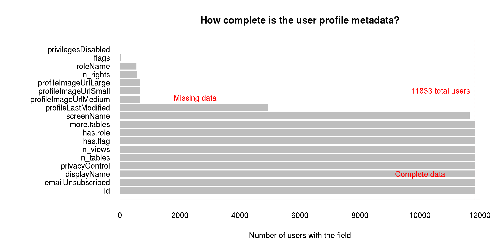
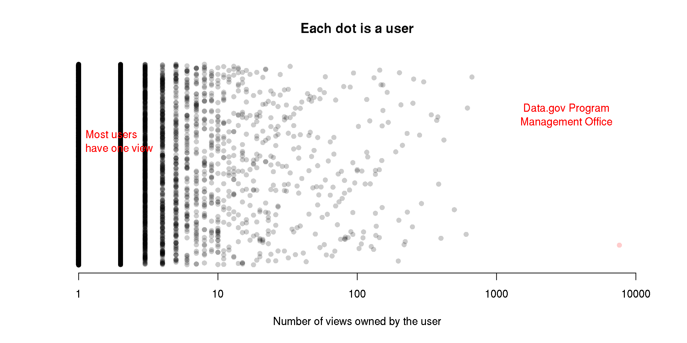
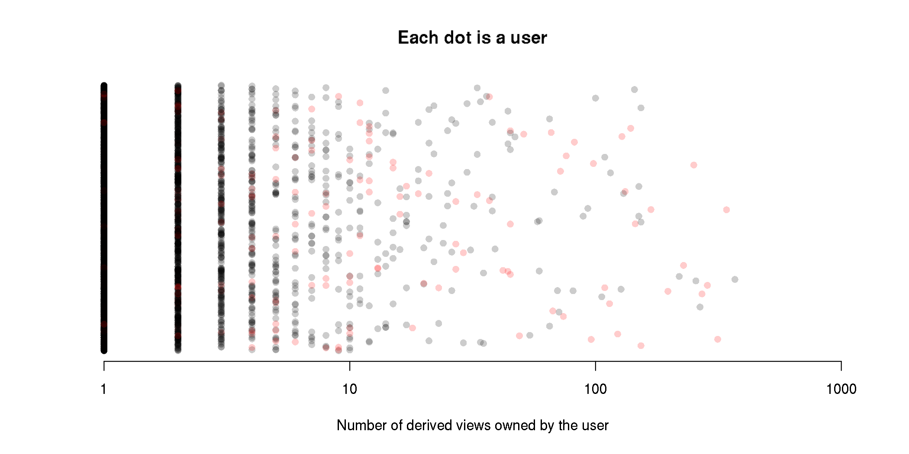
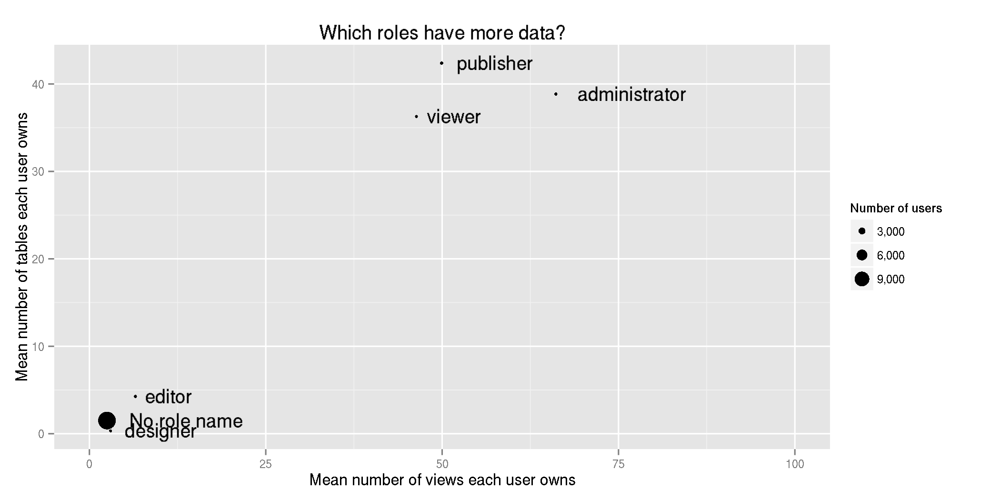

I recently downloaded the metadata files for all
of the datasets on all of the Socrata portals (for a particular definition
of "all"). And then I remembered that these datasets don't just float in
space; **people use them**.

My [first post](/!/socrata-summary) looked at popular datasets, and
my [second post](/!/socrata-genealogies) looked at big dataset families.

Through doing this, I've learned that Socrata is much more than a website
for converting datasets into different formats and serving them on the web.
Socrata "[consumerizes the data experience](http://www.socrata.com/open-innovation/)"
with web-based mapping and charting tools. Here's a sexy video they made.

<video controls="" id="wistia_1" preload="none" poster="http://embed.wistia.com/deliveries/d86ff91b0a3b280ee4fd5fea9b65993d1b250340.jpg?image_crop_resized=640x360" style="width: 100%; height: 100%; position: relative; display: block;"><source src="http://embed.wistia.com/deliveries/37d0ddf8aeb21db020b1059c10c62373c9140734/file.mp4" type="video/mp4"></video>


I live in this bubble of people who know how to use computers, so Socrata's
charting tools seem really clunky and stupid to me, but it turns out that
these clunky tools can be outrageously useful people who aren't strange like me.

[Nicole Neditch](https://twitter.com/nneditch) told me of one instance where someone in the Oakland government made a pie chart in
the Socrata data portal and embedded that in a blog. If Oakland hadn't been using Socrata,
the result probably would have been less exciting; Nicole said that the person probably
would have made a chart in Excel, exported that to a PDF and added a download link.

I wanted to find more people like this. That is, I want to see how people's approach to analysis
changes because of these web-based analysis tools that are strongly integrated
with both the data being analyzed and with web-based presentation formats.
So in this third post, I look at people who use Socrata's analysis tools substantially
and otherwise interestingly.

## The user data format
In order to do this analysis, I'm going to take user data from Socrata, and this
involves learning more about Socrata's API.

I'm still using the same 80,000 JSON files that I [downloaded](/!/socrata-summary) last month.
Each of these metadata files describes a Socrata [view](/!/socrata-genealogies#term-view).
Some of these JSON files are duplicates (because of
[federation](/!/socrata-genealogies#term-federation)),
so there are only about 50,000 unique views.
(And the other 30,000 are exact duplicates, so deduplicating was easy.)


Among the many fields in each JSON file are
fields are two fields related to the people who interacted with that view.
These fields are the `owner` and  `tableAuthor` fields. These fields are
both hashes/dictionaries/arrays with user information. For example, here's
mine.

    {
      "id" : "x73b-9d8f",
      "displayName" : "Thomas Levine",
      "emailUnsubscribed" : false,
      "privacyControl" : "login",
      "profileImageUrlLarge" : "/images/profile/0252/1851/govlab-experiment_large.jpg",
      "profileImageUrlMedium" : "/images/profile/0252/1851/govlab-experiment_thumb.jpg",
      "profileImageUrlSmall" : "/images/profile/0252/1851/govlab-experiment_tiny.jpg",
      "profileLastModified" : 1374508383,
      "screenName" : "Thomas Levine"
    }

### Owner
The `owner` field is quite straightforward; it's simply the person who
created the view, be it a
[dataset](/!/socrata-genealogies#term-dataset),
[filtered view](/!/socrata-genealogies#term-filtered-view),
[chart](/!/socrata-genealogies#term-chart-and-map) or
[whatever](/!/socrata-genealogies#term-other-view-types).

### Table Author
The `tableAuthor` field is the person who uploaded the
[table](/!/socrata-genealogies#term-table) (source data) associated
with the view. For datasets, this is the same as the owner, but for charts,
maps and filtered views, it might be different; one person may have uploaded
the data, and another person might have made the chart. "view", "dataset",
"map", "chart", "filtered view" and "table" all have rather special meanings
inside Socrata, so you should read my [post on that](/!/socrata-genealogies)
if the previous sentence didn't make sense.

## Extracting the user data
I already had a system for storing all of the Socrata metadata, so I just needed to write a
[sloppy function](https://github.com/tlevine/socrata-analysis/blob/e3d12254e928f986f1a83ed2099577e289048b94/numbers/run.py#L207)
to query it. This resulted in an SQLite3 database, which I converted to a
[CSV file](https://raw.github.com/tlevine/socrata-analysis/e3d12254e928f986f1a83ed2099577e289048b94/users.csv)
and read into R.

## Data summary
The user data frame schema looks like this.


```
str(users)
```
{: .language-r}

```
## 'data.frame':	11833 obs. of  18 variables:
##  $ id                   : chr  "wivw-ajwk" "6b59-fhhh" "vigz-pjyi" "abb4-qtmc" ...
##  $ emailUnsubscribed    : int  0 0 0 0 0 0 0 0 0 0 ...
##  $ displayName          : chr  "Rory Martin" "Roman Russia" "svelz" "Tobit Sibol" ...
##  $ privacyControl       : chr  "login" "login" "login" "login" ...
##  $ n_tables             : int  1 1 0 1 1 2 2 1 1 0 ...
##  $ n_views              : int  1 1 2 1 1 221 2 1 1 1 ...
##  $ screenName           : chr  "Rory Martin" "Roman Russia" "svelz" "Tobit Sibol" ...
##  $ profileLastModified  : Date, format: NA NA ...
##  $ profileImageUrlMedium: chr  NA NA NA NA ...
##  $ profileImageUrlSmall : chr  NA NA NA NA ...
##  $ profileImageUrlLarge : chr  NA NA NA NA ...
##  $ n_rights             : int  NA NA NA NA NA NA NA NA NA NA ...
##  $ roleName             : chr  NA NA NA NA ...
##  $ flags                : chr  NA NA NA NA ...
##  $ privilegesDisabled   : int  NA NA NA NA NA NA NA NA NA NA ...
##  $ has.flag             : logi  FALSE FALSE FALSE FALSE FALSE FALSE ...
##  $ has.role             : logi  FALSE FALSE FALSE FALSE FALSE FALSE ...
##  $ more.tables          : logi  FALSE FALSE FALSE FALSE FALSE FALSE ...
```


### Missing data
Not everyone had all of the fields.


``` r
a <- t(as.data.frame(lapply(users, function(variable) {
    sum(!is.na(variable))
})))
missingness <- data.frame(variable = rownames(a), present.value = a[, 1])
missingness <- missingness[order(missingness$present.value, decreasing = T), 
    ]
old.mar <- par()$mar
par(mar = c(5, 12, 4, 2))
barplot((missingness$present.value), names.arg = missingness$variable, border = NA, 
    col = "grey", axes = F, horiz = T, las = 1, xlim = c(0, 12000), main = "How complete is the user profile metadata?", 
    xlab = "Number of users with the field", ylab = "")
axis(1, at = seq(0, 12000, 2000))
abline(v = nrow(users), col = 2, lty = 2)
text(x = nrow(users), y = 15, labels = paste(nrow(users), "total users"), col = 2, 
    pos = 2)
text(x = 2500, y = 14, labels = "Missing data", col = 2)
text(x = 10000, y = 3, labels = "Complete data", col = 2)
```

 

```r
par(mar = old.mar)
```


### How many views do people have?


```r
plot.count(users$n_views, "views", col = (users$id == "e8ug-wzay") + 1)
text(x = 0, y = 1.2, labels = "Most users\nhave one view", pos = 4, col = 2)
text(x = 3.5, y = 1.5, labels = "Data.gov Program\nManagement Office", col = 2)
```

 


Most users (7790 to be exact) have exactly one view.
Actually, there are probably even more with no views, but I don't have the
data on them.

That one way off to the right is the Data.gov Program Management Office,
with 7618. 

### How many tables?

Let's make that same plot but for the number of tables. (A table is a raw
uploaded dataset, before any view filtering. A table can have many views,
and a view has only one table.)


```r
plot.count(users$n_tables, "tables", col = 1 + (!is.na(users$roleName) & (users$roleName == 
    "publisher" | users$roleName == "administrator")))
text(x = 3.5, y = 1.5, labels = "Data.gov Program\nManagement Office", col = 2)
```

 


That point off to the right is again the Data.gov Program Management Office.

### How many derived views?
When you upload a tabular data file to Socrata, Socrata creates a "table" and
a "dataset" view on that table. When you filter a view inside Socrata, Socrata
creates a new view but no new table. Thus, the difference between number of
tables and number of views tells us how many derived views people have made.
I think.


```r
plot.count(users$n_views - users$n_tables, "derived views", col = 1 + ((!is.na(users$roleName) & 
    (users$roleName == "publisher" | users$roleName == "administrator"))))
```

```
## Warning: NaNs produced
```

 


It also turns out that 65 users have more tables than views. This appears to be
mostly publishers. Maybe this is something about how the import API works that I
don't understand.

## Aside from data publishers and Socrata employees, who uses Socrata a lot?
I wanted to find people who have used Socrata a lot without being employed by
Socrata or data-publishing governments. I started out by trying to separate
employees of Socrata and data-publishers from everyone else. That was a bit
harder than you might expect.

### More tables than views
As I mentioned earlier, I didn't realize that it was possible to have more
tables than views. How does that happen?

#### An example
One case is [rseel](https://data.oregon.gov/profile/rseel/izyb-s78c?).
He is the author behind a private table, and 
[Cam Caldwell](http://www.socrata.com/company-info/leadership/), who works for Socrata, made 
[this view](https://data.oregon.gov/Health-Human-Services/WIC-Authorized-Vendors/5ew8-h6d9?)
based on that table. So some of the situations where people have tables but no views might
occur because of private views; the original dataset is private, and some views on that
dataset are public.

We care about this because this might be a way of identifying people who work
for data publishers. Considering that this private dataset is posted on Oregon's
portal and that a Socrata employee made a view based on it, I suspect that rseel
works for Oregon, or maybe Socrata.

#### More users like this
I looked at more of the users who had more tables than views.

    subset(users, n_tables > n_views)[c('displayName', 'roleName', 'flags', 'n_tables', 'n_views')]

I looked up a few of them with a search engine, and they mostly
[seem](http://www.linkedin.com/in/jkray)
[to](http://www.imaginaryrobots.net/resumes/Jesse_van_Herk_resume.pdf)
[be](http://www.linkedin.com/in/debraagagne)
[government](http://www.whitehouse.gov/champions/technology-and-innovation/waldo-jaquith)
[employees](http://waldo.jaquith.org/).
So I think I can count people as employees of data publishers or Socrata
if they have more tables than views.

### Role names
I noticed that most of the people in the above list have
`roleName` fields. Very few people have `roleName` fields, so
I think that people tend to have a `roleName` field
if and only if they work for data publishers. To investigate that,
let's look at the number of views that each person owns by the different
roles of user.


```r
user.by.role <- ddply(users, "roleName", function(users.role) {
    c(mean.number.of.views = mean(users.role$n_views), mean.number.of.tables = mean(users.role$n_tables), 
        number.of.users = nrow(users.role))
})
user.by.role[is.na(user.by.role$roleName), "roleName"] <- "No role name"
ggplot(user.by.role) + aes(x = mean.number.of.views, y = mean.number.of.tables) + 
    geom_point(aes(size = number.of.users)) + geom_text(aes(label = roleName), 
    hjust = -0.2) + scale_size_continuous("Number of users", labels = comma) + 
    scale_x_continuous("Mean number of views each user owns", limits = c(0, 
        100)) + scale_y_continuous("Mean number of tables each user owns") + 
    ggtitle("Which roles have more data?")
```

 


It looks like publishers and administrators make more views. Big surprise.
Moreover, few people have roles, and people with roles tend to have more data
than people without roles. This supports my suspicion that people with roles
are data publishers. To test that a bit more precisely, let's compare that to
my other suspected indicator of data-publisher-ness: Whether people have more
tables than views. Here's a plot of that.


```r
users$more.tables <- users$n_tables > users$n_views
users.roleNames <- ddply(users, "more.tables", function(df) {
    out <- data.frame(has.role = c(T, F), prop = c(mean(df$has.role), 1 - mean(df$has.role)))
})
barplot(users.roleNames$prop[users.roleNames$more.tables], names.arg = c("Has a roleName", 
    "No roleName"), ylim = 0:1, border = NA, las = 1, ylab = "Proportion of users with more tables than views", 
    xlab = "User group", main = "Are roleNames for data publisher employees?")
```

 


If we want to get all statistical about it, we can run
Fisher's Exact test.


```r
fisher.test(table(users$n_tables > users$n_views, users$has.role))
```

```
## 
## 	Fisher's Exact Test for Count Data
## 
## data:  table(users$n_tables > users$n_views, users$has.role)
## p-value < 2.2e-16
## alternative hypothesis: true odds ratio is not equal to 1
## 95 percent confidence interval:
##   35.69 118.94
## sample estimates:
## odds ratio 
##      63.77
```


and find that these counts are indeed disproportionate. 

This is all to say that `roleName` appears to be a **decent indicator for "data publisher"**.

### Flags
In a similar vein, I looked at Socrata users with a `flags` field.
35 users have a non-empty `flags` field, and
the value of that field is `["admin"]` for all of these users.
Here are those users.


```r
users$has.flag <- !is.na(users$flags)
subset(users, has.flag)["displayName"]
```

```
##               displayName
## rgff-7jh6     Doug McLeod
## g4md-3inp         chitang
## rqdg-xj2v           Clare
## p2g6-hzkg  Anthony Nowell
## 2bbf-kmrb  Marc Millstone
## 83hr-92mi   Kevin Merritt
## xpic-k57b     Chris Whong
## b5e4-d7x8          Jordan
## hmzy-ctip     Clint Tseng
## xtsj-wzxh   Roopa Prakash
## 4xtm-veev    MIchael Chui
## i7d8-sc4w   Chris Metcalf
## 86uf-6gqx     beth.blauer
## tm4c-rqum    Lilia Gutnik
## 2fra-n3vu        John Kew
## rj6s-jsfr       Will Pugh
## e9wa-d5y6 Giacomo Ferrari
## ipyd-bu8g          Adrian
## x5jh-tg6w      Hiko Naito
## 4tjb-bgqg      Anna Veldt
## 4qwc-qq8v         kfontes
## mvvk-izrz  Jeff Scherpelz
## iwnv-rtc2   Karin Hellman
## 8est-2umm           Sells
## 54cf-cqm2     Joe Pringle
## 7ef3-v99y   Paul Paradise
## nux4-azwn       bryantlau
## gyd7-94dj          mlouie
## 8vin-pcrv      amy winner
## eudm-snef             Saf
## bxv9-y9sr             rjm
## r5m2-5pds    Cam Caldwell
## tjtx-bges             anu
## zs8p-j3v5 Darrell Cabales
## vcvp-yass           Dylan
```


These appear to all be Socrata employees.

Hmm. Does anyone have both a `roleName` and a flag?


```r
subset(users, has.flag & has.role)[c("displayName", "roleName")]
```

```
##           displayName      roleName
## 86uf-6gqx beth.blauer administrator
## nux4-azwn   bryantlau administrator
```


[Beth](http://www.socrata.com/newsroom-article/government-innovator-beth-blauer-joins-socrata/)
and [Bryant](www.linkedin.com/in/bryantlau) are both
Socrata employees. I don't know why they have `roleName` fields.

Anyway, it looks like the **`flags` field is a decent proxy for "Socrata employee"**.

### Ordinary citizens
If having a `flags` field means you work for Socrata and
having a `roleName` means you work for a data publisher (a government, usually),
then maybe people with neither `flags` nor a `roleName` are the
citizens that Socrata is trying to empower.

#### No flags, no roles

```r
citizens <- subset(users, !has.flag & !has.role)
columns <- c("displayName", "n_tables", "n_views")
head(citizens[order(citizens$n_views, decreasing = T), columns])
```

```
##                                    displayName n_tables n_views
## vc35-nh3p                      Public Datasets      496     605
## v4c9-bc9b                              cpbride      242     498
## ugen-sv2k                                Scott        3     372
## w3yb-tyrd                                admin      296     340
## yahm-crqu U.S. Environmental Protection Agency       14     280
## rek6-gcru                           Sam S. Lee        2     221
```


Hmm okay they're not all citizens. For example,
"[Public Datasets](https://opendata.socrata.com/profile/Public-Datasets/vc35-nh3p)"
appears to be [recovery.gov](http://www.recovery.gov)'s open data initiative,
which is running on [opendata.socrata.com](https://opendata.socrata.com)
rather than on a separate portal.

#### Also no tables
Maybe we should also expect citizens not to have uploaded any tables.


```r
citizens <- subset(users, !has.flag & !has.role & n_tables == 0)
head(citizens[order(citizens$n_views, decreasing = T), columns])
```

```
##                   displayName n_tables n_views
## jyr3-c2kp              Njbate        0     153
## cif6-aywu                CPHA        0     150
## teh5-ns3w Kenya Open Data Bot        0     144
## 4p9m-76ij               Tracy        0     100
## edap-jnwh     warren.kagarise        0      93
## aeze-ppu4                  NL        0      89
```


Now we're getting somewhere.

[Njbate](https://explore.data.gov/profile/Njbate/jyr3-c2kp?)
made a bunch of filtered views on the
[FEC Contributions dataset](https://explore.data.gov/Contributors/FEC-Contributions/4dkz-64bn).

[CPHA](https://data.baltimorecity.gov/profile/CPHA/cif6-aywu?)
made a bunch of filtered views on the
[Baltimore 311 request dataset](https://data.baltimorecity.gov/Community/311-Customer-Service-Requests/9agw-sxsr).

The [Kenya Open Data Bot](https://opendata.go.ke/profile/Kenya-Open-Data-Bot/teh5-ns3w?)
made a bunch of charts on a few different datasets.
These charts are quite popular, and they account for a quarter of Kenya's open data portal.

Anyway, I see a pattern here: Users with the most views
just made different filters on the same dataset.

#### With a profile image
Let's try this yet again, but this time, let's look only at people with profile images.


```r
citizens <- subset(users, !has.flag & !has.role & n_tables == 0 & !is.na(profileImageUrlLarge))
columns <- c("displayName", "n_tables", "n_views", "profileImageUrlLarge")
head(citizens[order(citizens$n_views, decreasing = T), columns], 10)
```

```
##                      displayName n_tables n_views
## aeze-ppu4                     NL        0      89
## 732w-crxq    not The White House        0      30
## 86yi-jydw               VinylFox        0      26
## ef7y-9vvy Dave Francis Rodrigues        0      25
## pieh-8cyx    Michael Christopher        0      21
## v8wk-qcyk           MrDataFerret        0       8
## fcg6-n5gt       David T. Andrews        0       7
## dpze-sudn         prasannalaldas        0       6
## aj2c-kiyh    Mitali Kumar Mathur        0       4
## e83w-vpb9        nolewalkingshaw        0       4
##                                                 profileImageUrlLarge
## aeze-ppu4              /images/profile/6252/8605/photo__1__large.jpg
## 732w-crxq           /images/profile/7788/3275/ProfileImage_large.jpg
## 86yi-jydw                 /images/profile/4013/6059/coffee_large.jpg
## ef7y-9vvy             /images/profile/7984/1730/000224603_large.jpeg
## pieh-8cyx    /images/profile/5646/4628/michael_christopher_large.jpg
## v8wk-qcyk       /images/profile/3251/7780/ferretthumbnail1_large.jpg
## fcg6-n5gt /images/profile/7663/5320/Clair_at_New_Years_Eve_large.jpg
## dpze-sudn               /images/profile/8432/0223/P1000961_large.JPG
## aj2c-kiyh              /images/profile/6587/1742/frontface_large.png
## e83w-vpb9                  /images/profile/7942/2651/image_large.jpg
```


I ran queries like this to find what portals and data they used.

    subset(socrata, owner.id == 'aeze-ppu4')[c('portal', 'id', 'tableId', 'name', 'viewCount')]
    table(subset(socrata, owner.id == 'aeze-ppu4')$portal)

They look more like real people doing real analysis.


[not The White House](https://explore.data.gov/profile/not-The-White-House/732w-crxq)
is "[w]ay more open and transparent than the official White House website."
It's another account that's just making filters on one dataset, but they're a bit more
creative, diverse and involved. Here are some of her popular views.

* [People who went on the West Wing tour](https://explore.data.gov/dataset/West-Wing-Tour/e8wt-55cb)
* [People who played basketball at the White House](https://explore.data.gov/dataset/People-who-played-basketball-at-the-White-House/a4h3-3v3x)
* [Secret Service BBQ](https://explore.data.gov/dataset/Secret-Service-BBQ/tgmj-eaig)

not The White House also has its own separate website, 
[whitehouse.gov1.info](http://whitehouse.gov1.info/),
which is a parody of the [official White House website](http://www.whitehouse.gov/).


[NL](https://finances.worldbank.org/profile/NL/aeze-ppu4)
used to do a lot with World Bank data, though she hasn't for a few months.

She also has some views
[on databox.worldbank.org](https://databox.worldbank.org/profile/NL/aeze-ppu4).
Interestingly, that portal didn't show up in my list of Socrata portals.


[VinylFox](https://data.baltimorecity.gov/profile/VinylFox/86yi-jydw?)
has also made a bunch of interesting filters on Baltimore data.
His website discusses this [a bit more](http://www.vinylfox.com/about/).
<!-- Talk to him. -->


[Dave](https://finances.worldbank.org/profile/Dave-Francis-Rodrigues/ef7y-9vvy?)
has made a lot of filters and charts about India.
He also names his views really well. In particular, I like his hack of prefixing
all of the titles with "Dave_"; this gets around how Socrata doesn't make it particularly
clear who created the view that you are looking at.

#### Everyone else
I looked at a few specific Socrata users who are doing interesting things,
but let's look a bit more broadly. The histogram below shows how many views
users have created. Here, I'm including people without profile pictures.


```r
citizens <- subset(users, !has.flag & !has.role & n_tables == 0)
hist(citizens$n_views, col = 1, border = NA, xlab = "Number of Socrata views created by the user", 
    ylab = "Number of users", main = "How many views do Socrata users make?")
```

 


Here it is again, but leaving out the top ten users to make it easier to see.


```r
citizens <- subset(users, !has.flag & !has.role & n_tables == 0)
hist(citizens$n_views[citizens$n_views < 30], col = 1, border = NA, xlab = "Number of Socrata views created by the user", 
    ylab = "Number of users", main = "How many views do Socrata users make?")
```

 


As you might expect, most people make only one view.
In fact, there are probably even more users with no views.

I'm more concerned with the right side of the graph.
As we should expect, far fewer people have made 10 views than 1 view.
But look at the absolute counts. Only 411
users have made at least 10 views. Keep in mind that this includes
all of the users who have made a public view on any of the
60 portals; this number seems quite low.

Also keep in mind that that's *all* of the users with at least 10 views;
if we look at only the users whom I've identified as citizens, it drops
to 38,
or fewer than one user per portal. Quite low.

## Conclusions, lessons, ideas, &c.

### API documentation
Most of my work on this is still just in figuring out what the API fields mean and documenting them.
Some of you reading this are probably building developer APIs, so keep this in
mind: If you don't document your API fully, some random person might come along
and document it for you, which might be highly embarrassing and/or highly convenient.

Now on to some more serious conclusions.

### Big users
I looked for users that published a lot of views.

Unsurprisingly, data publishers create lots of views. And Data.gov is crazy.

Aside from data publishers, there are a few accounts that make lots of filters
on the same dataset. These accounts might be bots; one of them is even called
the "Kenya Open Data Bot".

I found some accounts (not The White House, NL, VinylFox and Dave Francis
Rodrigues) that are making lots of diverse filters and maps with Socrata
in study of a particular topic. Are these the prime examples of "consumer"
data analysts, as Socrata aims to create?

On the other hand, publishing a lot of views isn't the only thing that means
that you use Socrata a lot.

### One portal
Very few of the big users that I discuss above uses more than one Socrata portal.
This certainly makes sense as Socrata open data portals are presented as if they're
separate installations of the software. You can use the same account for all of the
portals, but there's no obvious way to search across portals or get a list of all
of the portals.

I wonder whether people would use data from multiple portals if it were easier to
search across portals. I think someone should set up a Socrata portal that
federates all of the other portals; maybe people would use Socrata Open Data Portal
software differently if they could easily collect and analyze data from all of the portals.

On the other hand, maybe they wouldn't. A couple of the bigger users I found
were using World Bank data, and it's quite possible that the data in the other portals
aren't that relevant to them.

### People don't use Socrata that much.
If people are using Socrata's data analysis tools, we should expect lots of
views to be created.
Searching across all of the portals, I found fewer than 500 users with at
least 10 views. This is less than ten such users per portal, which doesn't
seem like a lot. And almost all of these users are data publishers or Socrata
employees, so hardly any citizens seem to be analyzing Socrata data.

### Or do they?
Maybe they're using the data and just not using Socrata's analysis tools.

I think that people get good at one way of using computers and then never learn other ways.
(I credit this theory to [Alec Story](https://plus.google.com/116070987814199239957/posts).)
This applies for my former neighbor who could check her email just fine with the old
email software but got confused when she got a new computer with a new version of the email software.
This also applies for people like me who are stuck using R because they know all sorts of
[magical R incantations](/!/r-spells-for-data-wizards) even though they know that
[R is completely insensible](https://stat.ethz.ch/pipermail/r-help/2010-September/252618.html).

Getting back to Socrata, I suspect that people are using the Socrata data to some
degree but that they're downloading the dataset manually analyzing it in Excel.
(And it would be cool to test this suspicion, but I haven't yet come up with a good way of doing that.)

If this is what is happening, it would be really cool to have stronger integrations
between Excel and Socrata. Currently, you just download a view in Excel format and then
open it. What if there were an Excel macro that would synchronize a table in Excel
with a view in Socrata? Or a plugin that would let you upload reports from Excel back
to Socrata?

### Maintaining the openness of data
If people are analyzing open data in Excel and then disseminating the findings as
paper documents, then we're not maintaining the openness of the data.
There are a lot of situations where the analyst wants the analysis to stay private,
but there are also a lot of situations where the analyst would love to share the
analysis publicly if only it were easier.

Much focus in open data is on opening existing silos on data. Let's also think about
how we can **prevent data from becoming siloed** in the first place.

## A request for data
I managed to find a few interesting users, but I'm somewhat disappointed.
The available data are quite coarse, and few variables are exposed.

On the other hand, portal administrators have do have access to these data! If you run a portal,
you should be studying these usage data in order to understand what data people are using,
how people are using it and how you can improve your open data offerings.
Even better, you should just open the usage data
[like Oregon did](https://data.oregon.gov/analytics) so I can do this for you.

If you administrate a portal, I want you to make your analytics page public.
And if you don't administrate a portal, I want you convince your local portal
administrator to. It's just one box in administrator dashboard that you need to click.

Open data!
