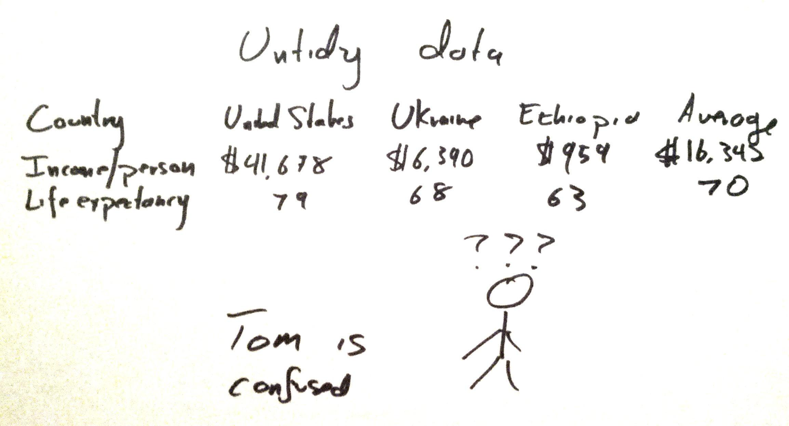

## I like tables.
In order to understand how the world works, I collect data
about it and then apply a bunch of fancy quantitative methods
A lot of these methods expect data to be represented in
data tables. When people like me work with tables so much,
we come up with lots of fancy words to describe all of the
different parts of a table. Today, I hope to teach you what
all of these different words mean.

## Rows and columns
Here's a data table about the wealth and health of nations.

Country | Life expectancy (years) | Income Per Person
------- | ----------------------- | -----------------
United States                | 79 | $41,678
Ukraine                      | 68 |  $6,390
Ethiopia                     | 63 |    $959

It has a grid with a value in each of the rectangular boxes.
Being this sort of grid, it has columns and rows. These columns
and rows mean special things.

*What we're calling "income per person" is technically gross-domestic product per
capita, adjusted for purchasing power parity and inflation. But don't worry about
that if it sounds like Greek.*

### Rows
The very first line in that table says "Country", "Life Expectancy" and "Income Per Person".
This line is called the "header", and we'll get to that later.

The rest of the lines are all *rows*.
A data table represents a collection of things, and each individual
thing is represented as a row. For example, the table above is about a
collection of countries, so each row is a country. I've copied it down
here again, this time highlighting one of its three rows.

Country | Life expectancy (years) | Income Per Person
------- | ----------------------- | -----------------
United States                | 79 | $41,678
Ukraine                      | 68 |  $6,390
Ethiopia                     | 63 |    $959
{:#row}

It is quite important to know that each row is a country, so we have a
name for this relationship; we say that country is the the *statistical unit*
in this data table.

**Synonyms**: Rows are also called *records*, *observations*, *trials*
and probably a bunch of other things.

### Columns
In this data table, we have recorded a bunch of information about
each the wealth and health of nations. More precisely, we have recorded
the same sorts of information about each country during the year 2012.
The first box in each row contains the name of that country,
and the second box contains the life expectancy for that country,
and the third contains the income per person.

Thus, all of the values in a given column are about the same sort of thing.
For example, the second column contains all of the life expectencies.

Country | Life expectancy (years) | Income Per Person
------- | ----------------------- | -----------------
United States                | 79 | $41,678
Ukraine                      | 68 |  $6,390
Ethiopia                     | 63 |    $959
{:#column}

**Synonyms**: Columns are also called *variables* and *features*. These words
sound very fancy, but they're not; when a data scientist says "variable" or
"feature", she's just using a fancy word for "column".

### Header
We usually indicate the names of the columns in the *header*, which is
highlighted below. This is how we know what each column means.

Country | Life expectancy (years) | Income Per Person
------- | ----------------------- | -----------------
United States                | 79 | $41,678
Ukraine                      | 68 |  $6,390
Ethiopia                     | 63 |    $959
{:#header}

### Tidy data
I said above that "row" is a synonym for "record", "observation" and "trial
and that "column" is a synonym for "variable" and "feature". This isn't *entirely*
true. In my mind, these truly are synonyms, but I'm sometimes given a data
table that doesn't look like this.

You could make a data table where rows don't correspond to records
and where columns don't correspond to variables. For example, you could make
a table where and columns are records and rows are variables. Or you could
make a table that includes a few rows that are statistics about the other rows.
I get confused when they I have tables like this.

{:.wide}

There's actually a name for this sort of data table; it's called *untidy*
data, and the first thing that I do when analyzing such a data table is
converting it into the *tidy* format where each row is an observation/trial/record
and each column is a variable.

## Review

* Data scientists like to put things in tables.
* In the table, a row is a record/observation/trial, which corresponds to the
    statistical unit of the dataset.
* In the table, a column is a variable/feature.
* This layout of a table is called "tidy data", and data scientists like their
    data to be tidy.

## Ask questions!

Data science has lots of words and concepts that often sound fancier
than they really are. What should I tell you about next?
