After I wrote about
[dead links on data catalogs](/!/dead-links-on-data-catalogs),
some people commented that the links were less dead than I'd thought.

[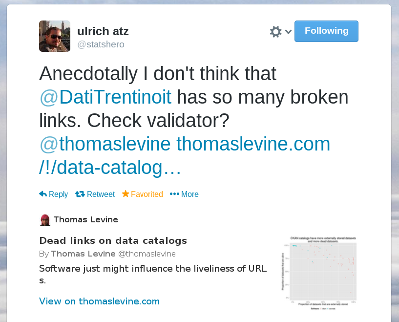](https://twitter.com/statshero/status/424147773852622848)

[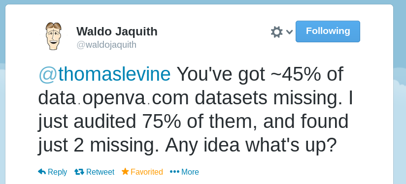](https://twitter.com/waldojaquith/status/424026174508261376)

Some explanations were proposed. Samuele and Jindřich both suggested that
the CKAN FileStore doesn't support HEAD requests.

[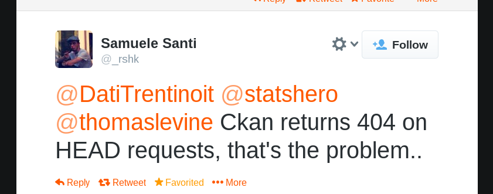](https://twitter.com/_rshk/status/424208140016418816)

[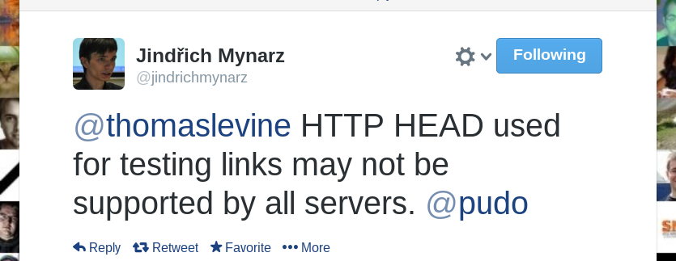](https://twitter.com/jindrichmynarz/status/428194318063370241)

And [Waldo](http://waldo.jaquith.org/)
suggested that I might be checking for status code 200 but
receiving status code 303 (redirect) from OpenVA.

So what was going on?

## Not reasons
I considered the two possibilities that were mentioned above, and
I don't think either of them was the issue.

### HEAD
CKAN does just fine on HEAD requests.

    url = 'http://dati.trentino.it/storage/f/2013-06-16T114537/_EBmYVk.csv'
    import requests

    get = requests.get(url)
    head = requests.head(url)
    
    print(get.status_code)
    # 200
    print(head.status_code)
    # 200

So I don't think the issue was that CKAN returns 404 on HEAD requests.

### Status code
I counted a link as alive if and only if it returned a status code of 200.
Could the issue be that I needed to check for other status codes? Specifically,
could it be that the URLs for files hosted on some CKAN FileStores are redirects
rather than final URLs?

URLs from the CKAN FileStore should not be an issue because I didn't check URLs
when the data were marked as being stored internally in the catalog.

That said, it's possible that people uploaded the data to the CKAN FileStore and
then told CKAN that it was an external link; it turns out that this was the case
for OpenVA

<!--
sqlite> select is_link,count(url like 'data.openva.com.s3.amazonaws.com%') 'aws', count(*) 'total' from links where catalog = 'data.openva.com' group by is_link;
is_link     aws         total     
----------  ----------  ----------
0           9           9         
1           99          99        
-->

Running this query

    SELECT DISTINCT url FROM links WHERE catalog = 'data.openva.com' AND NOT is_link;

yields three URLs with that characteristic.

    https://data.openva.com.s3.amazonaws.com/2013-06-30T21:27:16.600Z/2013.json
    https://data.openva.com.s3.amazonaws.com/2013-12-16T03:06:56.875Z/sentencing.csv
    https://data.openva.com.s3.amazonaws.com/2013-05-11T04:57:18.031Z/agency-websites.csv

They have issues with SSL certificates,

    requests.head('https://data.openva.com.s3.amazonaws.com/2013-06-30T21:27:16.600Z/2013.json')   
    # SSLError: hostname 'data.openva.com.s3.amazonaws.com' doesn't match either of '*.s3.amazonaws.com', 's3.amazonaws.com'

and they work just fine with unencrypted HTTP.

    requests.head('http://data.openva.com.s3.amazonaws.com/2013-06-30T21:27:16.600Z/2013.json').status_code
    # 200

Moreover, there aren't very many redirect status codes across all the links.

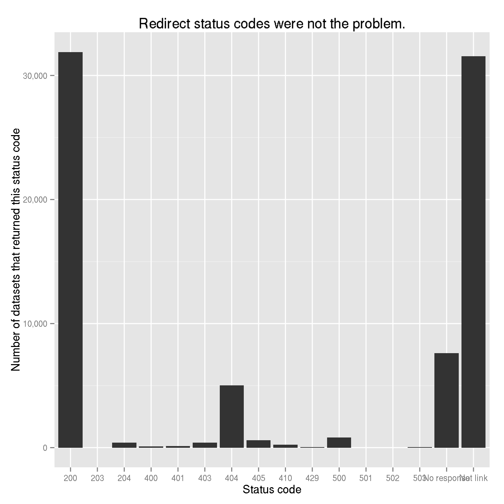 


Redirects are normally of status code 301 or 303, or at least in the 300-399
range. I followed redirects when I downloaded them, so this plot contains no
redirect status codes.

## Reasons
If the HEAD request thing and the redirect status code weren't the issues,
what was?

To figure this out, I tweaked my downloader and ran it on just the links that
had timed out or otherwise not responded; I didn't run it on links that had
responded with error status codes like 404. I also pulled out the hostname of
the links. (For example, `thomaslevine.com` of the URL of the page you're
reading.) Then I looked at the errors I got back.

I also looked around in the SQLite3 database in which I'd been storing
everything for this link analysis.

It's not like there was just one issue, of course.
Here are the main factors I see as leading to the strange results.

* I didn't fully parse links to datasets.
* I had a low timeout on my HTTP requests (2 seconds).
* I had duplicate data in my database.

### Incompletely parsed URLs
I looked at the different sorts of errors that I got when I requested links
to different hostnames.

 


That the left-most bar, for the hostname `http:`, is quite large and has
a lot of invalid URLs. Things that my hostname-parser detected as `http:` are
usually invalid URLs.


```
## [1] "http://"                                                                                                                                                                                                                                                                                                                                                                                                                                                                                                                                                                                                                                                                                                                                                                                        
## [2] "http://www..ic.nhs.uk/catalogue/PUB09271/per-soc-ser-adu-soc-car-sur-eng-2011-12-fin-tables-charts.xls"                                                                                                                                                                                                                                                                                                                                                                                                                                                                                                                                                                                                                                                                                         
## [3] "http://Gemeente-Den-Haag-open-data-Bodemenergie-restwarmtelocaties-bestaande-warmte-koude-opslag.zip"                                                                                                                                                                                                                                                                                                                                                                                                                                                                                                                                                                                                                                                                                           
## [4] "http://financial-transactions-data-west-midlands-strategic-health-authority-October-2012"                                                                                                                                                                                                                                                                                                                                                                                                                                                                                                                                                                                                                                                                                                       
## [5] "http://Con la legge 18 giugno 2009, n. 69 è stato previsto, all’art. 21, che le pubbliche amministrazioni pubblichino sui rispettivi siti internet le retribuzioni annuali, i curricula vitae, gli indirizzi di posta elettronica e i numeri telefonici ad uso professionale dei dirigenti, nonché le statistiche sui tassi di assenza e di maggiore presenza del personale distinti per uffici di livello dirigenziale.  La Presidenza è quindi impegnata nella necessaria raccolta dei dati trattati dai diversi Uffici del Segretariato generale e dei Ministri senza portafoglio, anche al fine di assicurarne l’omogeneità indispensabile per poter presentare elaborazioni attendibili e significative di una realtà complessa ed articolata come quella della Presidenza del Consiglio. "
```


Many of the URLs were intranet file paths (like `S:Foo\Bar\Baz.xls`).
Not all datasets are public yet, so this is better than nothing.
That said, I wonder whether people realize that these intranet paths are not
accessible on the normal internet.

Many of the links were specified as relative URLs, and I didn't try to parse them.
I could have known to look for this, but having absolute URLs would still have
been easier.

### Low Timeout
Aside from the invalid URLs, most of the bad links gave a timeout.

 


As we saw above, different websites (hostnames) tend to give different errors.
The following plot should make it more clear.

 


Recall that people thought that CKAN doesn't respond to HEAD requests. It might
just be that CKAN is slow to respond to requests. Here is a plot with datasets
color-coded based on whether they appear to be served from a CKAN filestore.

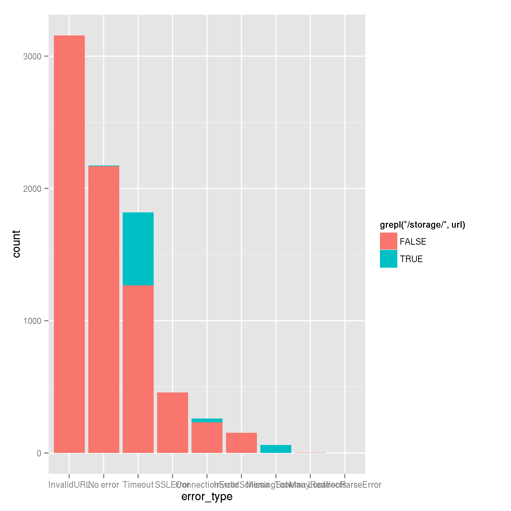 


(The `/storage` endpoint is typically used for the CKAN filestore.)

It looks like the CKAN FileStore can take a while to respond, and that might be
why people thought that HEAD requests fail.

## Duplicate data
It turned out that I had duplicate records in my table of link information. As I was working
with it, I forgot the correct schema and remembered a different one; I thought I had a unique
index on something for which I didn't.

To illustrate this, see below a plot of the number of CKAN datasets for which my link liveliness
data has duplicate records. The top bar graph is for datasets that were stored internally, and
the bottom bar graph is for datasets that were stored externally.


```
## stat_bin: binwidth defaulted to range/30. Use 'binwidth = x' to adjust
## this. stat_bin: binwidth defaulted to range/30. Use 'binwidth = x' to
## adjust this.
```

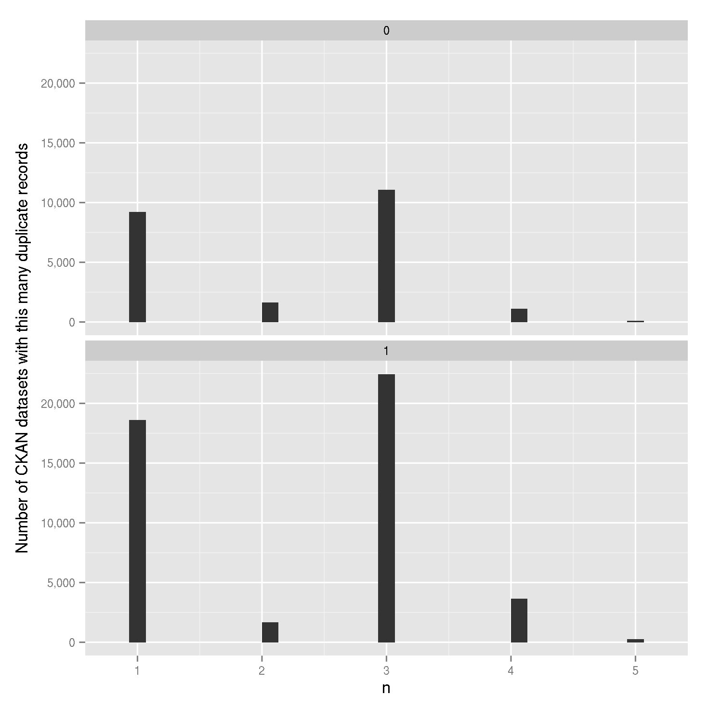 


We see that there were quite a many duplicates, particularly for datasets that were stored
externally. This happened because I ran my downloader script multiple times, thinking that
duplicates were being skipped rather than resolved properly.

Because of how I set up the database, it's hard to see this in the Socrata data.


```
## stat_bin: binwidth defaulted to range/30. Use 'binwidth = x' to adjust
## this. stat_bin: binwidth defaulted to range/30. Use 'binwidth = x' to
## adjust this.
```

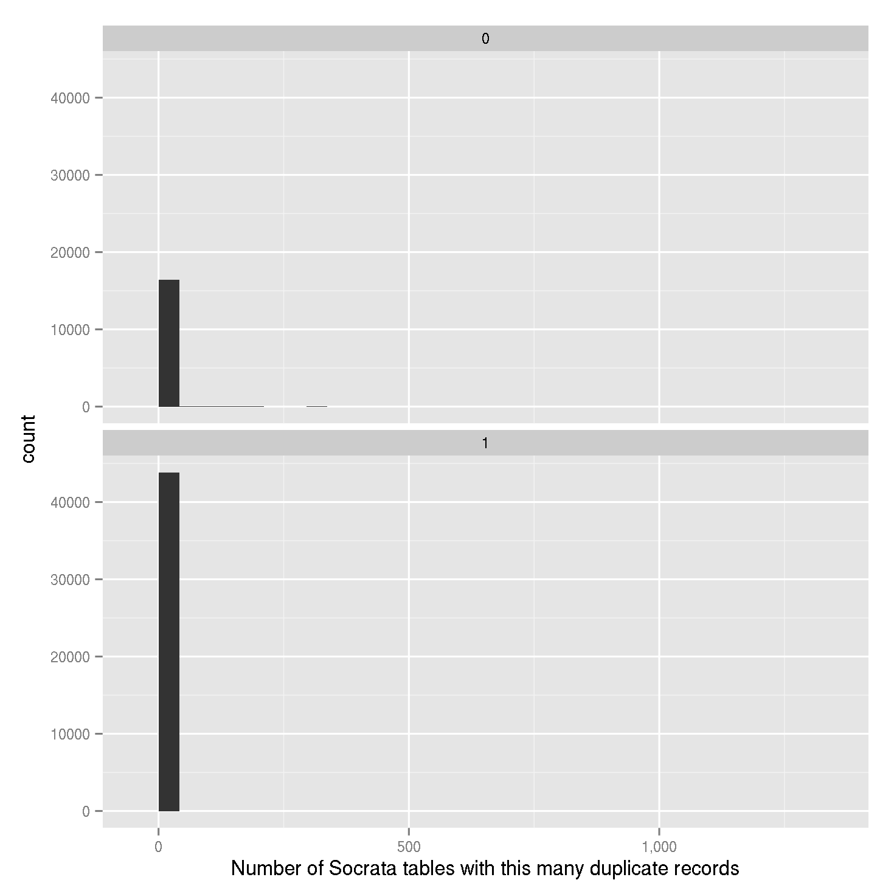 


This plot shows that I have hundreds of duplicates of the same dataset.
Most of these duplicates probably came from original Socrata site (as explained
[here](/!/socrata-deduplicate)).
Like with the CKAN datasets, my database schema issue probably only doubled or
tripled the duplication for the Socrata datasets.

## New results
I used a longer timeout on the previously-erring links and deduplicated my duplicates.
Here are new results that correspond with the plots in the
[previous article](/!/data-catalog-dead-links).

In these plots, each bar represents all of the datasets for one data catalog. The bar
is colored differently at different segments to represent different categories of dataset.

The first plot shows that most datasets within a given catalog are alive, either because
they are internally stored or because they are stored externally and have live links.

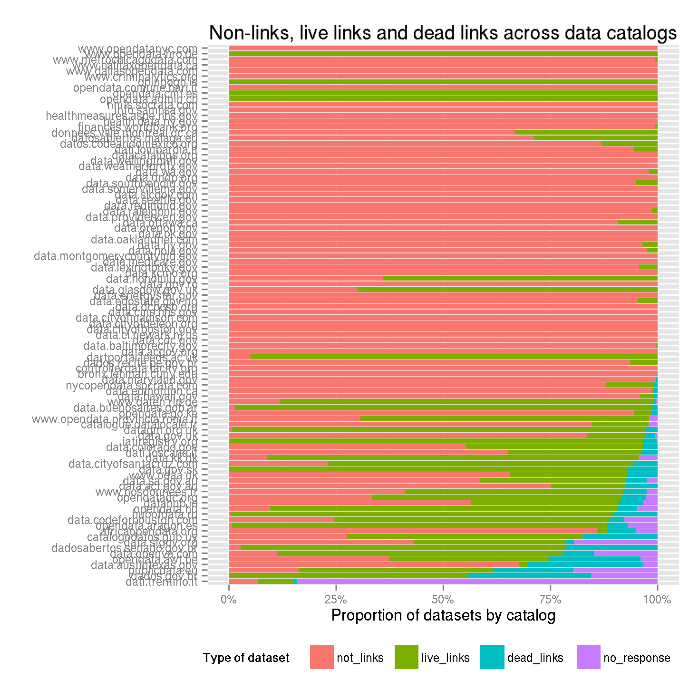 


Let's ignore the datasets that are stored internally. The bars will represent only the
datasets that are external links, and the missing bars correspond to catalogs with no
external links.

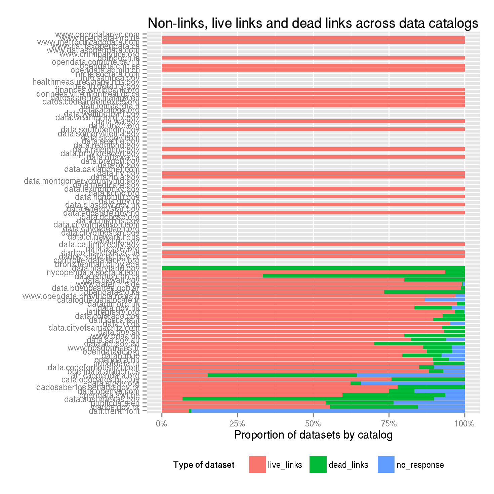 


One of my main conclusions in the prior article was that Socrata and CKAN encourage
different paradigms for adding data to the catalog. Socrata sites are more likely to
have internally stored data, and CKAN sites are more likely to have externally stored
data. On the other hand, externally stored datasets are more likely to be alive in
CKAN sites than in Socrata sites. I made this plot to explain that.


The plot looks a bit different with the fixed data (below),

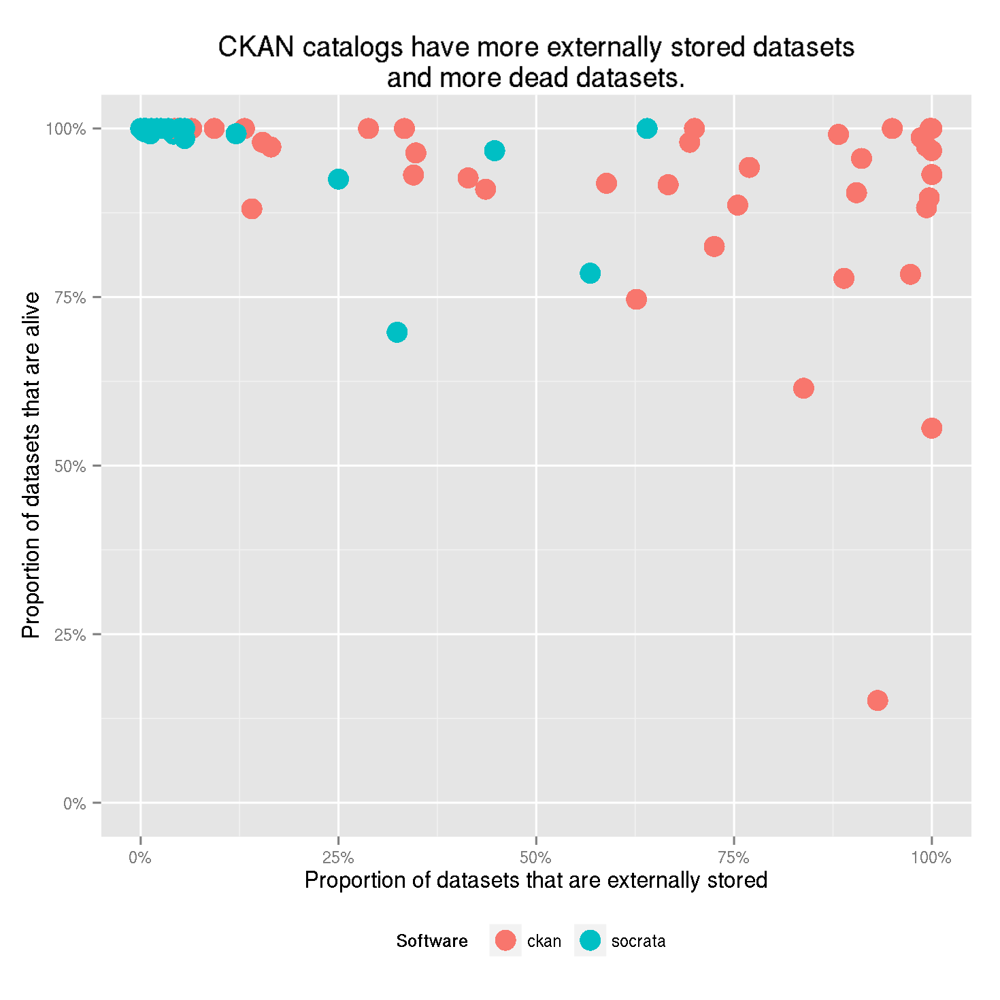 


but conclusion still seems reasonable.

## Unexplained
Let's look closely at the two catalogs for which my prior results didn't seem right.

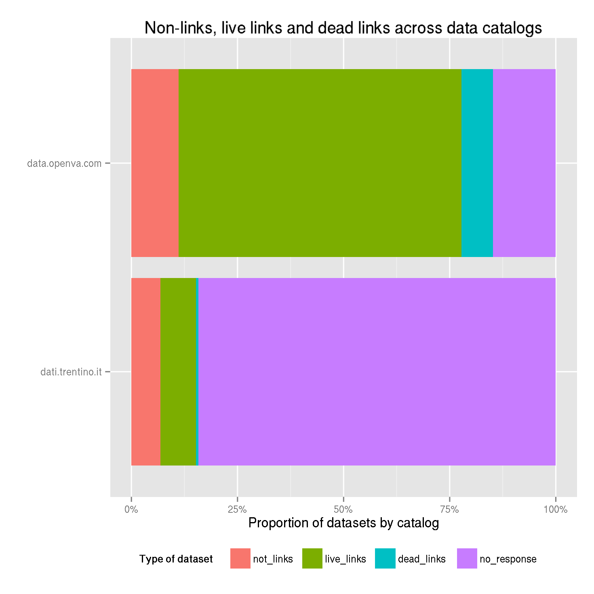 


OpenVA is looking more alive than it did before, and the links that I marked as dead
are links with SSL problems. But I don't know why Trentino's links are marked as dead.
I checked a few of these links, and they download just fine.

## Conclusion
My prior article gave some strange figures regarding the liveliness of datasets.
In particular, there were high rates of dead links for some catalogs.
Most of the strange figures in my prior article are explained by me having duplicates
in my database. Also, some dead links are explained by factors that we might not think
of as dead links, such as ambigous URLs or bad SSL configurations.

My main conclusion in the previous article is that CKAN and Socrata encourage storing
data in different places (internally and externally). After I accounted for the
duplication, this conclusion continues to seem valid.

Finally, we saw some interesting issues with the construction of URLs for datasets.
There was a bit more variation in URLs than I had anticipated.

# Appendix: How I figured this all out
Here are a bunch of things I tried doing in order to figure out what was going on.
It's not very well organized or explained, but you might find it interesting.

## Status codes
I called a URL alive if an ordinary HEAD request to it returned a
[status code](http://www.w3.org/Protocols/rfc2616/rfc2616-sec10.html) of 200.
This simplifies things a little bit.
I started out by considering whether this was an appropriate test.

Here are all of the status codes that I received, from all of the different
links from all of the catalogs.

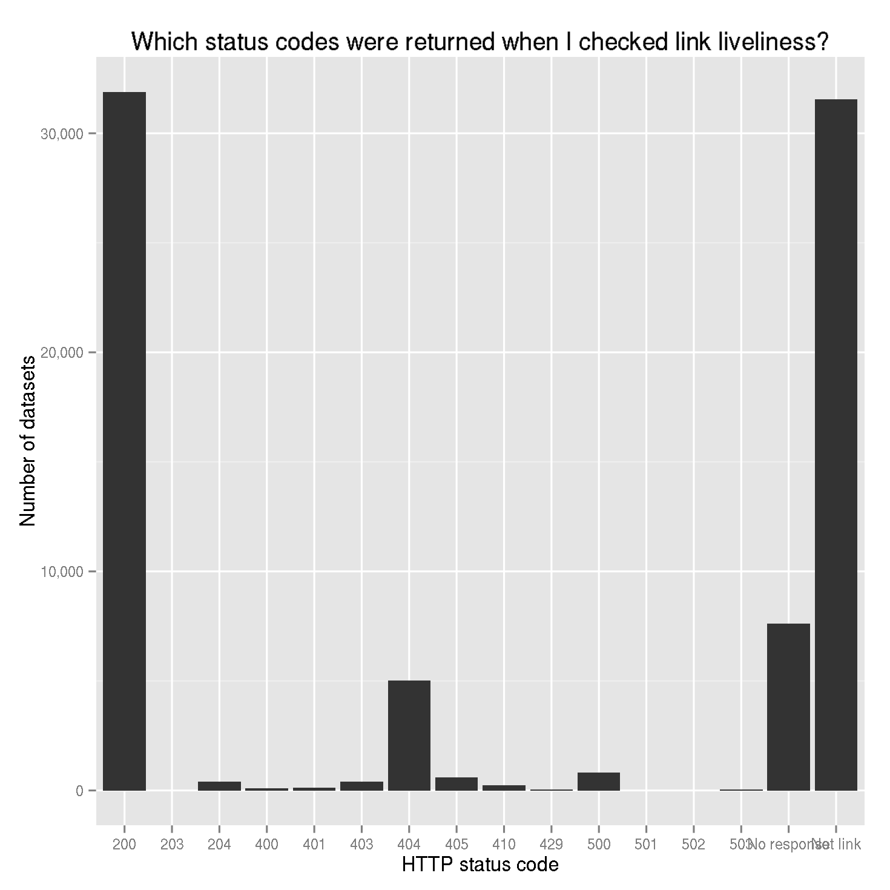 


Let's look at this for just the specific catalogs that those Tweets were about.

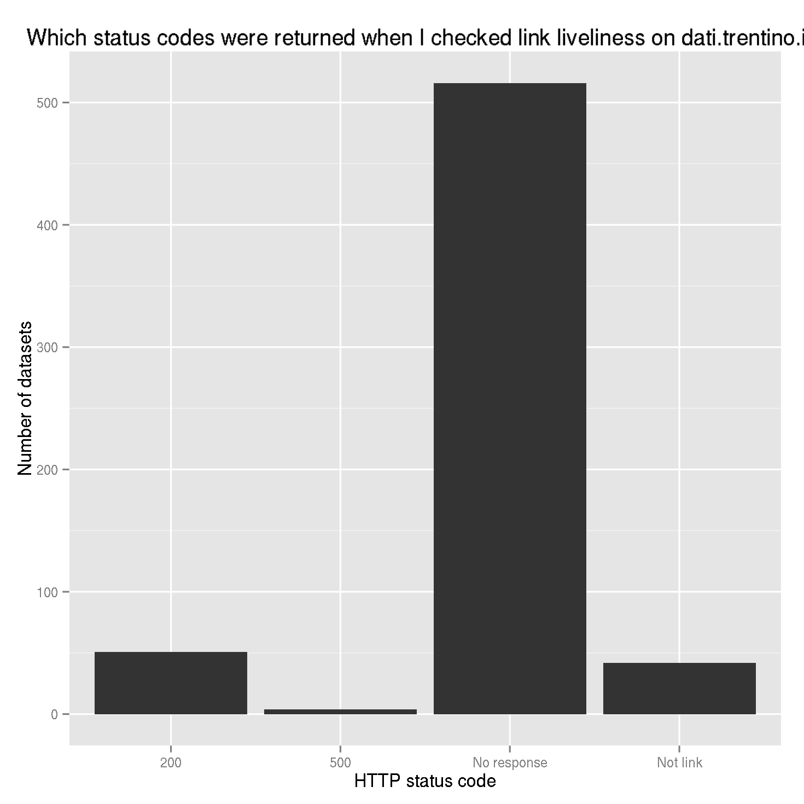 


```
## 
##         200 No response    Not link         404         203 
##          18           4           3           2           0
```


```
## 
## No response         200    Not link         500         203 
##         516          51          42           4           0
```


Aside from 200, all of those status codes are errors, so this method of checking
seems fine. On the other hand, it seems like there were a lot of non-responses....
More about non-responses later; for now, we'll just say that the status code
check is fine.

## Duplicates
When plotting this, I realized that some of the data didn't line up. I set up
a database schema that was more normalized so that I wouldn't check a link twice
if two datasets linked to it. I thus had a datasets table and a links table.

Then I wound up changing my mind and using the links table to store a single record
per dataset. Here arose a problem; there was no unique index on this datasets table,
but I thought there was, so I added multiple records for each link.


```
## |catalog                 |identifier                                             |  count(*)|
## |:-----------------------|:------------------------------------------------------|---------:|
## |dartportal.leeds.ac.uk  |dart_excavation_data                                   |         5|
## |dartportal.leeds.ac.uk  |dart_geophysics_cmdminiexplorer                        |         5|
## |dartportal.leeds.ac.uk  |dart_geophysics_flashres64                             |         5|
## |dartportal.leeds.ac.uk  |dart_geophysics_geoscanrm15                            |         5|
## |dartportal.leeds.ac.uk  |dart_laboratorydata                                    |         5|
## |dartportal.leeds.ac.uk  |dart_monitoring_apparent_permitivity_cstdr100          |         5|
## |dartportal.leeds.ac.uk  |dart_monitoring_bulk_electrical_conductivity_cstdr100  |         5|
## |dartportal.leeds.ac.uk  |dart_monitoring_soilconductivity_imko_pico_t3p         |         5|
## |dartportal.leeds.ac.uk  |dart_monitoring_temperature_cs107l                     |         5|
## |dartportal.leeds.ac.uk  |dart_monitoring_weather_data                           |         5|
```


I had thought that there was a unique index on
`links.software, links.catalog, links.identifier`,
but there wasn't!


## Misinterpreting NULLs
Another issue: I had interpreted NULL as meaning that the dataset is not a link,
but it really represents that link's liveliness has yet  to be checked;
here's the relevant line of code.

    url_list = [row['url'] for row in dt.execute('SELECT DISTINCT url FROM links WHERE status_code IS NULL')]

I don't remember exactly how this affected the results thought; it might not have
been a big deal.

## Unresponsive datasets
I recorded when HTTP requests for datasets had timed out or otherwise
not responded. (In the database, these are indicated as status code -42.)
I checked a few of these manually. Here are two of them.

    dati.trentino.it/storage/f/2013-06-16T111814/_ggeiWE.csv
    https://www-genesis.destatis.de/genesis/online/link/tabelleDownload/46421-0001.html

They both work, but they take a while. Also, I found that they took longer
to download to my desktop computer on my desk than they took to download to
my server in a datacenter.
In case the problem was my internet connection (tethered from a phone),
I used that server in a datacenter to run the checker again on
all datasets that had timed out. Results didn't remarkably change.

## Slow datasets
Those links took a while to download. Maybe my timeout threshold is being hit?

  url = 'http://dati.trentino.it/storage/f/2013-06-16T114537/_EBmYVk.csv'
  import requests

  timeout = requests.head(url, timeout = 2)
  # timeout error

So it is. More detail follows.

  get = requests.get(url)
  head = requests.head(url)

  print(get)
  # <Response [200]>

  print(head)
  # <Response [200]>

  print(head.elapsed)
  # datetime.timedelta(0, 3, 353558)

The link is alive, but my timeout of 2 seconds was too short.
In this case, the request with a timeout failed, so the initial
response took too long. Also, it took a total of 3.35 seconds to
download. The elapsed time isn't the same thing as the time until
which the request will time out, but they're related.

### Bad URLs
A bunch of datasets have a field for an external link but provided
an empty URL.


```
## [1] catalog  count(*)
## <0 rows> (or 0-length row.names)
```


Aside from being interesting in itself, this pointed out to me that
there were probably lots of types of errors that I hadn't really
thought about. I realized I could look at the errors for each of the links
I checked. I thought I had saved the error in the database, but
my code for doing that turned out to be broken.

So I fixed that! Collecting better error information, I ran the checker
on all of the links that had failed before.

### Hostname
I figured that errors might be related to the server that a dataset comes
from, and I figured that the hostname of the URL would be a decent proxy
for server. (In the URL "http://thomaslevine.com/open-data", the hostname
is "thomaslevine.com".) So I wrote a sloppy function to detect these hostnames.

      datasets$hostname <- sub('(?:(?:http|ftp|https)://)?([^/]*)/.*$', '\\1', datasets$url)

Here are the top few hostnames and the number of datasets with each hostname.


```
## 
##                          \t 0ccfs001.sussex.nhs.uk\\csu 
##                           1                           1 
##            10.96.9.105:8080               176.32.230.19 
##                           1                           1 
##             192.171.153.213               194.151.67.33 
##                           1                           1 
##               195.217.160.2              195.55.247.252 
##                           1                           1 
##             2010.census.gov              207.251.86.229 
##                           1                           1
```


Having come up with this variable, I now could look at error types by hostname.

### Base error rate
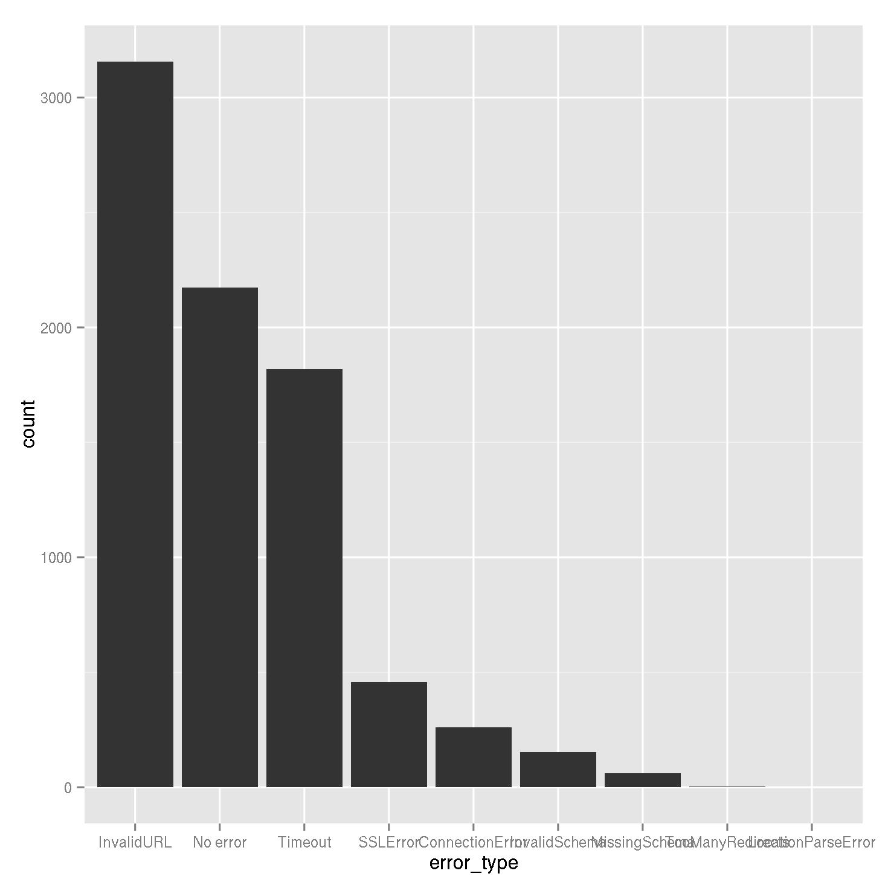 


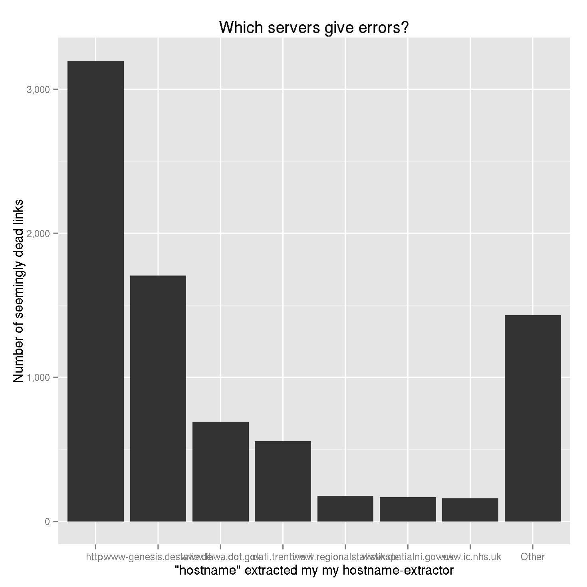 


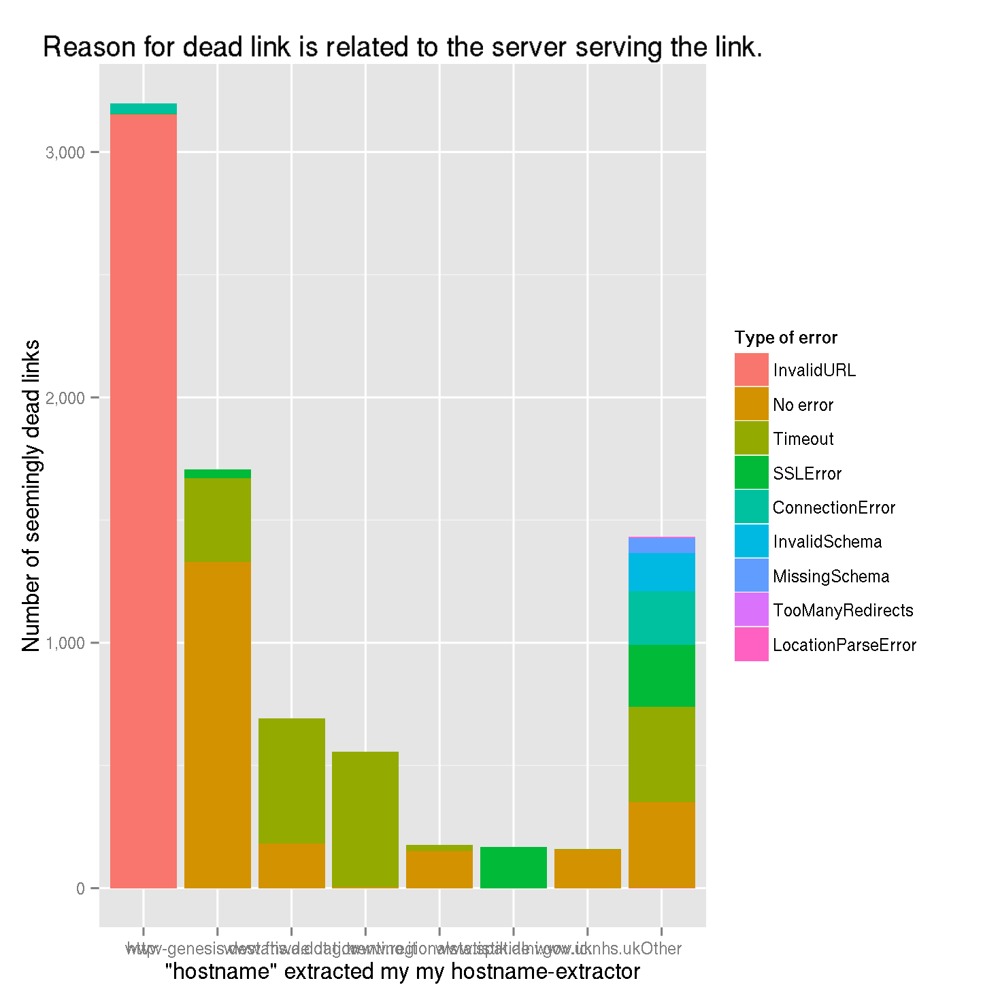 


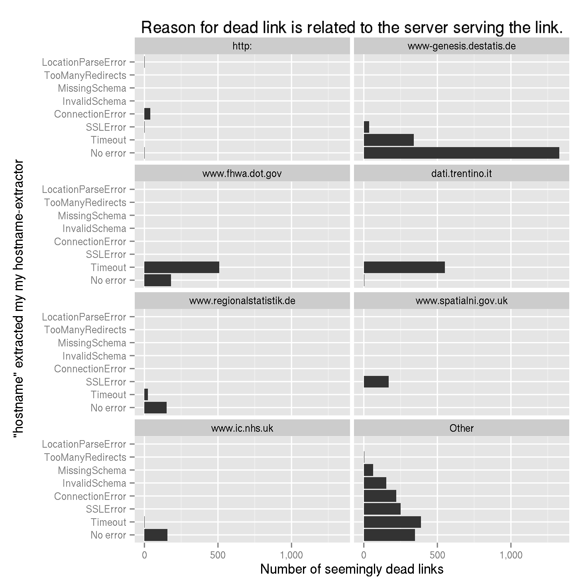 


### Invalid URLs
The "http:" datasets weren't valid URLs.


```
##             error_type
## 88     ConnectionError
## 132    ConnectionError
## 133    ConnectionError
## 343    ConnectionError
## 695 LocationParseError
##                                                                                                        url
## 88                                                  http:// Localisation des accès des offices de tourisme
## 132                                                                                 http://nullFPM.shp.zip
## 133                                                                                     http:// 2012_PNOA.
## 343                                                         http://fotovoltaico.provincia.tn.it\\solar.xml
## 695 http://2011 NFL draft: Andrew Luck is cementing his status as the No. 1 overall prospect on the board.
```


### Connection errors
Connection errors seem to correspond to some datasets with strange URLs and others for
which the site just can't be contacted.

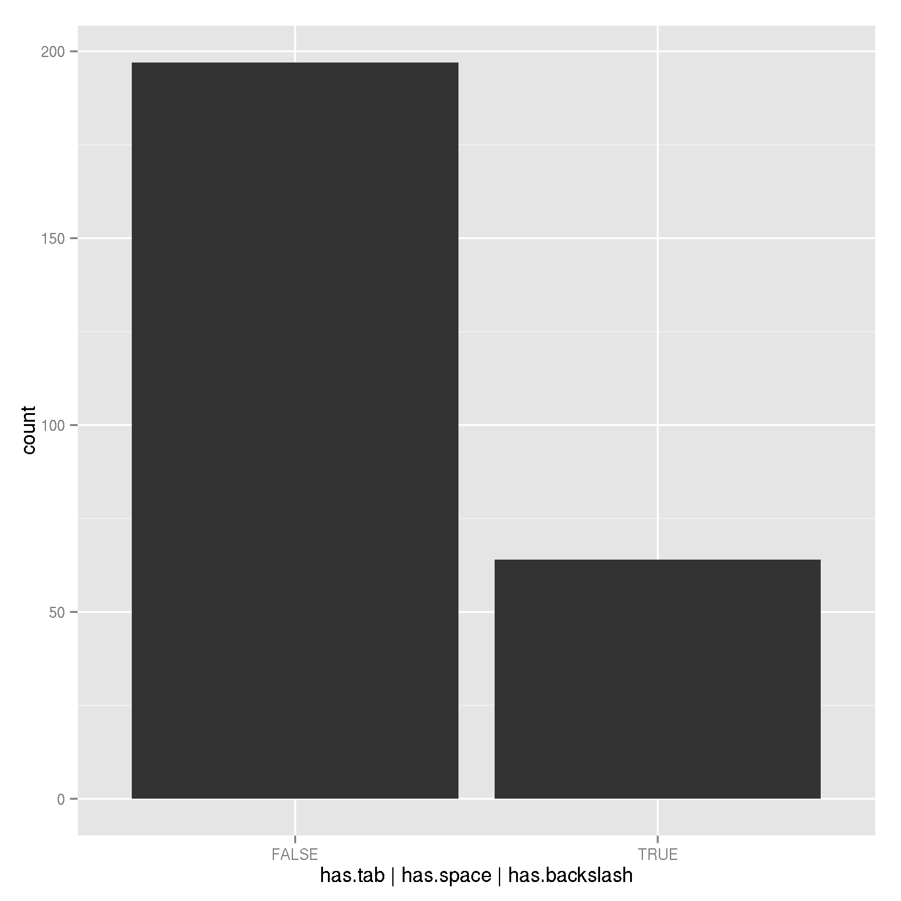 


### Invalid schemas
Invalid schemas are for datasets sent over protocals other than HTTP, like FTP.

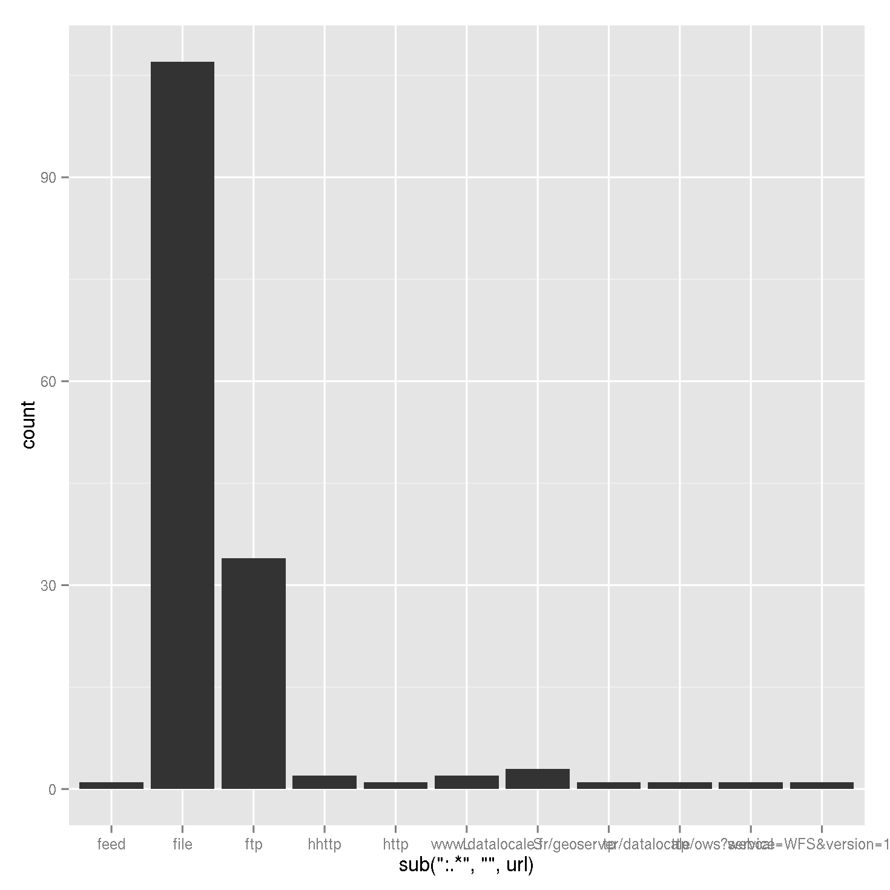 


Most of these schemas indicate that the files are stored on local systems
rather than being accessible from the internet. But a large minority of these
(FTP, specifically) is fully reasonable to put on the internet; I didn't
check them properly.

### Missing schemas
Missing schemas tend to be for datasets where the hostname was not specified.
Examples:


```
## [1] "/storage/f/2012-08-13T002240/COSCParks.kmz"                             
## [2] "/storage/f/2012-08-22T025312/prod_test.csv"                             
## [3] "/storage/f/2012-08-10T100153/sc_addies.csv"                             
## [4] "/en/storage/f/2013-02-11T170442/Copy-of-GB_Certified_130211_for-map.csv"
## [5] "/storage/f/2012-08-10T071459/annual-new-h2o-meters-2000-2010.csv"
```


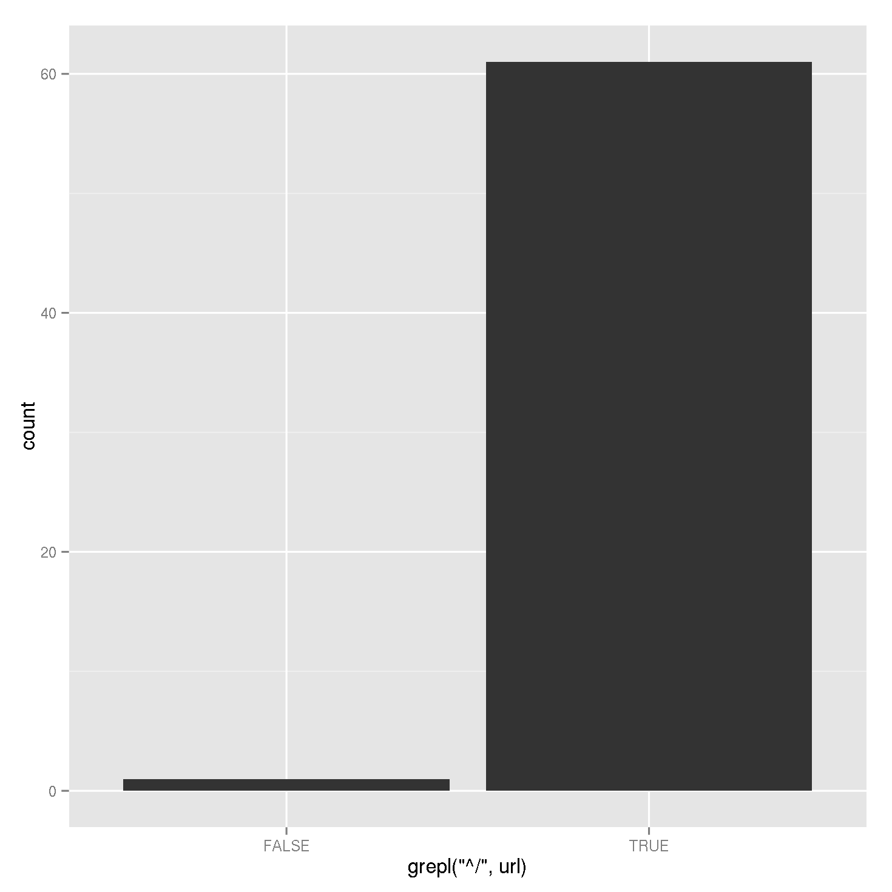 


This is a valid relative URL. I could have gotten the hostname from the site
from which I got the link, but I did not do this.

### SSL Errors
A bunch of sites did not have SSL certificates that I recognized.

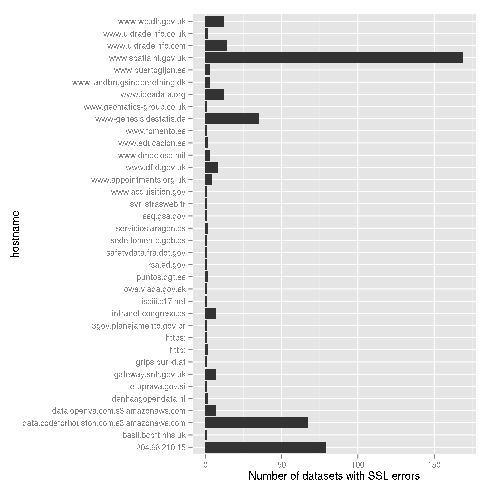 


I could ignore the certificates and download the dataset, but the SSL warning
is slightly unnerving.

SSL errors explain only a small part of the links I marked as dead. Of the
datasets that I'd marked as dead before, here are the numbers of datasets
with and without SSL errors.


```
## 
## FALSE  TRUE 
##  7630   457
```


They are interesting, but they don't explain my strange results.

### Timeouts
Once we get rid of the strange URLs, most of these links have no errors or have
timeouts. (Remember, these are the links that I marked as dead in my previous
analysis, and I tried downloading again for the present analysis.)

 


The "www-genesis.destatis.de" datasets seem mostly okay, though there are some timeouts.

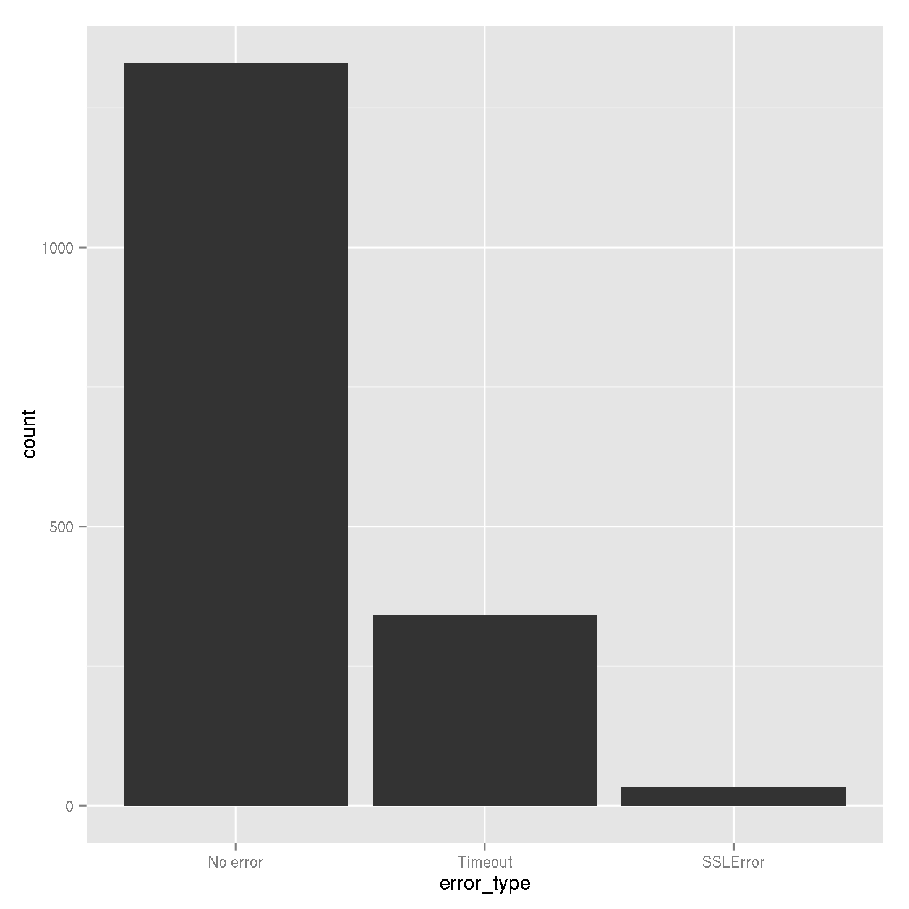 


```
##     error_type
## 730   No error
## 732   No error
## 735   No error
## 742   No error
## 743   No error
##                                                                                                          url
## 730                      https://www-genesis.destatis.de/genesis/online/link/tabelleDownload/61351-0011.html
## 732                      https://www-genesis.destatis.de/genesis/online/link/tabelleDownload/52911-0003.html
## 735 https://www-genesis.destatis.de/genesis/online?sequenz=tabelleAufbau&selectionname=23611-0004&sprache=de
## 742  https://www-genesis.destatis.de/genesis/online?sequenz=tabelleKarte&selectionname=22541-0001&sprache=de
## 743                      https://www-genesis.destatis.de/genesis/online/link/tabelleDownload/46241-0009.html
```


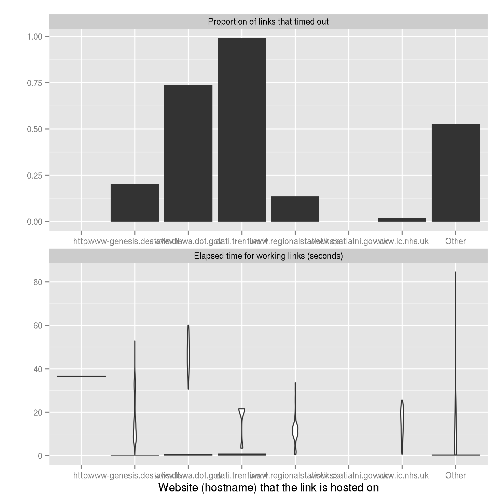 

