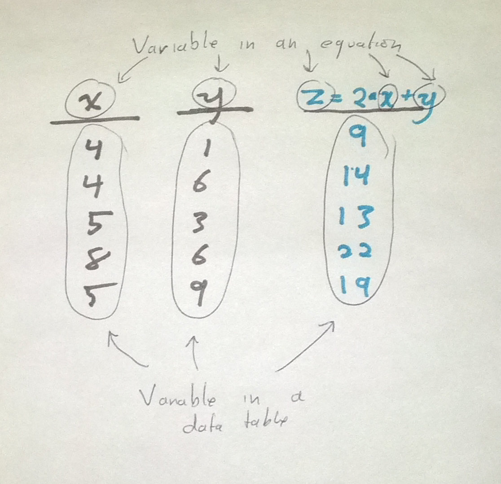

## Introduction

### Variable in an equation
If you ever took an algebra class, you'll think that
*x* in the following equation is a variable.

$$12 = x + 7$$

### Variable in a data table
As I've [explained prevously](/!/table-words), when I say "variable",
I'm usually talking about a column in a data table. That is, "variable"
is a synonym for "column".

This meaning of the word "variable" can be confusing if you were taught
a different meaning of "variable" in school. You might find it strange that
we use the word "variable" in two seemingly different ways. In fact,
I usually think of these as different meanings of the word "variable".

### Relatedness
It turns out that these two senses of "variable" are quite related.
In the current blog post, I hope to explain why we use the same word to
describe two concepts that seem sort of different.

## Fitting models
Once we have created a data table, we might decide to make a fancy equation that
explains how some values in the table are related to each other. We might call
this a *fitted model*.

Here's part of a data table about the wealth and health of nations.
(You may have [seen this before](/!/table-words#rows-and-columns).)

Year | Country | Life expectancy (years) | Income Per Person
---- | ------- | ----------------------- | -----------------
2012 | United States                | 79 | $41,678
2012 | Ukraine                      | 68 |  $6,390
2012 | Ethiopia                     | 63 |    $959

What we're calling "income per person" is technically gross-domestic product per
capita, adjusted for purchasing power parity and inflation. But don't worry about
that if it sounds like Greek.

Here's a fancy [graph](http://www.gapminder.org/world/#$majorMode=chart$is;shi=t;ly=2003;lb=f;il=t;fs=11;al=30;stl=t;st=t;nsl=t;se=t$wst;tts=C$ts;sp=5.59290322580644;ti=2012$zpv;v=0$inc_x;mmid=XCOORDS;iid=phAwcNAVuyj1jiMAkmq1iMg;by=ind$inc_y;mmid=YCOORDS;iid=phAwcNAVuyj2tPLxKvvnNPA;by=ind$inc_s;uniValue=8.21;iid=phAwcNAVuyj0XOoBL_n5tAQ;by=ind$inc_c;uniValue=255;gid=CATID0;by=grp$map_x;scale=log;dataMin=283;dataMax=110808$map_y;scale=lin;dataMin=18;dataMax=87$map_s;sma=49;smi=2.65$cd;bd=0$inds=;example=75)
of the data.

And here's an equation that describes those data.

<!-- 
lm(formula = c(79, 68, 63) ~ log(c(41678, 6390, 959)))
lm(formula = c(79, 68, 63) ~ log10(c(41678, 6390, 959)))
-->

$$Predicted\; life\; expectancy = 32 + 4.239 \times log\left(Income\; per\; person\right)$$

In this equation, life expectency and income per person
just numbers that we take from one row of the table.
To make that look more like what you might be used to, let's
rewrite it like this.

$$y = 32 + 4.239 \times log\left(x\right)$$

By distilling this relationship to a simple equation, we can express complex
information as a simple summary of it is small enough to fit in our brains.

### Making predictions
There are lots of ways we can use this equation (the fitted model).
Right now, we're just going to talk about using the equation to make
predictions.

Typically we write the equation such that the left side is the thing
we are predicting and the right side is the stuff we know. This is
how I've been writing it so far, so we are predicting life expectency
(*y*) based on income per person (*x*). Let's say that we have measured
the income per person of another country but don't know the life
expectency. We can use our equation to predict it! Here's a new row

Year | Country | Life expectancy (years) | Income Per Person
---- | ------- | ----------------------- | -----------------
2012 | China       | <!-- 75 --> unknown |  $9,502

We know China's income per person *x*, so let's plug that into our
equation to predict China's life expectency.

$$y = 32 + 4.239 \times log\left(9502\right)$$

$$y = 32 + 4.239 \times 9.159258$$

$$y = 32 + 38.82609$$

$$y = 70.82609$$

$$y \approx 71 $$

We thus predict China's life expectency to be 71 years.
The actual value is 75, so that's pretty close.

Let's get back to why these two senses of variable are the same
thing. Our fitted model is an equation with two variables, income per
person and life expectency. Each of these variables corresponds
to a column in our data table.

In the first data table I presented, we knew the values of all
of the cells. That is, we knew the income per person and life
expectancy for each of the three countries.

In the second table, we didn't only knew the value for one of
the two variables (income per person). In order to predict the value
for the other variable (life expectency), we plugged in the
variable that we did know into our equation, and we solved
it for the variable that we didn't know.

## Conclusion
The word "variable" sort of has two senses, and it can be confusing
to listen to data scientists when you don't realize this.

If you've taken an algebra class, you probably think of a variable as
a letter in an equation.

When data scientists talk about variables, that *might* be what they mean.
But they might also be talking about columns in data tables.

These two meanings of the word "variable" arise because of we model
data. We come up with equations to describe the relationships within the dataset,
so a variable in the column sense is sort of like a lot of variables in the
letter-in-an-equation sense. Once we have our fitted model (equation), we can
plug in variables for some of the variables in order to predict other
variables.

We'll often solve the same equation as many times as we have rows in our
table, so it's sort of like we're plugging a whole column of numbers into
our equation rather than just a single number.

{:.wide}

## Ask more questions
What else are you wondering about data science?
Tell me what I should write about next week.
