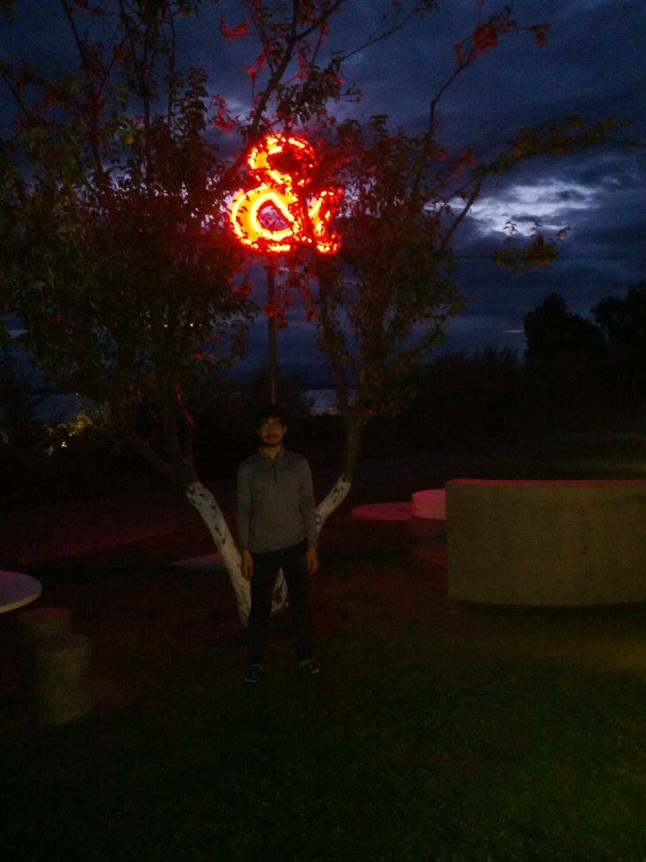

A couple months ago, I downloaded the metadata files for all of the
datasets on 60 Socrata open data portals. Interesting things
[happen](http://thomaslevine.com/socrata) when you do craziness like this.

Last Friday, I visited Socrata in Seattle. The most important part of my
visit was of course the teriyaki lunch; it was so important
that Developer Evangelist Chris Metcalf sent me a Google Calendar invitation for it.
They've been doing this for about 19 months and have only missed two weeks!

Of secondary importance was my discovery of a glowing ampersand.

{:.wide}

([I like ampersands](http://thomaslevine.com/!/ampersands/).)

But I also met everyone, talked about my findings, and
learned a lot about the implementation of open data portals.

## Why
After my talk, VP of marketing Saf Rabah asked me why I had done all of
this study of open data. That was a good question; I regularly forget
that I tend to do strange things.

I think most things do better when knowledge is shared. I run and write
free software, I post most of my work quite publicly, I pay attention to
media licensing, I read copyright law
when I was in high school, and I started a
[Free Culture Foundation](http://freeculture.org) chapter in college.
Naturally, I also care about open data. But that still doesn't quite explain it.

### Hackathon apps
At the first hackathon for the [NYC Big Apps](http://nycbigapps.com/)
competition, [Ashley Williams](http://heyashleyashley.com) and
[I](http://thomaslevine.com) started talking about the sort of apps that
come out of contemporary hackathons. We quickly decided to
algorithmically generate random hackathon apps.

We noticed that many apps follow a search-for-things-on-a-map paradigm;
that is, you fill out a search form and get results on a map. We
automated the creation of the cliche hackathon apps in
[AppGen](http://appgen.me). (Being cliche hackathon apps,
AppGen-generated apps also broke a month after being created.)

### Dataset dataset
In building AppGen, I wound up downloading all of the datasets on the
New York City data portal. I generalized it to run on any Socrata Open Data
Portal, and then I downloaded all of the metadata about all of the datasets
on 60 Socrata portals.

I started treating datasets as data points and doing analysis across
datasets, and I think this is the main novelty of all my open data
studies; I've just been quantifying things that other people hadn't
thought to quantify.

### Communication
Someone recently suggested that I'm generally interested in understanding
how information gets created and shared.

Fun related story: This one time, I posted
"EMERGENCY EXIT ONLY ALARM WILL SOUND" signs on doors that weren't
emergency exits only. Those emergency signs are scary! Even I was afraid
of opening the doors afterwards! I continue to be intrigued by how
signs are seen as authoritative sources of information even though anyone
can put up a sign. 

When so much information passes through a central and open resource like
a data portal, we acquire rich data about how different people produce and
interpret information. This ecosystem of open data doesn't just give us
more data to analyze; it also allows us to analyze data analysis.
